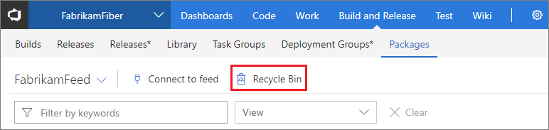

If you've deleted/unpublished an npm package, NuGet package, or Maven artifact from Azure DevOps Services, builds that depend on that package will start to fail.  You won't be able to repush that package to the feed because of [immutability](../feeds/immutability.md).  In order to recover the package and have builds start working again, you can recover it from the Recycle Bin.

1. Find the Recycle Bin in the **Packages** page underneath the **Build and Release** page group in Azure DevOps Services: 

    

    > Once in the Recycle Bin, you will see any packages that have been deleted from the current feed in the **past 30 days**.

2. Click a package to get more details such as: *Version*, *Deleted date/time*, and *Scheduled permanent deletion:*

    

3. Select a version to *Restore to feed:*

    

