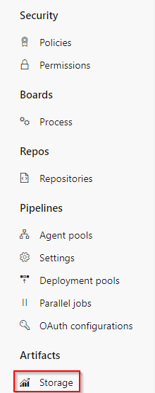
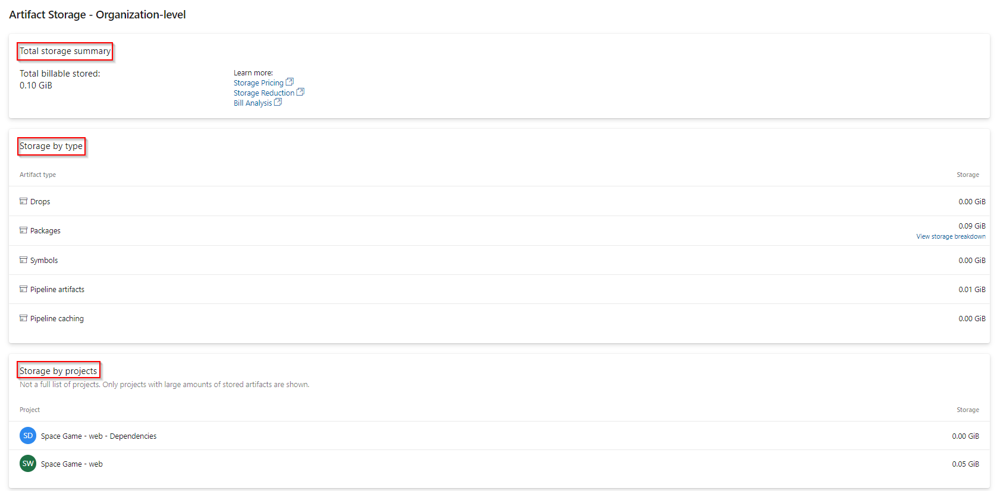
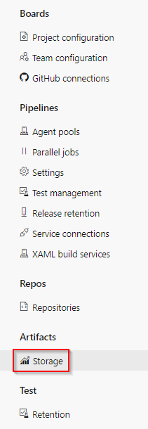
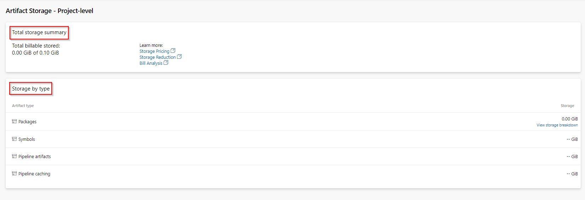

# Artifacts storage consumption

[!INCLUDE [temp](../includes/version-tfs-2017-through-vsts.md)]

With Azure Artifacts free-tier plan, you get two Gibibytes (GiB) of free storage to store different types of packages. When you reach your maximum storage limit, you can either upgrade to a paid subscription or delete some of your existing artifacts.

Azure Artifacts uses a consumption-based billing for all the supported package types (NuGet, npm, Python, Maven, and Universal packages). Storing symbols files is free.

Using the artifact storage UI from your organization/project settings, you can view your storage consumption at both the organization level and the project level. Storage is also grouped by project and/or by artifact type.

## Organization-level storage

The organization-level view shows your total storage summary and your storage consumption by artifact type and by project.

1. From within your organization, select  **Organization settings**.

1. Under **Artifacts**, select **Storage** on the left pane.

    > [!div class="mx-imgBorder"]
    > 

1. View your storage consumption for each section.

    > [!div class="mx-imgBorder"]
    > 

For the current release, you can view the storage breakdown for **Packages** and for projects listed in the **Storage by projects** section.

The **Packages** storage breakdown lists packages in organization-scoped feeds.

> [!div class="mx-imgBorder"]
> 

> [!NOTE]
> The **Storage by projects** section shows only projects with the largest storage consumption and not the full list of projects in your organization.

## Project-level storage

The project-level view shows your total storage summary and your storage consumption by artifact type.

1. From within your project, select  **Project settings**.

1. Under **Artifacts**, select **Storage** on the left pane.

    > [!div class="mx-imgBorder"]
    > 

1. View your total storage summary and your storage by artifact type.

    > [!div class="mx-imgBorder"]
    > 

The total storage summary shows your total billable stored artifacts. The **Storage by type** section lists your storage consumption by artifact type. For the current release, you can view your storage breakdown for the **Packages** section only.

## Related articles

- [What are feeds?](concepts/feeds.md)
- [What are feed views?](concepts/views.md)
- [Get started with NuGet packages](get-started-nuget.md)
- [Publish to NuGet feeds (YAML/classic)](../pipelines/artifacts/nuget.md)
- [Azure Artifacts billing: blog post](https://devblogs.microsoft.com/devops/azure-artifacts-billing-changes-coming-october-2020/)
