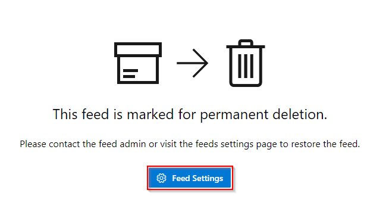
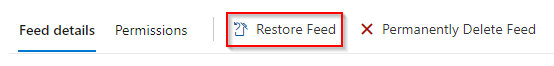
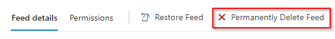

# What are feeds?

**Azure DevOps Services | Azure DevOps Server 2020 | Azure DevOps Server 2019 | TFS 2018 | TFS 2017**

Artifacts Feeds are organizational constructs that allow you to store, manage, and group your packages and control who to share it with. Feeds are not package-type dependent. You can store all the following package types in a single feed: npm, NuGet, Maven, Python, and Universal packages. 

## Project-scoped vs Organization-scoped feeds

Previously, all feeds were scoped to an organization, they could be viewed and accessed in the Azure Artifacts hub from any project within an organization. With the introduction of public feeds, we also introduced **project-scoped feeds**. This type of feed can only be accessed from within the hosting project. 

Only project-scoped feeds can be made public. You can learn more about [public feeds](#public-feeds) later in this article. See [Feeds visibility](../feeds/project-scoped-feeds.md) to understand the differences between project-scoped and organization-scoped feeds.

> [!NOTE]
> To access a feed in a different organization, a user must be given access to the project hosting that feed.

## Public feeds

Public feeds are used to share your packages publicly with anyone on the Internet. Users won't have to be a member of your organization or your enterprise. They can access the packages even if they don't have an Azure DevOps account. 

Public feeds are **project-scoped feeds** and it will inherit the visibility settings of the hosting project.

There some important things to note regarding public feeds:

* Public feeds can only be created inside of public projects.
* Public feeds aren't intended as a replacement for existing package management platforms (NuGet.org, npmjs.com, etc.).
* Public feeds cannot have upstream sources.
* Public users cannot currently download universal packages. All other package types are supported for public access.

## Create a feed

[!INCLUDE ]

::: moniker range=">= azure-devops-2019"

## Restoring a deleted feed

If you accidentally delete a feed, Azure Artifacts provides a 30 days window to recover your feed to its original state. After the 30 days, the feed will be deleted permanently. During the recovery window, the feed name will be reserved, package download unavailable, and write access suspended for that feed.

You can view the feeds pending permanent deletion in your **Feeds** dropdown list under the **Deleted Feeds** tab.

1. Under **Deleted feeds** select your feed.

    > [!div class="mx-imgBorder"] 
    > 

1. Select **Feed Settings**.

    > [!div class="mx-imgBorder"] 
    > 

1. Select **Restore Feed**.

    > [!div class="mx-imgBorder"] 
    > 

## Permanently deleting a feed

A feed pending deletion will still use storage space. If you want to permanently delete your feed before the 30 days period is up, you can do this from the deleted feeds settings. 

1. Under **Deleted feeds** select your feed.

    > [!div class="mx-imgBorder"] 
    > 

2. Select **Permanently delete** and confirm the deletion

    > [!div class="mx-imgBorder"] 
    > 

Once the feed is permanently deleted, users won't be able to view or restore its packages. The feed name will be available for reuse 15 minutes after the deletion.

::: moniker-end
