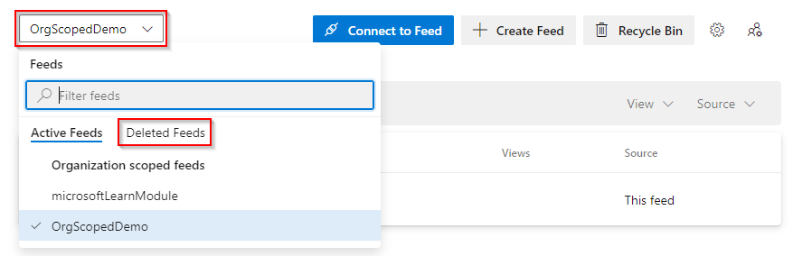

# What are feeds?

[!INCLUDE [version-lt-eq-azure-devops](../../includes/version-lt-eq-azure-devops.md)]

Artifacts Feeds are organizational constructs that allow you to store, manage, and group your packages and control who to share it with. Feeds are not package-type dependent. You can store all the following package types in a single feed: npm, NuGet, Maven, Python, and Universal packages. 

## Project-scoped vs Organization-scoped feeds

Previously, all feeds were scoped to an organization, they could be viewed and accessed in the Azure Artifacts hub from any project within an organization. With the introduction of public feeds, we also introduced **project-scoped feeds**. This type of feed can only be accessed from within the hosting project. 

Only project-scoped feeds can be made public. You can learn more about [public feeds](#public-feeds) later in this article. See [Feeds visibility](../feeds/project-scoped-feeds.md) to understand the differences between project-scoped and organization-scoped feeds.

> [!NOTE]
> To access a feed in a different organization, a user must be given access to the project hosting that feed.

## Public feeds

Public feeds are used to share your packages publicly with anyone on the Internet. Users won't have to be a member of your organization or your enterprise. They can access the packages even if they don't have an Azure DevOps account. 

Public feeds are **project-scoped feeds** and it will inherit the visibility settings of the hosting project.

There some important things to note regarding public feeds:

* Public feeds can only be created inside of public projects.
* Public feeds aren't intended as a replacement for existing package management platforms (NuGet.org, npmjs.com, etc.).
* Public users cannot currently download universal packages. All other package types are supported for public access.

> [!NOTE]
> All feed views in a public project are accessible to everyone on the internet.

## Create public feeds

Public feeds are project-scoped feeds in a public project.

1. Select **Artifacts**.

    :::image type="content" source="../media/goto-feed-hub-azure-devops-newnav.png" alt-text="Screenshot showing Artifacts in the Azure DevOps dashboard.":::

1. Select **Create Feed**.

    :::image type="content" source="../media/new-feed-button-azure-devops-newnav.png" alt-text="Screenshot showing the create feed button.":::

1. Give your feed a **Name**, and then select **Project** for your feed's scope.

    :::image type="content" source="../media/new-public-feed.png" alt-text="Screenshot showing how to create a new public feed.":::

1. Select **Create** when you are done.

::: moniker range=">= azure-devops-2019"

## Delete a feed

1. Select **Artifacts**, and then select your feed from the dropdown menu.

1. Select the gear icon  to navigate to your feed's settings.

    :::image type="content" source="../media/feed-settings.png" alt-text="A screenshot showing how to access the feed's settings":::

1. Select **Delete feed**.

1. Select **Delete** when you are ready.

    :::image type="content" source="media/delete-warning.png" alt-text="A screenshot showing a warning message prior to deleting a feed":::

## Restore deleted feeds

If you accidentally delete a feed, Azure Artifacts provides a 30 days window to recover your feed to its original state. After the 30 days, the feed will be deleted permanently. During the recovery window, the name of the feed remains reserved, packages are unavailable for download, and write access is suspended for that feed.

You can view the feeds that are pending permanent deletion in the feed picker dropdown list under the **Deleted Feeds** tab.

1. Select **Artifacts**.

1. Select the feed picker dropdown menu, and then select **Deleted Feeds**

    > [!div class="mx-imgBorder"] 
    > 

1. Select the feed you want to restore, and then select **Feed Settings**.

    > [!div class="mx-imgBorder"] 
    > 

1. Select **Restore Feed**.

## Permanently deleting a feed

A feed pending deletion will still use storage space. If you want to permanently delete your feed before the 30 days period is up, you can do this as follows:

1. Select **Artifacts**.

1. Select the feed picker dropdown menu, and then select **Deleted Feeds**

    > [!div class="mx-imgBorder"] 
    > 

1. Select the feed you want to restore, and then select **Feed Settings**.

    > [!div class="mx-imgBorder"] 
    > 

1. Select **Permanently Delete Feed**, and then select **Delete**.

Once the feed is permanently deleted, users won't be able to view or restore its packages. The feed name will be available for reuse 15 minutes after the deletion.

::: moniker-end
