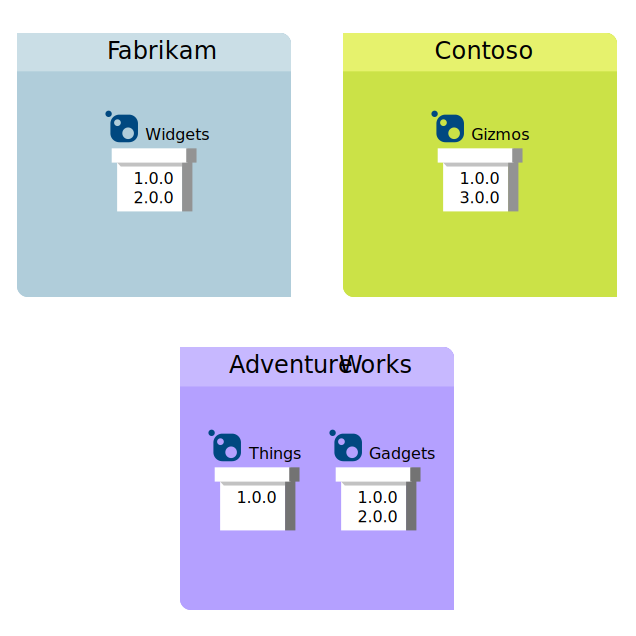
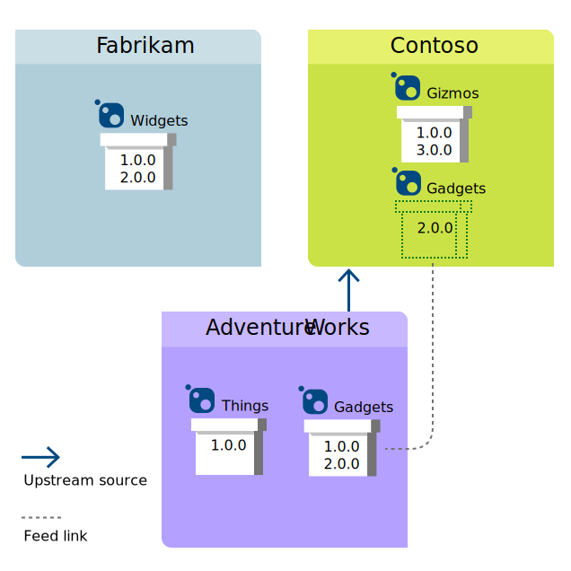
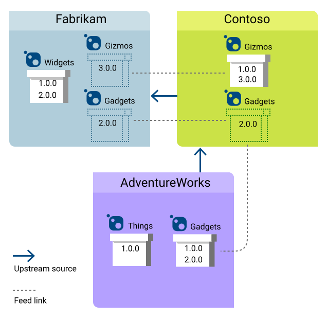
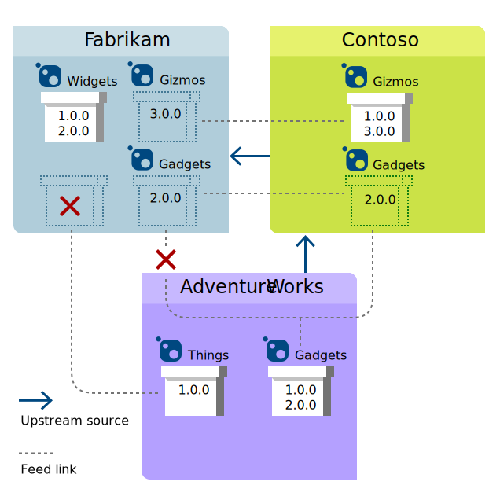

# Constructing a complete package graph

**Azure DevOps Services | TFS 2017** ([availability note](../overview.md#versions-compatibility))

When you release a package, it's important to ensure that any dependencies of that package are also available in your feed, either by republishing them directly (not recommended) or by consuming them from an [upstream source](upstream-sources.md). Once you consume a package from an upstream source once, a copy of it is always saved in your feed. Even if the upstream source goes down, your copy will remain available both to you and to your downstream consumers.

## How upstreams construct the set of available packages

Because Azure DevOps Services feeds can have other Azure DevOps Services feeds as upstreams, it seems possible on the surface to have a cycle of upstream sources, where feed A upstreams to feed B which upstreams to feed C which upstreams back to feed A. Left unchecked, such a cycle could break package requests by creating an infinite loop where a user asks A for a package, then A asks B, then B asks C, then C asks A again, etc. Upstream sources are designed to prevent this.

When a feed consults its upstream sources for a package (step 3 in the [search order](upstream-sources.md#search-order)), Azure DevOps Services upstream sources will return the packages in the view configured for that upstream source. Thus, a query to feed A does not actually result in a transitive query to feed C (A -> B -> C), because views are [read-only](views.md#read-only). This means that A has access to any packages from C that a user of B has previously saved into B, but not the full set of packages available in C.

Thus, the onus falls to B to ensure that its local packages represent a complete dependency graph, so that users who consume B's package via an upstream source from another feed are able to successfully resolve the graph and install their desired B package.

## Example: constructing the set of available packages

Assume three feeds, Fabrikam, Contoso, and AdventureWorks. In this example, we'll look at the packages available to the Fabrikam feed as we add upstream sources.

At first, Fabrikam has no upstream sources, and users connected to Fabrikam can only install versions 1.0.0 and 2.0.0 of the Widgets package. Likewise, Contoso has no upstream sources, and users connected to Contoso can only install versions 1.0.0 and 3.0.0 of the Gizmos package. Ditto for the AdventureWorks feed, where connected users can only install versions 1.0.0 and 2.0.0 of the Gadgets package or version 1.0.0 of the Things package.

Next, consider what happens if Contoso adds an upstream source to AdventureWorks. Then, a user connected to Contoso can install any version of Gizmos, any version of Gadgets, or any version of Things. If she installs Gadgets@2.0.0, that package-version is *saved* into Contoso (with a link back to AdventureWorks).

Now, let's have the Fabrikam feed add an upstream source to the Contoso feed. Once that's done, a user connected to Fabrikam can install any version of Widgets, any version of Gizmos, but only *saved* versions (i.e. 2.0.0) of Gadgets. 

He cannot install version 1.0.0 of Gadgets or any version of Things, because those package-versions haven't been saved into Contoso by a Contoso user.

