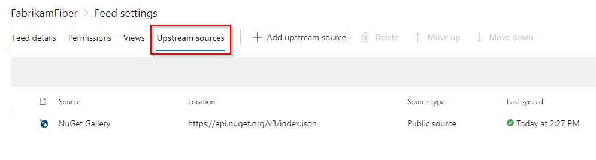

# Upstream sources

**Azure DevOps Services | Azure DevOps Server 2020 | Azure DevOps Server 2019 | TFS 2018 | TFS 2017**

> [!NOTE]
> Check [Versions and compatibility](../overview.md#versions-compatibility) to ensure compatibility. 

Upstream sources enable you to use a single feed to store both the packages you produce and the packages you consume from "remote feeds": both public package managers (npmjs.com, NuGet.org, Maven Central, and PyPI) and Artifacts feeds. Once you've enabled an upstream source, any user connected to your feed can install a package from the remote feed, and your feed will save a copy.

Already familiar with the concepts and want to jump right in? Start with these how-tos:

- [How-to: Set up upstream sources](../how-to/set-up-upstream-sources.md)
- [Use nuget.org as an upstream](../nuget/upstream-sources.md)
- [Use npmjs.com as an upstream](../npm/upstream-sources.md)
- [Use Maven Central as an upstream](../maven/upstream-sources.md)

::: moniker range="azure-devops"

> [!NOTE]
> Custom upstream sources are currently only supported for npm.

::: moniker-end

## Benefits of upstream sources

Upstream sources enable you to manage all of your product's dependencies in a single feed. We recommend publishing all of the packages for a given product to that product's feed, and managing its dependencies from remote feeds in the same feed, via upstream sources. This setup has a few benefits:

- **Simplicity:** your NuGet.config, .npmrc, or settings.xml contains exactly one feed (your feed).
- **Determinism:** your feed resolves package requests in order, so rebuilding the same codebase at the same commit or changeset uses the same set of packages.
- **Provenance:** your feed knows the provenance of packages it saved via upstream sources, so you can verify that you're using the original package, not a custom, or malicious copy published to your feed.
- **Peace of mind:** packages used via upstream sources are guaranteed to be saved in the feed on first use. If the upstream source is disabled/removed or the remote feed goes down or deletes a package you depend on, you can continue to develop and build.

## Best practices: feed consumers

To take full advantage of the benefits of upstream sources as a consumer of another feed, consider applying the following best practices to your project.

<a name="single-feed"></a>

### Use a single feed on the client

In order for your feed to provide [deterministic restore](#search-order), it's important to ensure that your package feed configuration file (.npmrc_ or _nuget.config) references only your Azure Artifacts feed with upstream sources enabled. For NuGet, the `<packageSources>` section should look like this:

```xml
<packageSources>
  <clear />
  <add key="FabrikamFiber" value="https://pkgs.dev.azure.com/fabrikam/_packaging/FabrikamFiber/nuget/v3/index.json" />
</packageSources>
```

> [!NOTE]
> The `<clear />` tag is required because NuGet composes [several configuration files](/nuget/consume-packages/configuring-nuget-behavior) to determine the full set of options to use. `<clear />` tells NuGet to ignore all other `<packageSources>` defined in higher-level configuration files.

For npm, you should have only one `registry` line:

```ini
registry=https://pkgs.dev.azure.com/fabrikam/_packaging/FabrikamFiber/npm/registry/
always-auth=true
```

### Order your upstream sources intentionally

If you only use public package managers (e.g. nuget.org or npmjs.com), the order of your upstream sources is irrelevant. Requests to the feed will follow the [search order](#search-order).

If you use multiple upstream sources, or a mixture of public package managers and upstream sources, their order is taken into account in step 3 of the [search order](#search-order). In that case, we recommend putting the public package managers first. This ensures that you look for OSS packages from the public repos before checking any upstream sources, which could contain modified versions of public packages.

In rare cases, some organizations choose to modify OSS packages to fix security issues, to add functionality, or to satisfy requirements that the package is built from scratch internally, rather than consumed directly from the public repository. If your organization does this, put the upstream source that contains these modified OSS packages before the public package managers to ensure you use your organization's modified versions.

### Use the suggested default view

Upstream sources require you to select a **view** of the remote feed when you add it as an upstream source. This prevents your upstream sources from creating a cycle and it requires and encourages your upstream feed to provide you with a [complete package graph](package-graph.md). In general, the feed owner should [select the correct default view](#local), as the view communicates which packages and versions the producer wants consumers to use.

## Best practices: feed owners/package producers

To make your feed easily usable as an upstream source to other feeds, consider applying the following best practices to your feed.

<a name="local"></a>

### When in doubt, `@local` is your default view

If you don't use [views](views.md), the `@local` view should be your default view (and is the default view on all newly created feeds). @local contains all packages uploaded/pushed/published to the feed from a public package repository (e.g. nuget.exe) **and** all packages saved from any upstream source. @local, like [all views](views.md), does **not** include packages that are available in the feed's upstream sources but have never been saved into the feed.

If you do use views to release package versions, you can set the default view to whichever view contains the packages you want to make available to your consumers.

### Provide a complete graph

Because your consumers require a [complete graph](package-graph.md) to successfully install and consume your package, you should ensure that your [default view](#local) contains one. This is most easily done by connecting to the feed's default view ([NuGet](../nuget/consume.md), [npm](../npm/npmrc.md)) and installing the package you wish to share. You may need to do this once connected to the feed (instead of the feed@view). If the package installs correctly while you're connected to the default view, all of its dependencies are in the view.

<a name="search-order"></a>

## Determining the package to use: search order

For public package managers that support multiple feeds (NuGet and Maven), the order in which feeds are consulted is sometimes unclear or non-deterministic (for example in NuGet, parallel requests are made to all feeds in the config file and the first response wins). Upstream sources prevent this non-determinism by searching the feed and its upstream sources using the following order:

1. Packages pushed to the feed
2. Packages saved via an upstream source
3. Packages available via upstream sources: each upstream is searched in the order it's listed in the feed's configuration

To take advantage of the determinism provided by upstream sources, you should ensure that your client's configuration file [only references your product feed](#single-feed), and not any other feeds like the public package managers.

<a name="saved-packages"></a>

## Saving packages from upstream sources: continuity

When you enable an upstream source, packages installed from the upstream source via the feed will automatically be saved in the feed. These packages could be installed directly from the upstream (for example, `npm install express`) or they could be installed as part of dependency resolution (for example, the install of `express` would also save dependencies like `accepts`).

Saving can improve download performance and save network bandwidth especially for TFS servers located on internal networks.

<a name="overriding-packages"></a>

## Overriding a package from an upstream source

You can't publish any package-version that already exists in any upstream source enabled on your feed. For instance, if the nuget.org upstream source is enabled you cannot publish `Newtonsoft.Json 10.0.3` because that same package-version is already present on nuget.org.

If you must push a package-version that already exists on one of your upstream sources, you must disable the upstream source, push your package, then re-enable the upstream source. Note that you can only push a package-version that wasn't previously saved from the upstream, because saved packages remain in the feed even if the upstream source is disabled or removed. See the [immutability concept](../artifacts-key-concepts.md#immutability) for more info.

<a name="upstream-health-status"></a>

## Upstream sources health status

If a feed has a failing upstream source, the metadata can no longer be refreshed for packages of the same protocol. To view your upstream sources health status, select the gear icon  to access your **Feed settings**, then select **Upstream sources**. 

If there are any failures, a warning message will be displayed. The settings page will also indicate which one of the upstream sources is failing. Selecting the failing source will provide more details on the reason of failure and instructions on how to solve it.

> [!div class="mx-imgBorder"]
> 

<a name="offline-upstreams"></a>

> [!NOTE]
> For feeds that have public package respositories such as nuget.org as upstream sources, there is a 3-6 hour delay between when a package is pushed to the public repository and when it is available for download by your feed. This delay depends on job timing and package data propagation. The delay doesn't apply when the upstream sources are Azure DevOps feeds.

## Offline upstream sources

Upstream sources are a great way to protect your CI/CD infrastructure from public package managers outages. When a package is ingested in the downstream feed, a copy of the package is created, so even when the upstream feed is not available, the package is still available in the downstream feed.

## Related articles

- [Set up upstream sources](../how-to/set-up-upstream-sources.md)
- [Manage dependencies with upstream sources](../tutorials/protect-oss-packages-with-upstream-sources.md)
- [Manage feed permissions](..//feeds/feed-permissions.md)
