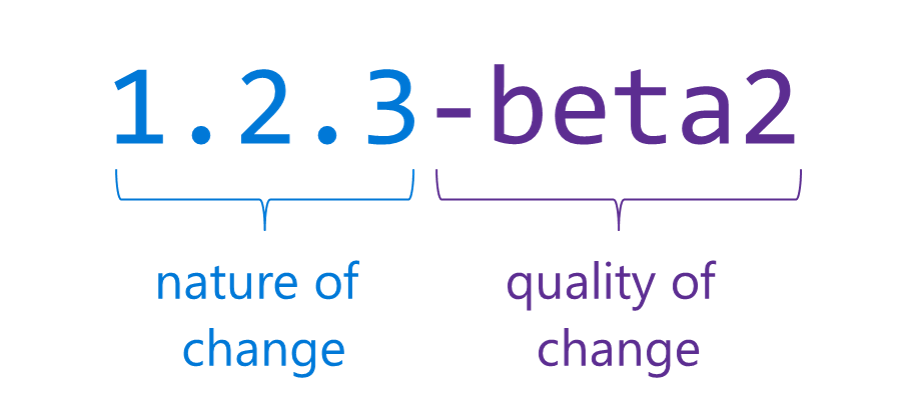
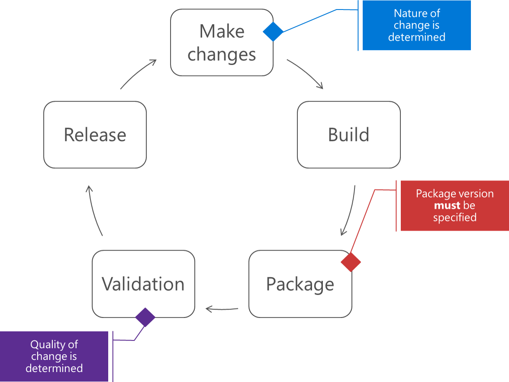
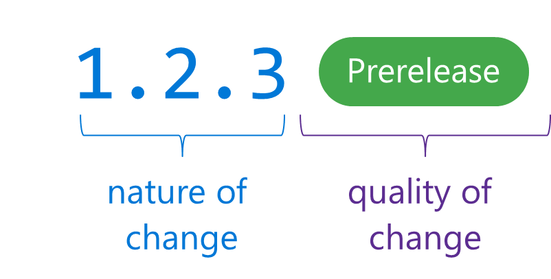

 

# Views on Azure DevOps Services feeds

**Azure DevOps Services** | **TFS 2018** | **TFS 2017**

*If you're familiar with the principles behind views, you can jump to the [docs page](../feeds/views.md) to quickly start using them.*

Views enable you to share subsets of the NuGet, npm, and Maven package-versions in your feed with consumers. A common use for views is to share package-versions that have been tested, validated, or deployed but hold back packages still under development and packages that didn't meet a quality bar.

## Views and upstream sources

Views and upstream sources are designed to work together to make it easy to produce and consume packages at enterprise scale.

### The `@local` view

All Azure DevOps Services feeds come with 3 views: `@local`, `@prerelease`, and `@release`. The latter two are suggested views that you can rename or delete as desired. The `@local` view is a special view that's commonly used in [upstream sources](upstream-sources.md).

`@local` contains all packages published directly to the feed (e.g. by `nuget push` or `npm publish`) and all packages [saved from upstream sources](upstream-sources.md#saved-packages). If you don't use any other views, `@local` should be your [default view](#default-view). To learn more about why `@local` exists, read the [package graph](package-graph.md) doc.

### Default view

Your Azure DevOps Services feed must have a default view. When the feed is created, the default view is `@local`. The default view is used when other feeds add your feed as an [upstream source](upstream-sources.md). To learn more about why upstream sources require the use of views, read the [package graph](package-graph.md) doc.

### Views cannot save packages from upstream sources

Views are read-only, which means that users connected to a view can only use packages that are published to the feed and packages previously saved from upstream sources by users connected to the feed.

## Using views to release packages

When creating packages in continuous integration and delivery scenarios, it's important to convey 3 pieces of information: the *nature* of the change, the *risk* of the change, and the *quality* of the package.

### Assess the nature and risk of changes

Because the nature and the risk of the change both pertain to the *change* itself&mdash;i.e. what you set out to do&mdash;they're both generally known at the outset of the work. You know if you're introducing new features, making updates to existing features, or patching bugs; this is the *nature* of your change. And, you know if you're still making changes to the API surface of your application; this is one facet of the *risk* of your change. Many NuGet users use [Semantic Versioning](http://semver.org) (SemVer) notation to convey these two pieces of information; SemVer is a widely used standard and does a good job of communicating this information.

### Determine and communicate quality

However, the *quality* of the *package* generally isn't known until validation, which comes after your change is built and packaged. Because of this, it's not feasible to communicate the quality in the version number, which is specified during packaging and before validation. There are workarounds to pre-validate (e.g. by consuming the build's DLLs directly before they're packaged; or, publishing packages to a "debug" or "CI" feed, validating, and re-publishing to a "release" feed), but none that we've seen can truly guarantee that the built package meets the correct quality standard.

Release views enable you to communicate the quality of a package after it's been validated. You create SemVer-compliant packages in CI/CD that communicate the nature and risk of your changes using the package version, then promote the package into a release view to show your consumers that it's of a certain quality (e.g. `@prerelease`, `@release`, etc.). So, a release view enables your consumers to see only the subset of versions of each package that are tested, validated, and ready to go.

