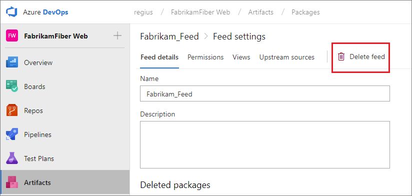
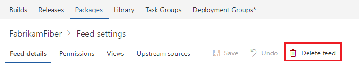

 
# Edit a feed

**Azure DevOps Services | TFS 2017**

Feeds have some basic settings: name, description, and permissions.

## Editing a feed's name and description

[!INCLUDE [edit-feed](../_shared/edit-feed.md)]

In the edit feed dialog:
- Change the name and/or description.
- Select **Save**.

## Editing a feed's permissions

To edit permissions, see [Secure feeds using permissions](feed-permissions.md#edit-permissions).

## Removing a feed

::: moniker range="vsts"

# [New navigation](#tab/new-nav)
> [!div class="mx-imgBorder"] 
>
> 

# [Previous navigation](#tab/previous-nav)

---

::: moniker-end

::: moniker range=">= tfs-2017 < vsts"

::: moniker-end

In the edit feed dialog:
- Select **Delete feed**
- In the delete feed dialog, type the name of the feed
- Select **Delete**
