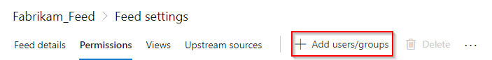
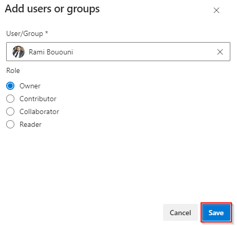
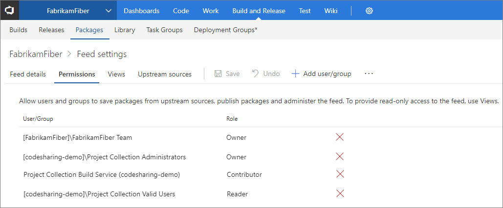

# Secure and share packages using feed permissions

**Azure DevOps Services | TFS 2017**

The packages you host in Azure Artifacts are stored in a **feed**. Setting permissions on the feed allows you to share your packages with as many or as few people as your scenario requires.

## Feed permissions overview

Feeds have four levels of access: Owners, Contributors, Collaborators, and Readers. Owners can add any type of identity-individuals, teams, and groups-to any access level.

| Permission | Reader | Collaborator | Contributor | Owner |
| ---------- | ------ | ------------ | ----------- | ----- |
| List and restore/install packages             | &#x2713; | &#x2713; | &#x2713; | &#x2713; |
| Save packages from upstream sources           |          | &#x2713; | &#x2713; | &#x2713; |
| Push packages                                 |          |          | &#x2713; | &#x2713; |
| Unlist/deprecate packages                     |          |          | &#x2713; | &#x2713; |
| Promote a package to a view                   |          |          | &#x2713; | &#x2713; |
| Delete/unpublish package                      |          |          |          | &#x2713; |
| Edit feed permissions                         |          |          |          | &#x2713; |

By default, the Project Collection Build Service is a Contributor and your project team is a Reader.

> [!NOTE]
> To access a feed in a different organization, a user must be given access to the project hosting that feed.

::: moniker range=">= azure-devops-2019"

## Adding users/groups permissions to a feed

::: moniker-end

::: moniker range=">= tfs-2017 < azure-devops-2019"

## Editing permissions for a feed

::: moniker-end

[!INCLUDE [edit-feed](../includes/edit-feed.md)]

Select **Permissions**.

::: moniker range=">= azure-devops-2019"

> [!div class="mx-imgBorder"] 
>

Select **Add users/groups**.

> [!div class="mx-imgBorder"]
>

Add `users` and/or `groups` and choose their access role.

> [!div class="mx-imgBorder"]
>

When you're done, select **Save**.

::: moniker-end

::: moniker range=">= tfs-2017 < azure-devops-2019"

In the edit feed dialog:

- Choose to make each person or team an Owner, Contributor, Collaborator, or Reader.
- When you're done, select **Save**.

::: moniker-end

## Understanding feeds and views permissions

Feeds are containers that allow users to group packages and control who can access them by modifying the feed permissions.

A feed view on the other hand is a way to enable users to share some packages while keeping others private. A common scenario for using a feed view is when a team shares a package version that has already been tested and validated but keeps packages that are still under development from being viewed.

By default, there are 3 views in a feed: `@local`, `@prerelease`, and `@release`. The latter two are suggested views that you can rename or delete as desired.

The `@local` view is the default view and it includes all the packages that were published directly to the feed as well as all the packages that were saved from the [upstream sources](../concepts/upstream-sources.md).

> [!IMPORTANT]
> If a user have permission to a specific view, and even if they don't have permission to the feed, they will still be able to access and download packages through that view.
If you want to completely hide your packages, you must restrict both feeds and views permissions.

To restrict access to your feed, simply select a user or group from the permission table in your [Feed Settings](#adding-usersgroups-permissions-to-a-feed) and select **Delete**. You can restrict access to a view by changing its visibility to **specific people** as shown below.

> [!div class="mx-imgBorder"]
>

After restricting your view's visibility, the permissions column should indicate that your view is only available to `feed users`.

> [!div class="mx-imgBorder"]
>

> [!IMPORTANT]
> A very important concept to keep in mind is that views inherit their permissions from their parent feed. Setting view permissions to `Specific people` without specifying users or groups will cause the view permissions to default back to their parent feed permissions.

## Package permissions in Azure Pipelines

To use packages from a feed in Azure Pipelines, the appropriate build identity must have permission to your feed. By default, the **Project Collection Build Service** is a Contributor. If you've changed your builds to run at [project scope](../../pipelines/build/options.md#build-job-authorization-scope), you'll need to add the project-level build identity as a Reader or Contributor, as desired. The project-level build identity is named as follows:

`[Project name] Build Service ([Organization name])` (e.g. FabrikamFiber Build Service (codesharing-demo))

you can also use the `Allow project-scoped builds` feature if you would like to automatically set up permissions for your project-scoped build identity.

1. With your feed selected, select the gear icon  to access the **Feed settings**.

1. Select **Permissions**.

1. Select the ellipsis on the right and select **Allow project-scoped builds** from the drop down menu.

> [!div class="mx-imgBorder"]
>

## Sharing packages with everyone in your organization

If you want to make the packages in a feed available to all users in your organization, create or select a [view](views.md) that contains the packages you want to share and ensure its visibility is set to **People in my organization**.

::: moniker range="azure-devops"

## Sharing packages publicly with anonymous users

You can also make your packages available to anonymous users with limited access by [creating a public feed](../tutorials/share-packages-publicly.md).

::: moniker-end