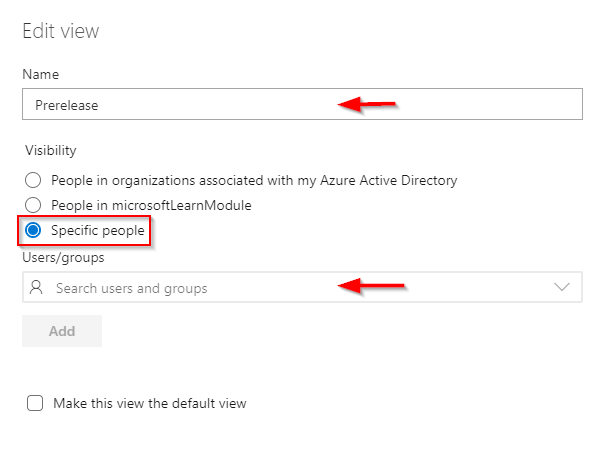
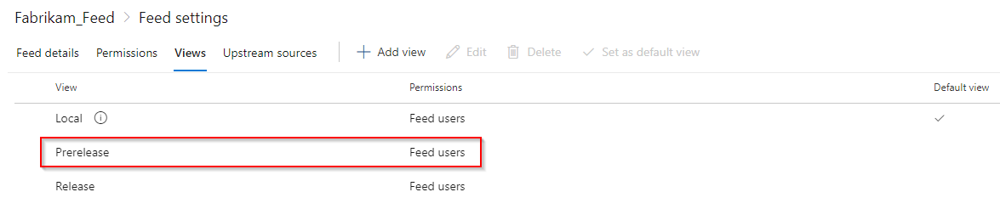
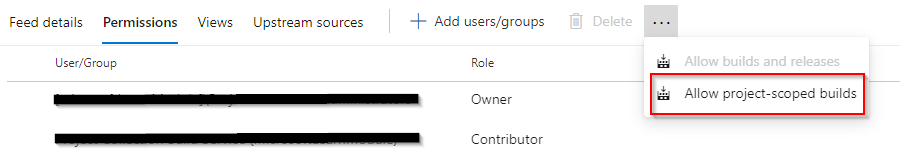

# Configure permissions

**Azure DevOps Services | Azure DevOps Server 2020 | Azure DevOps Server 2019 | TFS 2018 | TFS 2017**

With Azure Artifacts you can publish,, consume, and store different types of packages in your feed. Setting up permissions for your feed allows you to control who can access your packages.

## Configure Azure Artifacts settings

Feed owners have the ability to specify who can create or administer Artifacts feeds. The settings icon will not be visible if you don't have the right permissions. To access the settings panel, select **Artifacts** from within your project, and then select the **Azure Artifacts settings** icon on the right side of the screen.

:::image type="content" source="media/artifacts-settings-button.png" alt-text="Screenshot showing the Artifacts settings icon":::

By default, everyone in the same organization have the permission to create new feeds. A user who creates a feed is both an owner and an administrator of that feed.

1: Users in the same organization are able to create new feeds.

2: Only feed administrators and users or groups specified here 2 are able to create new feeds.

3: Users or groups added here become administrators of all the feeds in the organization.

:::image type="content" source="media/artifacts-settings.png" alt-text="Screenshot showing how to set up Azure Artifacts settings":::

> [!NOTE]
> It's very important to understand the difference between feeds, project, and project collection administrators.
> 
> A **Feed Administrator** can perform all operations on the feed (edit feed permissions, delete packages, promote packages, etc.).
>
> A **Project Administrator** on the other hand has permissions to manage all project/team related operations (update project visibility, delete project, manage test environments etc.).
>
> **Project Collection Administrators** are granted all collection-level permissions to manage resources for projects and project-collections (add/delete projects, trigger events, manage build resources, audit streams etc.).

## Configure feeds settings

[!INCLUDE [edit-feed](../includes/edit-feed.md)]

::: moniker range=">= azure-devops-2019"

2. Select **Permissions**.

    :::image type="content" source="media/editfeeddialog-azure-devops-newnav.png" alt-text="Screenshot showing feed permissions.":::

3. Select **Add users/groups**.

    :::image type="content" source="media/add-users-groups.png" alt-text="Screenshot showing the add users/groups button.":::

4. Add new user(s)/group(s), and then select their access role. Select *Save** when you are done.

    :::image type="content" source="media/add-users-groups-dialogue.png" alt-text="Screenshot showing how to add new users or groups.":::

::: moniker-end

::: moniker range=">= tfs-2017 < azure-devops-2019"

2. Select **Permissions**.

    :::image type="content" source="media/editfeeddialog1.png" alt-text="Screenshot showing feed permissions TFS.":::

In the edit feed dialog:

- Choose to make each person or team an Owner, Contributor, Collaborator, or Reader.
- When you're done, select **Save**.

::: moniker-end

## Permissions table

In Azure Artifacts, feeds can be grouped into two categories: project-scoped and organization-scoped feeds. All feeds created through the web UI are project-scoped feeds. By default, every user in the same organization have the permissions to create a new feed. A user who creates a feed is both an owner and an administrator of that feed. Below are the four different access levels for a feed

|                   Permission                  |  Reader  | Collaborator | Contributor |   Owner  |  Administrator  |
| --------------------------------------------- | -------- | ------------ | ----------- | -------- | --------------- |
| List/install/restore packages                 | &#x2713; |   &#x2713;   |   &#x2713;  | &#x2713; |     &#x2713;    |
| Publish packages                              |          |              |   &#x2713;  | &#x2713; |     &#x2713;    |
| Unlist packages                               |          |              |   &#x2713;  | &#x2713; |     &#x2713;    |
| Promote packages to a view                    |          |              |   &#x2713;  | &#x2713; |     &#x2713;    |
| Delete packages                               |          |              |             | &#x2713; |     &#x2713;    |
| Add/remove upstream sources                   |          |              |             | &#x2713; |     &#x2713;    |
| Allow external package versions               |          |              |             | &#x2713; |     &#x2713;    |
| Save packages from upstream sources           |          |   &#x2713;   |   &#x2713;  | &#x2713; |     &#x2713;    |
| Edit feeds settings                           |          |              |             | &#x2713; |     &#x2713;    |

> [!NOTE]
> To access a feed in a different organization, you must be given access to the project hosting that feed.

## Understanding feeds and views permissions

Feeds are containers that allow users to group packages and control who can access them by modifying the feed permissions.

A feed view on the other hand is a way to enable users to share some packages while keeping others private. A common scenario for using a feed view is when a team shares a package version that has already been tested and validated but keeps packages that are still under development from being viewed.

By default, there are 3 views in a feed: `@local`, `@prerelease`, and `@release`. The latter two are suggested views that you can rename or delete as desired.

The `@local` view is the default view and it includes all the packages that were published directly to the feed as well as all the packages that were saved from the [upstream sources](../concepts/upstream-sources.md).

> [!IMPORTANT]
> If a user have permission to a specific view, and even if they don't have permission to the feed, they will still be able to access and download packages through that view.
If you want to completely hide your packages, you must restrict both feeds and views permissions.

To restrict access to your feed, simply select a user or group from the permission table in your [Feed Settings](#configure-feeds-settings) and select **Delete**. You can restrict access to a view by changing its visibility to **specific people** as shown below.

> [!div class="mx-imgBorder"]
>

After restricting your view's visibility to `specific people`, the access permissions column should reflect your changes.

> [!div class="mx-imgBorder"]
>

> [!IMPORTANT]
> A very important concept to keep in mind is that views inherit their permissions from their parent feed. Setting view permissions to `Specific people` without specifying users or groups will cause the view permissions to default back to their parent feed permissions.

## Package permissions in Azure Pipelines

To use packages from a feed in Azure Pipelines, the appropriate build identity must have permission to your feed. By default, the **Project Collection Build Service** is a Contributor. If you've changed your builds to run at [project scope](../../pipelines/process/access-tokens.md#job-authorization-scope), you'll need to add the project-level build identity as a Reader or Contributor, as desired. The project-level build identity is named as follows:

`[Project name] Build Service ([Organization name])` (e.g. FabrikamFiber Build Service (codesharing-demo))

You can also use the `Allow project-scoped builds` feature if you would like to automatically set up permissions for your project-scoped build identity.

1. With your feed selected, select the gear icon  to access the **Feed settings**.

1. Select **Permissions**.

1. Select the ellipsis on the right and select **Allow project-scoped builds** from the drop down menu.

> [!div class="mx-imgBorder"]
>

> [!NOTE]
> If you want your pipelines to use a package from a feed in a different project, you must set up the other project to grant read/write access to the build service in addition to setting up the appropriate [feed permissions](#configure-feeds-settings).

## Sharing packages with everyone in your organization

If you want to make the packages in a feed available to all users in your organization, create or select a [view](views.md) that contains the packages you want to share and ensure its visibility is set to **People in my organization**.

::: moniker range="azure-devops"

## Sharing packages publicly with anonymous users

You can also make your packages available to anonymous users with limited access by [creating a public feed](../tutorials/share-packages-publicly.md).

::: moniker-end

## What's next?

* [Use public feeds to share your package publicly](../tutorials/share-packages-publicly.md).

* [Delete and recover packages](../how-to/delete-and-recover-packages.md).

* [Promote a package to a view](./views.md).
