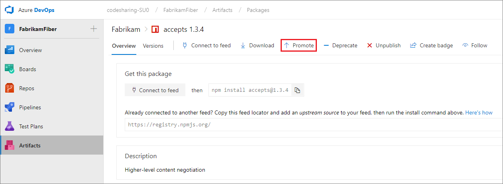
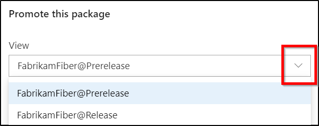

 
# Use feed views to share your packages

**Azure DevOps Services | Azure DevOps Server 2020 | Azure DevOps Server 2019 | TFS 2018 - TFS 2017**

Feeds are containers that allow users to group packages and control who can access them by modifying the feed's permissions.

A feed view on the other hand is a way to enable users to share some packages while keeping others private. Views filter the feed to a subset of packages that meet criteria defined by that view.

There are three types of views: `@local`, `@Prerelease`, and `@Release`. @local is the default view that's commonly used in upstream sources. The latter two are suggested views that you can rename or delete as desired. Those views contain a subset of the feed's packages that have been promoted into that specific view. All views currently support NuGet, npm, Maven, Python, and Universal packages.

## Get started with feed views

By default, every feed has three types of views: `@local`, `@Prerelease`, and `@Release`. When you first create a feed, your default view is `@local`.

### Promote a package to prerelease or release view 

To promote a package-version:

1. Select a package from your feed

1. Select **Promote**
    > [!div class="mx-imgBorder"]
    > 

1. Choose a view from the dropdown menu then select **Promote**.
    > [!div class="mx-imgBorder"]
    > 

> [!NOTE]
> Package demotion is not currently supported. If you want this feature to be added to future releases, please feel free to **Suggest a feature** on our [Azure DevOps Developer Community](https://developercommunity.visualstudio.com/spaces/21/index.html).

### Promote a package using the REST API

In addition to using the user interface in Azure Artifacts, you can also promote a package to a view using the REST API. Azure Artifacts currently supports the following package types: NuGet, Python, npm, Maven, and Universal packages.

* **Promote a NuGet package**:

    Example:
    
    ```Command
    PATCH https://pkgs.dev.azure.com/{organization}/{project}/_apis/packaging/feeds/{feedId}/nuget/packages/{packageName}/versions/{packageVersion}?api-version=5.1-preview.1
    ```
    
    Use [JsonPatchOperation](/rest/api/azure/devops/artifactspackagetypes/nuget/update%20package%20version?view=azure-devops-rest-5.1&preserve-view=true#jsonpatchoperation) to construct the body of your request. See [NuGet - update package version](/rest/api/azure/devops/artifactspackagetypes/nuget/update%20package%20version?view=azure-devops-rest-5.1&preserve-view=true) for more details.

* **Promote an npm package**:

    Example:
    
    ```Command
    PATCH https://pkgs.dev.azure.com/{organization}/_apis/packaging/feeds/{feedId}/npm/{packageName}/versions/{packageVersion}?api-version=5.1-preview.1
    ```
    
    Use [JsonPatchOperation](/javascript/api/azure-devops-extension-api/jsonpatchoperation#jsonpatchoperation) to construct the body of your request. See [Npm - update package version](/rest/api/azure/devops/artifactspackagetypes/npm/update%20package?view=azure-devops-rest-5.1&preserve-view=true) for more details.

* **Promote a Python package**:

    Example:
    
    ```Command
    PATCH https://pkgs.dev.azure.com/{organization}/{project}/_apis/packaging/feeds/{feedId}/pypi/packages/{packageName}/versions/{packageVersion}?api-version=5.1-preview.1
    ```
    
    Use [JsonPatchOperation](/rest/api/azure/devops/artifactspackagetypes/python/update%20package%20version?view=azure-devops-rest-5.1&preserve-view=true#jsonpatchoperation) to construct the body of your request. See [Python - update package version](/rest/api/azure/devops/artifactspackagetypes/python/update%20package%20version?view=azure-devops-rest-5.1&preserve-view=true) for more details.


* **Promote a Universal package**:

    Example:
    
    ```Command
    PATCH https://pkgs.dev.azure.com/{organization}/_apis/packaging/feeds/{feedId}/upack/packages/{packageName}/versions/{packageVersion}?api-version=5.1-preview.1
    ```
    
    Use [JsonPatchOperation](/rest/api/azure/devops/artifactspackagetypes/universal/update%20package%20version?view=azure-devops-rest-5.1&preserve-view=true#jsonpatchoperation) to construct the body of your request. See [Universal packages - update package version](/rest/api/azure/devops/artifactspackagetypes/universal/update%20package%20version?view=azure-devops-rest-5.1&preserve-view=true) for more details.
    
    Keep in mind that you cannot publish a package directly to a view. Instead, you should publish the package to your feed then promote it to a view. 

> [!TIP]
> Check out the [Get started with the REST API](../../integrate/how-to/call-rest-api.md) and the [REST API samples](../../integrate/get-started/rest/samples.md) to learn how to interact with Azure DevOps REST API.

## Managing views

You can create your own views or rename and delete existing ones in the feed settings dialog.

[!INCLUDE [edit-feed](../includes/edit-feed.md)]

In the feed settings view:
- Select **Views**
- Make your changes (Add view, Edit, or Delete)
- Select **Ok**

> [!div class="mx-imgBorder"]
> 

## Related articles

- [Understand upstream sources](../concepts/upstream-sources.md)
- [Set up upstream sources](../how-to/set-up-upstream-sources.md)
- [Manage dependencies with upstream sources](../tutorials/protect-oss-packages-with-upstream-sources.md).