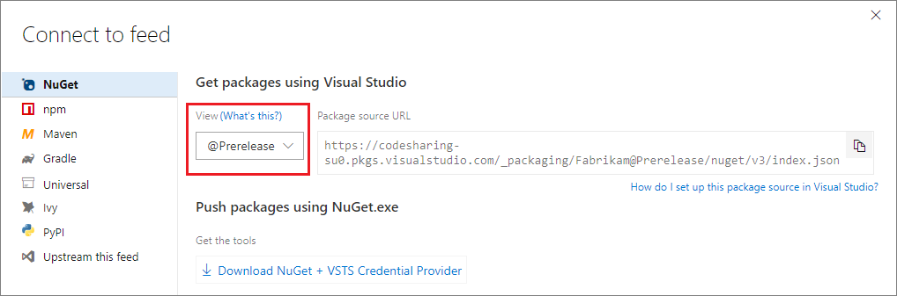

 

# Communicate package quality with release views

**Azure DevOps Services**

Views filter the feed to a subset of packages that meet criteria defined by the view.

Right now, the only [kind of view](#views-for-other-scenarios) is a *release view*. Release views contain the subset of the feed's package-versions that have been *promoted* into that view. Release views work with NuGet, npm, and Maven packages.

*If you've never used release views, read more about [why and how they're useful for package continuous integration and delivery](../concepts/views.md) before getting started.*

## Get started with release views

By default, every feed has two release views: `Prerelease` and `Release`.

### Promoting to a release view 
To promote a package-version into the release view:

1. Select the package
1. Click the Promote button
1. Select the view to promote to and select **Promote**

You can also promote using REST APIs. 

However, you cannot publish packages directly to a view (e.g. `nuget.exe publish -Source ...feed@view/nuget/...`). Instead, publish packages to the feed directly then promote them into a view. 

<!-- TODO REST API link -->

### Consuming from a release view
Once a package-version is in a release view, you can connect your package client to `feed@view` to see only packages in that release view. To do so:

1. Select **Connect to feed**
1. Copy the feed URL

<!-- 1. Optionally, select the view -->

For more details, see [Consume NuGet packages in Visual Studio](../nuget/consume.md), [Install npm modules](../get-started-npm.md), or [Install Maven artifacts](../maven/install.md).

If you have a release process with more steps or differently-named steps, you can [customize your views](#managing-views). 

## Use release views with continuous integration/delivery

Today, you can use the **NuGet** task in Team Build to automatically version your packages, then promote packages into a release view manually in the **Packages** page. In this case, make sure to check the **Include pre-release** button in the Visual Studio NuGet Package Manager extension, even when you're using the `Release` view.

You can also promote packages from a build or release using the [Promote package to Release View](https://marketplace.visualstudio.com/items?itemName=rvo.vsts-promotepackage-task) task from the Marketplace.

### What about SemVer and `-prerelease`?

Today, the **NuGet Publisher** build task uses the `-prerelease` part of a SemVer version number to insert build metadata and provide a monotonically increasing package version number to ensure that package [immutability constraints](../artifacts-key-concepts.md#immutability) are met. In an upcoming sprint, we expect to make improvements to this task to give you better control over the `-prerelease` field and better integration with release views.

## Managing views

You can create your own views and rename and delete existing views in the feed settings dialog.

[!INCLUDE [edit-feed](../_shared/edit-feed.md)]

In the edit feed dialog:
- Select **Release views**
- Make your changes
- Select **Save**

## Views for other scenarios

In time, we expect to provide views for a wider range of scenarios. For example, you might create a view to filter to packages from a certain author or with a certain OSS license. If you have a scenario you'd like to suggest, please visit the [Azure Artifacts UserVoice](https://visualstudio.uservoice.com/forums/330519-team-services/category/145266-package-management).
