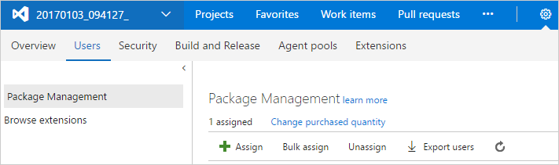
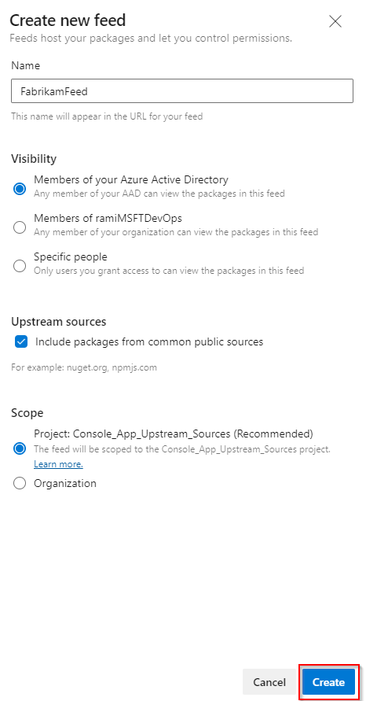

# Get started with npm packages in Azure Artifacts

Azure Artifacts supports publishing and consuming npm packages to and from Azure Artifacts feeds and public registries. Use this quickstart to create your feed, set up your .npmrc file, build your project, and publish your npm packages to your feed.

::: moniker range=">=tfs-2017 <= tfs-2018"

## License the Azure Artifacts extension

To use Azure Artifacts, you must upgrade to Visual Studio Team Foundation Server 2017. If the Azure Artifacts extension has been removed, you can install it from [Visual Studio Marketplace](https://marketplace.visualstudio.com/items?itemName=ms.feed).

### Assign licenses in Team Foundation Server

Each organization gets five free licenses. If you need more than five licenses, go to [Visual Studio Marketplace](https://marketplace.visualstudio.com/items?itemName=ms.feed), and select **Get it free**.

If you aren't sure, you can select **Start 30-day free trial**. Every user in your organization is then granted access to Azure Artifacts for 30 days. After the 30-day trial period, your organization reverts back to five entitled users, and you must assign licenses to individual users. If you need additional licenses at this point, you can purchase them from Visual Studio Marketplace. If you have a license for Visual Studio Enterprise, you already have access to Azure Artifacts and don't need to be assigned a license. Just ensure that you've been assigned the "Visual Studio Enterprise" access level.

> [!NOTE]
> If you selected **Start 30 day free trial** and are still in the trial period, every user is granted access. Licenses don't need to be assigned until the trial period ends. 

1. From any collection in Team Foundation Server, hover over the settings menu and select **Users**. Then select **Package Management**.

   > [!div class="mx-imgBorder"]
   > 

1. Select **Assign**, enter the users you want to assign licenses, and then select **OK**.

   * Users with Visual Studio Enterprise subscriptions get Azure Artifacts for free. Make sure that your Visual Studio Enterprise subscribers have the appropriate access level. For more information, see [Change access levels](../organizations/security/change-access-levels.md).

   * Users who are using an instance of Team Foundation Server that's disconnected from the internet (and thus can't purchase licenses from Visual Studio Marketplace) can still assign licenses purchased through an enterprise agreement.

::: moniker-end

## Create a feed

A feed is an organizational construct that allows users to store packages and control who can access them by modifying the feed permissions.

Feeds aren't dependent on the type of package. Azure Artifacts currently supports storing NuGet, npm, Maven, Python, and Universal packages in a single feed.

To create a new feed, select **Create feed** from within your feed, and fill out the form.

* **Name**: The feed name.
* **Visibility**: Choose who can upload or download packages to or from your feed.
* **Upstream sources**: If you want to add upstream sources to your feed such as *npmjs.org* or *NuGet.org*, select **Include packages from common public sources**. When upstream sources are enabled, your client can fetch packages from the public registry through your private feed, and your private feed will cache those packages for you. If you want to create your feed without connectivity to public registries, clear the **Upstream sources** check box. You can add them later if you choose to.

When you're done, select **Create**.

::: moniker range=">= azure-devops-2019"

> [!div class="mx-imgBorder"] 
> 

::: moniker-end

::: moniker range="<= tfs-2018"

> [!div class="mx-imgBorder"]
> 

::: moniker-end

You can change these settings later by editing the feed.

[!INCLUDE [edit-feed](includes/edit-feed.md)]

::: moniker range=">= azure-devops-2019"

## Set up your .npmrc files

All Azure Artifacts feeds require authentication. You store credentials for the feed before you can install or publish packages. npm uses [.npmrc configuration files](https://docs.npmjs.com/files/npmrc) to store feed URLs and credentials.

> [!NOTE]
> `vsts-npm-auth` isn't supported on on-premises Team Foundation Server and Azure DevOps Server.

### Find your .npmrc files

We recommend that you use two .npmrc files:

1. One .npmrc should live at the root of your Git repo where your project's package.json file is located.

   1. From **Artifacts**, select **Connect to feed**.

      > [!div class="mx-imgBorder"] 
      > 

   1. Select **npm** > **Get the tools**.

   1. Follow steps 1 and 2 to download the Node.js file, npm, and the artifacts credential provider.

   1. Select **Windows** if you're on a Windows Machine, or **Other** if you're on macOS or Linux.
   
   1. Follow the instructions in the **Project setup**, **Restore packages**, and **Publish packages** sections.

      > [!div class="mx-imgBorder"] 
      > 
        
2. On your development machine, you also have a .npmrc file in the **$home** folder for Linux or Mac systems, or in **$env.HOME** for Windows. This .npmrc file should contain credentials for all of the registries that you need to connect to. The NPM client looks at your project's .npmrc file, discovers the registry, and fetches matching credentials from **$home/.npmrc** or **$env.HOME/.npmrc**.

This enables you to share the project's .npmrc file with the whole team, while keeping your credentials secure.

### Set up authentication on your development machine

At this point, you should have a project-specific .npmrc file. This file contains only your feed's registry information that you discovered from the **Connect to feed** dialog box. There should be no credentials in this file. The file is usually stored in the same location as your project's package.json file.

> [!IMPORTANT]
> There can be only a single `registry=` line in your .npmrc file. Multiple registries are possible with [scopes](npm/scopes.md) and [upstream sources](npm/upstream-sources.md).

#### Windows

If you're developing on Windows, we recommend that you use `vsts-npm-auth` to fetch credentials and inject them into your ~/.npmrc file on a periodic basis. The easiest way to set this up is to install `vsts-npm-auth` globally (that is, `npm install -g vsts-npm-auth`), and then add a run script in your project's package.json file.

```json
"scripts": {
    "refreshVSToken": "vsts-npm-auth -config .npmrc"
}
```

#### Linux/Mac

If you're developing on Linux or Mac, `vsts-npm-auth` isn't supported. Instead, generate a token in the following manner for your $HOME/.npmrc file.

[!INCLUDE [](./includes/npm/npmrc.md)]

::: moniker-end

## Build your project

At this point, your project should have a package.json file and a .npmrc file in the same folder. Run `npm install` from the directory that contains both of these files. npm discovers your feed in the .npmrc file in the current working directory. It then fetches the credentials from your home directory's .npmrc file that you configured in the "Create a feed" section.

> [!NOTE]
> If you are using Yarn, run the following command to set the yarn registry: 
>
> `yarn config set registry "https://pkgs.dev.azure.com/<yourOrganization>/_packaging/<yourFeed>/npm/registry/"`


## Publish npm packages

You can now publish the npm package:

1. Browse to the directory that contains your package's package.json file.

1. Run `npm publish`.

This command authenticates to the feed by using the .npmrc configuration files that you had to set up earlier. For more information, see the [npm CLI docs](https://docs.npmjs.com/cli/publish).

Your npm package should now be available in your feed.

> [!IMPORTANT]
> Ensure that your working folder has an `.npmrc` file with a `registry=` line, as described in the **Connect to feed** screen in your feed. The build doesn't support using the `publishConfig` property to specify the registry to which you're publishing. If you include the `publishConfig` property in your package.json file, the build might fail with an unrelated authentication error.

## Download npm packages

[!INCLUDE [](includes/npm/install.md)]

## Next steps

> [!div class="nextstepaction"]
> [Publish npm packages (YAML/Classic)](../pipelines/artifacts/npm.md)
> [Use packages from npmjs.com](./npm/upstream-sources.md)
> [Use npm scopes](npm/scopes.md)
> [Use npm audit](npm/npm-audit.md)
