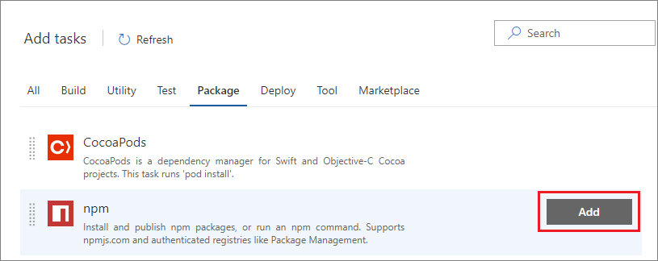

# Use npm to store JavaScript packages in Azure DevOps Services or TFS

**Azure DevOps Services** | **TFS 2018** | **TFS 2017**

This quickstart guides you through using npm to store JavaScript packages in Azure DevOps Services or Team Foundation Server (TFS). It covers installation, license assigning, and setup.

## Step 1: License the Azure Artifacts extension

::: moniker range="< azure-devops-2019" 

### Install Azure Artifacts in TFS

Azure Artifacts is installed by default for TFS 2017 customers. To use Azure Artifacts, you must upgrade to TFS 2017.

> If the Azure Artifacts extension has been removed, you can install it from the [Marketplace page for Azure Artifacts](https://marketplace.visualstudio.com/items?itemName=ms.feed).

::: moniker-end

::: moniker range=">= azure-devops-2019" 

### Assign Azure Artifacts in Azure DevOps Services

Each organization gets five free licenses. If you need more than five licenses, go to the [Marketplace page for Azure Artifacts](https://marketplace.visualstudio.com/items?itemName=ms.feed) and select **Get**. Select **Buy** and purchase the additional licenses that you need.  

Assign your licenses by following these instructions:

1. Go to your organization and select **Admin settings** on the lower left of the UX.
2. Select **Users**.
3. Select the user or users you want to assign the Azure Artifacts extension to, and select **Manage extensions**.
4. If you're selecting multiple users, select **Assign extensions** and choose the Azure Artifacts extension. If you're selecting only one user, select the Azure Artifacts box under **Extensions** and select **Save changes**.

If you have a Visual Studio Enterprise license, you already have access to Azure Artifacts and don't need to be assigned a license. Just ensure that you've been assigned the "Visual Studio Enterprise" access level.

1. Go to your account, go to the **Users** page, and select **Package Management**.
2. Select **Assign**, enter the users you want to assign licenses to, and then select **Ok**.

If you have a Visual Studio Enterprise license, you already have access to Package Management and don't need to be assigned a license. Just ensure that you've been assigned the "Visual Studio Enterprise" access level.

::: moniker-end

::: moniker range="< azure-devops-2019" 

### Assign licenses in TFS

Each organization gets five free licenses. If you need more than five licenses, go to the [Marketplace page for Azure Artifacts](https://marketplace.visualstudio.com/items?itemName=ms.feed) and select **Get**. Select **Buy** and purchase the additional licenses that you need.  

If you aren't sure, you can select **Start 30 day free trial**. Every user in your organization is then granted access to Azure Artifacts for 30 days. After the 30-day trial period, your organization reverts back to five entitled users, and you must assign licenses to individual users.  If you need additional licenses at this point, you can purchase them from this same dialog box in the Marketplace.

> If you selected **Start 30 day free trial** and are still in the trial period, every user is granted access. Licenses don't need to be assigned until the trial period ends. 

1. From any collection in TFS, hover over the settings menu and select the **Users** page. Then select **Package Management**.

   

1. Select **Assign**, enter the users you want to assign licenses, and then select **Ok**.

   * Users with Visual Studio Enterprise subscriptions get Azure Artifacts for free.  [Ensure that your Visual Studio Enterprise subscribers are assigned the Visual Studio Enterprise access level](../organizations/security/change-access-levels.md).

   * Users who are using an instance of TFS that's disconnected from the internet (and thus can't purchase licenses from the Marketplace) can still assign licenses purchased through an enterprise agreement.

::: moniker-end

## Step 2: Create a feed

On your first visit to **Azure Artifacts**, you're welcomed with an image that prompts you to create a new feed. Click the **+ New feed** button.

In the dialog box:
* Give the feed a name.
* **Visibility**: Choose who can read and contribute (or update) packages in your feed. An organization-visible feed is created with permissions that allow all users in the organization to see and use your feed (recommended). A private feed is created with permissions such that only you have access.
* **Upstream sources**: Selecting **Use packages from public sources through this feed** will add both the public npm (registry.npmjs.org) and NuGet (packages.nuget.org) packages as upstreams to your feed. When upstreams are enabled, your client (that is, npm and NuGet) can fetch packages from the public registry through your private feed, and your private feed will cache those packages for you. If you select **Use packages published to this feed**, your feed is created without connectivity to public registries. You can connect them later if you want.
* When you're done, select **Create**.

::: moniker range=">= azure-devops-2019"

> [!div class="mx-imgBorder"] 
>

::: moniker-end

::: moniker range="<= tfs-2018"


::: moniker-end

You can change these settings later by [editing the feed](./feeds/edit-feed.md).

## Step 3: Set up your .npmrc files

All Azure Artifacts feeds require authentication. You'll need to store credentials for the feed before you can install or publish packages. npm uses [.npmrc configuration files](https://docs.npmjs.com/files/npmrc) to store feed URLs and credentials.

### Find your .npmrc files

We recommend that you use two .npmrc files:

* One .npmrc file should be at the root of your Git repo, adjacent to your project's package.json file. It should contain a "registry" line for your feed. It should not contain credentials, because it will be checked into Git. You can find the registry information for your feed from the **Connect to feed** button:

  1. From **Azure Artifacts**, select **Connect to feed**.

     ::: moniker range=">= azure-devops-2019"

     > [!div class="mx-imgBorder"] 
     >

     ::: moniker-end

     ::: moniker range="<= tfs-2018"

     

     ::: moniker-end

  1. Copy the "registry" text:

     ::: moniker range=">= azure-devops-2019"

     > [!div class="mx-imgBorder"] 
     >

     ::: moniker-end

     ::: moniker range="<= tfs-2018"

     

     ::: moniker-end

  1. From your **Packages** page, select **Connect to feed**.

     

* On your development machine, you also have an .npmrc file in $home for Linux or Mac systems, or $env.HOME for Windows systems. This .npmrc file should contain credentials for all of the registries that you need to connect to. The npm client will look at your project's .npmrc file, discover the registry, and fetch matching credentials from $home/.npmrc or $env.HOME/.npmrc. The next section will discuss credential acquisition.

This enables you to share the project's .npmrc file with the whole team while keeping your credentials secure.

### Set up authentication on your development machine

At this point, you should have a project-specific .npmrc file that contains only your feed's registry information that you discovered from the **Connect to feed** dialog box. There should be no credentials in this file. The file is usually adjacent to your project's package.json file.

> [!IMPORTANT]
> There can be only a single "registry=" line in your .npmrc file.  Multiple registries are possible with [scopes](npm/scopes.md) and the new upstream feature (discussed here).

#### Windows

If you're developing on Windows, we recommend that you use `vsts-npm-auth` to fetch credentials and inject them into your ~/.npmrc file on a periodic basis. The easiest way to set this up is to install `vsts-npm-auth` globally (that is, `npm install -g vsts-npm-auth`) and then add a run script in your project's package.json file.

```json
"scripts": {
    "refreshVSToken": "vsts-npm-auth -config .npmrc"
}
```

#### Linux or Mac

If you're developing on Linux or Mac, `vsts-npm-auth` is not supported. We recommend generating a token in the following manner for your $HOME/.npmrc file.

[!INCLUDE [](./_shared/npm/npmrc.md)]

### Set up authentication in a build task

There are two options for setting up authentication in a build task:
* [Without a task runner](#without-a-task-runner)
* [With a task runner (for example, make Gulp work)](#with-a-task-runner-for-example-make-gulp-work)

#### Without a task runner
To set up npm authentication in a build task _without_ a task runner, use the following directions:

1. Add a build pipeline in Azure DevOps Services under the **Pipelines** page.

   ::: moniker range=">= azure-devops-2019"

   > [!div class="mx-imgBorder"] 
   > 

   ::: moniker-end

   ::: moniker range="<= tfs-2018"

   

   ::: moniker-end

1. Choose your source **Project**, **Repository**, and **Default branch**, and select **Continue**.

1. Select **Empty job** at the top of the form.

1. Add a task to **Agent job 1** of your build pipeline by selecting the plus sign (**+**):

   ::: moniker range=">= azure-devops-2019"

   > [!div class="mx-imgBorder"] 
   > 

   ::: moniker-end

   ::: moniker range="<= tfs-2018"

   

   ::: moniker-end

1. Select **Package** or search for **npm** on the search bar, select **npm**, and select **Add**:

   

1. Select the **npm install** task under **Agent job 1**:

   ::: moniker range=">= azure-devops-2019"

   > [!div class="mx-imgBorder"] 
   > 

   ::: moniker-end

   ::: moniker range="<= tfs-2018"

   

   ::: moniker-end

1. Browse to and select your folder under **Working folder with package.json**:

   

1. Expand **Custom registries and authentication**. Here you have a few options: 

   * **Registries in my .npmrc**

     

     > You can choose credentials to authenticate to outside of your current organization/collection by setting up [service connections.](../pipelines/library/service-endpoints.md#sep-npm)

   * **Registry I select here**

     

     When you choose this option, the task creates a temporary .npmrc file with credentials for the registry you've selected. The temporary file overrides the project's .npmrc file. This is useful when you want to publish to a specific feed. 


#### With a task runner (for example, make Gulp work)

When using a task runner, you'll need to add the **npm Authenticate** build task at the beginning of your build pipeline. This injects credentials into your project's .npmrc file and persists them for the lifespan of the build. This allows subsequent build steps to use the credentials in the .npmrc file.

1. Add a build pipeline in Azure DevOps Services under the **Pipelines** page.
    
   ::: moniker range=">= azure-devops-2019"

   > [!div class="mx-imgBorder"] 
   > 

   ::: moniker-end

   ::: moniker range="<= tfs-2018"

   

   ::: moniker-end

1. Choose your source **Project**, **Repository**, and **Default branch**, and select **Continue**.

1. Select **Empty process** at the top of the form.

1. Add a task to **Agent job 1** of your build pipeline by selecting the plus sign (**+**):

   ::: moniker range=">= azure-devops-2019"

   > [!div class="mx-imgBorder"] 
   > 

   ::: moniker-end

   ::: moniker range="<= tfs-2018"

   

   ::: moniker-end

1. Select **Package** or search for **npm** in the search bar, select **npm Authenticate**, and select **Add**:

   

1. Select the **npm Authenticate** task under **Agent job 1**:

   ::: moniker range=">= azure-devops-2019"

   > [!div class="mx-imgBorder"] 
   > 

   ::: moniker-end

   ::: moniker range="<= tfs-2018"

   

   ::: moniker-end

1. Browse to and select your file under **.npmrc file to authenticate**:

   

   > You can choose credentials to authenticate to outside your current organization or collection by setting up [service connections](../pipelines/library/service-endpoints.md#sep-npm).

1. After setting up your **npm Authenticate** task, you can add other build tasks for your task runner, like **Gulp**.

## Step 4: Use packages from npmjs.com

In addition to packages that you publish, you can use packages from [www.npmjs.com](https://www.npmjs.com/) through this feed via *upstream sources*. Because this feed was created with public registries enabled (see [Step 2](#step-2-create-a-feed)), you should be able to use packages from an upstream source. To try it, run an `npm install` command (for example, `npm install lodash`) in a shell opened to your project's folder. Learn more about upstream sources on the [upstream sources concepts page](concepts/upstream-sources.md).

You can choose to enable or disable upstream sources on the **Settings** > **Upstream sources** tab:

::: moniker range=">= azure-devops-2019"

> [!div class="mx-imgBorder"] 
> 

::: moniker-end

::: moniker range="<= tfs-2018"


::: moniker-end

## Step 5: Build your project

At this point, your project should have a package.json file and an .npmrc file adjacent to each other. Run `npm install` from the directory that contains both of these files. npm will discover your feed in the .npmrc file in the current working directory. It will then fetch credentials from your home directory's .npmrc file that you configured in [Step 2](#step-2-create-a-feed).

## Step 6: Publish an npm package

You can now publish the npm package:

1. Browse to the directory that contains your package's package.json file.

1. Run `npm publish`.

> The `npm publish` command will work because of the credentials that you acquired in [Step 3: Set up your .npmrc files](#step-3-set-up-your-npmrc-files).

If you have followed all of the steps up to this point, package publishing should simply work.

> [!IMPORTANT]
> If you have npmjs.com configured as an upstream and the package name/version exists in the public registry, you'll be blocked from publication. We don't support overriding packages that exist in the public registry.
