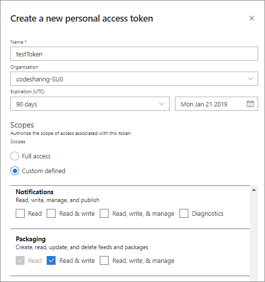

# Publish a Maven artifact using Gradle

**Azure DevOps Services** | **TFS 2018**

This topic covers creating and publishing a Maven artifact with Gradle using Azure DevOps Services.

## Prerequisites

Before you start, make sure you have the [Gradle build tool](https://gradle.org/install/) installed.

Note that Gradle itself requires a prior installation of the Java JDK or JRE (version 7 or later). If you don't have it already, you can get the Java JDK from this link: [Java SE Downloads](https://www.oracle.com/technetwork/java/javase/downloads/index.html).

To verify that you have the Java JDK or JRE version 7 or later installed, run the following command in an elevated command prompt:

```CLI
java -version
```

If the above command returns a java version then you can now install Gradle, otherwise go back and install Java JDK or JRE first. 

Once Gradle installation is complete, you can confirm the installation with the following command:

```CLI
gradle -v
```

You're ready to start! This tutorial will guide you through the process of publishing a Maven artifact using Gradle.

> [!NOTE]
> This topic assumes you have cloned your Git repo to your local machine. If you aren't sure how to clone your repo, read [Clone an existing Git repo](../../repos/git/clone.md).

## Set up authentication

First, you need a **gradle.properties** file that contains an Azure DevOps Services credential token.

::: moniker range=">= azure-devops-2019"

1. Navigate to `https://dev.azure.com/{yourOrganization}/_usersSettings/tokens`, where `{yourOrganization}` is the name of your organization.

1. Click **New Token**.

Give your token a name, duration, and select the **Packaging (read and write)** scope. 

> [!NOTE]
> You may have to choose "Show all scopes" at the bottom to see the Packaging area.



1. Click **Create**.

::: moniker-end

::: moniker range="<= tfs-2018"

1. Navigate to `https://dev.azure.com/{yourOrganization}/_usersSettings/tokens`, where `{yourOrganization}` is the name of your organization.

1. Click **Add**.


1. Give your new token a name and a duration. 

1. Select the **Packaging (read and write)** scope.


::: moniker-end

1. Copy your token and save it in a secure location. The token will be a long alphanumeric string, something like _"lzitaoxppojf6smpl2cxdoxybepfxfetjvtkmcpw3o6u2smgebfa"_.

1. Create a text file and name it: **gradle.properties** in your `.gradle` folder under the Gradle installation root directory. Typically, the path to your gradle folder is: `%INSTALLPATH%/gradle/user/home/.gradle/`.

1. Open the **gradle.properties** file with a UTF-8-capable text editor and add the following:

```ini
vstsMavenAccessToken=<PASTE_YOUR_TOKEN_HERE>
```

1. Replace _<PASTE_YOUR_TOKEN_HERE>_ with the token you created earlier. Save the file when you're done.

## Create a feed

[!INCLUDE [](../includes/create-feed.md)]

## Configure build.gradle 

1. Create a text file and name it **build.gradle** in the root of your cloned repo. 

1. Open it with a text editor and add the following snippet:

```groovy
apply plugin: 'java' 
apply plugin: 'maven-publish' 
 
publishing { 
    publications { 
        myPublication(MavenPublication) { 
            groupId '{your-group-ID-here}' 
            artifactId '{your-artifact-id-here}' 
            version '{your-version-number-here}' 
            artifact '{path-to-your-JAR-file-here}' 
        } 
    } 

    // Repositories *to* which Gradle can publish artifacts 
    repositories { 
        maven { 
            url 'https://pkgs.dev.azure.com/{OrganizationName}/{ProjectName}/_packaging/{FeedName}/maven/v1' 
            credentials { 
                username "{FeedName}"
                //The Azure DevOps Services build system will use the "SYSTEM_ACCESSTOKEN" to authenticate to Azure DevOps Services feeds 
                password System.getenv("AZURE_ARTIFACTS_ENV_ACCESS_TOKEN") != null ? System.getenv("AZURE_ARTIFACTS_ENV_ACCESS_TOKEN") : vstsMavenAccessToken 
            } 
        } 
    } 
} 
 
// Repositories *from* which Gradle can download dependencies; it's the same as above in this example
repositories { 
    maven { 
        url 'https://pkgs.dev.azure.com/{OrganizationName}/{ProjectName}/_packaging/{FeedName}/maven/v1' 
        credentials { 
            username "{FeedName}" 
            //The Azure DevOps Services build system will use the "SYSTEM_ACCESSTOKEN" to authenticate to Azure DevOps Services feeds 
            password System.getenv("AZURE_ARTIFACTS_ENV_ACCESS_TOKEN") != null ? System.getenv("AZURE_ARTIFACTS_ENV_ACCESS_TOKEN") : vstsMavenAccessToken 
        } 
    } 
} 
```

In the above example, you are publishing artifacts and downloading dependent artifacts from the same organization. You can configure publishing and downloading to use separate organizations, if you prefer. You can use the _project setup_ section, under **Connect to feed** > **Gradle**, as a guide to set up connection to your feed. 

> [!NOTE]
> You can use the Azure Artifacts connect to feed dialog box to copy the `maven` repository section to use in your build.gradle file.

1. Replace the following fields with your own values:

- `groupId`: A group ID you associate with your package. Give it a team or organization name so consumers can identify the origin easier.
- `artifactId`: Your artifact ID number that will be used when publishing your package. Again, give it a meaningful name that specifies the package type and version for example.
- `version`: Your package version. This number should be incremented for future iterations.
- `artifact`: Your `.jar` file path. Example: *./target/myJavaClasses.jar*.
- `feedName`: The name of your feed. If not specified, the default value will be `{OrganizationName}`.


## Publish your Maven package with Gradle

Run the following command in an elevated command prompt:

```CLI
gradle publish
```

Your new package will be named: `groupId:artifactId` and should show up in your Artifacts feed.
