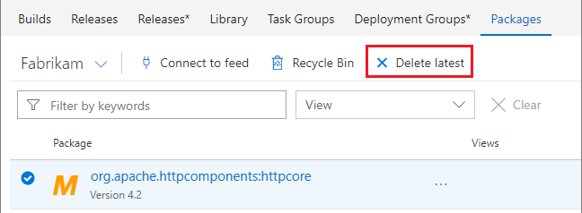
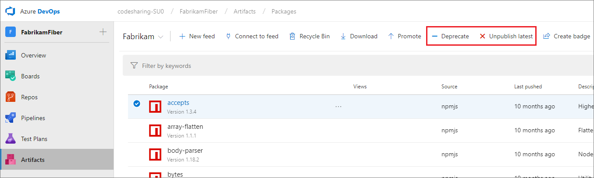
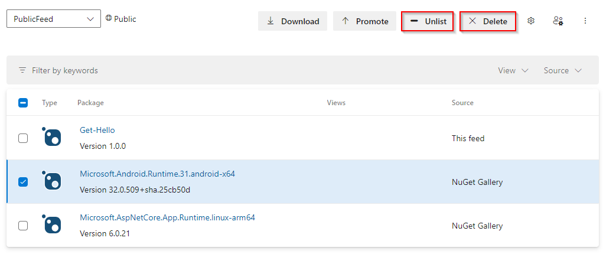
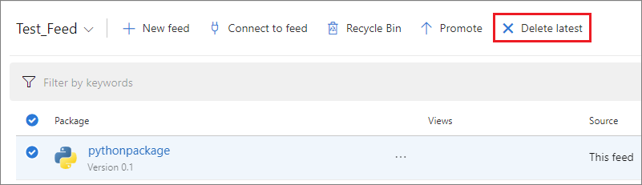
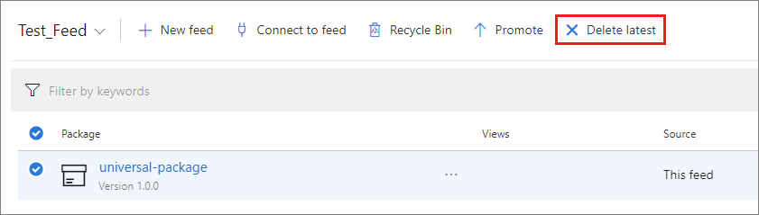
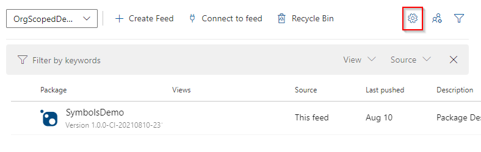
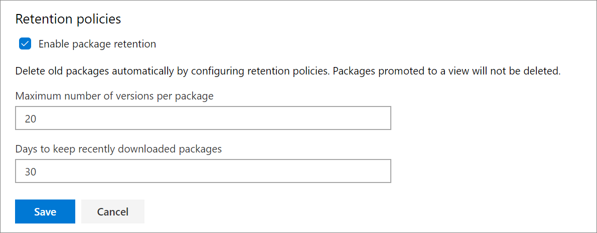
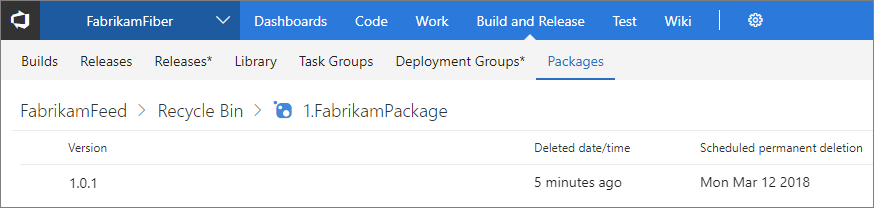

# Delete and recover packages

**Azure DevOps Services | Azure DevOps Server 2020 | Azure DevOps Server 2019 | TFS 2018 | TFS 2017**

Azure Artifacts keeps all of your artifacts safe for as long as you need them, whether you published them directly or saved them from upstream sources. But, as older artifacts fall out of use, you may want to clean them up or let Azure Artifacts remove them automatically. In this article, you’ll learn how to:

1. Delete packages from Azure Artifacts feeds.
1. Set up retention policies to automatically delete older, unwanted packages from feeds.
1. Recover recently deleted packages from the recycle bin.

> [!NOTE]
> To delete, recover packages and set up retention policies, you need to be an **Owner** of that particular feed.

## Delete packages from Azure Artifacts feeds

#### [Maven](#tab/maven/)
Choose the artifact from the **Packages** page in the **Build and Release** page group and select the appropriate option from the menu:

> [!div class="mx-imgBorder"]
> 

When you publish a particular version of a package to a feed, that version number is permanently reserved. You cannot upload a newer revision package with that same version number, or delete it and upload a new package at the same version.

#### [npm](#tab/npm/)
There are two options available to remove a version of an npm package from a feed.

1. **Deprecate:** deprecating a version of a package adds a deprecation message that most npm clients, and Azure DevOps Services, will show whenever the package is viewed or installed. 
Deprecating a version can help you discourage new usage of it by presenting a warning message when the package is installed.
2. **Unpublish:** Unpublishing a version of a package makes it unavailable to install. Unpublished packages can be restored from the Recycle Bin within 30 days of deletion. After 30 days, the package will be deleted permanently.

When you publish a particular version of a package to a feed, that version number is permanently reserved. You cannot upload a newer revision package with that same version number, or delete it and upload a new package at the same version.

::: moniker range=">= azure-devops-2019"

### Deprecate or unpublish an npm package

You must be a **contributor** to deprecate a package and an **owner** to unpublish it.


From within your feed, select the appropriate package and select **Deprecate** or **Unpublish**.

> [!div class="mx-imgBorder"]
> 

::: moniker-end

::: moniker range=">=tfs-2017 < azure-devops-2019"

### Deprecate or unpublish an npm package in TFS

You must be a **contributor** to deprecate and an **owner** to unpublish.

Select **Build and Release**, then **Packages**. select the appropriate package and select **Deprecate** or **Unpublish**.

> [!div class="mx-imgBorder"]
> 

::: moniker-end

### Deprecate or unpublish an npm package using npm
1. You must first [set up your client's npmrc](../npm/npmrc.md).
1. To deprecate a package, run the following command:
    ```
    npm deprecate <package>[@<version>] <message>
    ```
1. To unpublish a package, run the following command:
    ```
    npm unpublish <package>@<version>
    ```

> [!NOTE]
> `npm unpublish` will not unpublish all versions of the package.

See the [deprecate](https://docs.npmjs.com/cli/deprecate) or [unpublish](https://docs.npmjs.com/cli/unpublish) npm documentation for more info.

#### [NuGet](#tab/nuget/)
There are two options available to remove a version of a NuGet package from a feed.

1. **Unlist:** Unlisting a package version hides it from the search results, Visual Studio UI and from appearing on NuGet.org.
2. **Delete:**  Deleting a version of a package makes it unavailable to install. Deleted packages can be restored from the Recycle Bin within 30 days of deletion. The packages will be deleted permanently afterwards.

When you publish a particular version of a package to a feed, that version number is permanently reserved. You cannot upload a newer revision package with that same version number, or delete it and upload a new package at the same version.

::: moniker range=">= azure-devops-2019"

### Unlisting or deleting a NuGet package

You must be a **contributor** to unlist a package and an **owner** to delete it.

From within your feed, select the appropriate package and select **Unlist** or **Delete latest**.

> [!div class="mx-imgBorder"]
> 

::: moniker-end

::: moniker range=">=tfs-2017 < azure-devops-2019"

### Unlisting or deleting a NuGet package

You must be a **contributor** to unlist a package and an **owner** to delete it.

Select **Build and Release**, then **Packages**. select the appropriate package and select **Unlist** or **Delete latest**.

> [!div class="mx-imgBorder"]
> 

::: moniker-end

### Unlisting a NuGet package using NuGet.exe
1. Navigate to your feed and select **Connect to feed**

   ::: moniker range=">= azure-devops-2019"

    > [!div class="mx-imgBorder"] 
    > 

   ::: moniker-end

   ::: moniker range=">=tfs-2017 < azure-devops-2019"

    > [!div class="mx-imgBorder"]
    > 

   ::: moniker-end

2. Select **NuGet.exe** then find and Copy the _Package Source_ URL.

3. Run the following command:

    ```
    nuget.exe delete {your_package_id} {version} -Source {feed URL} -ApiKey key
    ```

NuGet.exe currently only performs the **unlist** packages operation. Azure DevOps Services and TFS interpret the `nuget.exe delete` command as an **unlist** operation. To **delete** a package, you must use the REST API or the web interface.

#### [Python](#tab/python/)
You must be an **owner** to delete a Python package.

From within your feed, select the appropriate package and select **Delete latest**.

> [!div class="mx-imgBorder"]
> 

#### [Universal](#tab/universal/)
You must be an **owner** to delete a Universal Package.

From within your feed, select the appropriate package and select **Delete latest**.

> [!div class="mx-imgBorder"]
> 

* * *

> [!NOTE]
> Packages that are placed in the recycle bin will be deleted permanently after 30 days. However, these packages still count as part of your storage bill. If you want to delete them sooner, you can navigate to the recycle bin and delete them manually.

## Automatically delete old package versions with retention policies

Over time, the number of versions for each package being hosted in your feed can grow quickly. You can set up retention policies to automatically delete old packages and save storage space.

- **maximum number of versions**: allow you to chose how many versions of a package you want to keep.
- **days to keep recently downloaded packages**. Packages will be deleted only if they have not been downloaded for the number of days set in here.

If you'd like to retain a package indefinitely, you can promote it to a [view](../concepts/views.md). Versions that got promoted to views are exempt from retention policies and will not be deleted.

> [!NOTE]
> Package demotion is not currently supported. If you want this feature to be added to future releases, please feel free to **Suggest a feature** on our [Azure DevOps Developer Community](https://developercommunity.visualstudio.com/spaces/21/index.html). See [Get started with feed views](../feeds/views.md#get-started-with-feed-views) for more information.

To configure retention policies:

::: moniker range=">= azure-devops-2019"

1. Navigate to Azure Artifacts.

    > [!div class="mx-imgBorder"]
    > 

2. Select the gear icon in your feed and select **Feed settings**.
    > [!div class="mx-imgBorder"]
    > 

2. From the **Feed details** tab, in the **Retention policies** setting, enter the maximum number of versions per package to retain, and the number of days to keep recently downloaded packages.
    > [!div class="mx-imgBorder"]
    > 

3. Select **Save**.

::: moniker-end

::: moniker range=">=tfs-2017 < azure-devops-2019"

1. Select **Build and Release**, then **Packages** to navigate to your feed and select the gear icon. 
    > [!div class="mx-imgBorder"]
    > 

2. From the **Retention** tab, enter the maximum number of versions per package to retain.
    > [!div class="mx-imgBorder"]
    > 

3. Select **Save**.

::: moniker-end

> [!NOTE]
> When you enable retention policies, a version of a package will be deleted when **both** of the following criteria are met:
> 1. The number of published versions of that package reaches the **maximum number of versions** limit, **AND** 
> 2. A version of that package has not been downloaded within the number of **days to keep recently downloaded packages**.

## Recover a deleted package from the recycle bin

Deleted packages will remain in the recycle bin for 30 days after which it will be permanently deleted. You must be assigned an **owner** role in order for you to recover deleted packages.

::: moniker range=">= azure-devops-2019"

1. Select Azure Artifacts.

    > [!div class="mx-imgBorder"]
    > 

2. Select "Recycle Bin".

3. Select the appropriate package then select the package version.

4. Select **Restore to feed**.

::: moniker-end

::: moniker range=">=tfs-2017 < azure-devops-2019"

1. Select **Build and Release**, then **Packages** to navigate to your feed and select **Recycle bin**. 
    > [!div class="mx-imgBorder"]
    > 

2. Select the appropriate package then select the package version.
    > [!div class="mx-imgBorder"]
    > 

3. Select **Restore to feed**.
    > [!div class="mx-imgBorder"]
    > 

::: moniker-end

## Q&A

### Q: What happens with old/existing packages when we enable retention policies?

A: Those packages will get soft-deleted and moved to the recycle bin. The deletion job runs once a day but there could be an initial delay after the policy is turned on for the first time due to an influx of packages. Packages remain in the recycle bin for 30 days before they are permanently deleted. To remove the packages from your billable storage, you can chose to delete them manually using the UI or the REST API before the 30 days is up. 

## What's next?

- [Set up upstream sources](./set-up-upstream-sources.md)
- [Configure permissions](../feeds/feed-permissions.md)
- [Promote a package to a view](../feeds/views.md)
