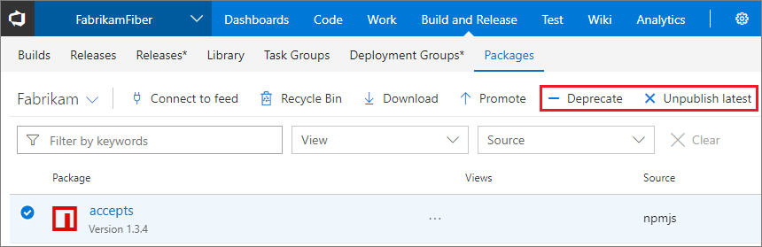
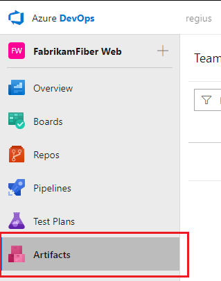
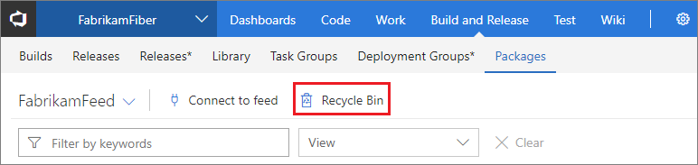

# Delete packages and recover deleted packages from the recycle bin in Azure Artifacts

Azure Artifacts keeps all of your artifacts safe for as long as you need them, whether you published them directly or saved them from upstream sources. But, as older artifacts fall out of use, you may want to clean them up or let Azure Artifacts clean them up automatically. In this article, you’ll learn how to:

1. Delete packages from feeds in Azure Artifacts
1. Set up retention policies to automatically delete older, unwanted packages from feeds
1. Recover recently deleted packages from the recycle bin

## Delete packages from Azure Artifacts feeds

# [Maven](#tab/maven)

You must be an **owner** to delete an artifact.

Choose the artifact from the **Packages** page in the **Build and Release** page group and select the appropriate option from the menu:


Deleting packages respects [feed immutability](../feeds/immutability.md). Once you publish a particular version of a package to a feed, that version number is permanently reserved. You cannot upload a newer revision package with that same version number, or delete it and upload a new package at the same version.

# [npm](#tab/npm)

There are two options available to remove a version of an npm package from a feed.

1. **Deprecate:** deprecating a version of a package adds a deprecation message that most npm clients, and Azure DevOps Services, will show whenever the package is viewed or installed. 
Deprecating a version can help you discourage new usage of it by presenting a warning message when the package is installed.
2. **Unpublish:** Unpublishing a version of a package makes it unavailable for install. After unpublishing, a package can be [restored from the Recycle Bin](#recover-a-deleted-package-from-the-recycle-bin) within 30 days of deletion. After 30 days, it is permanently unavailable to restore. Unpublishing a package will cause others that depend on it to break.

Deprecate and unpublish both respect [feed immutability](../feeds/immutability.md). Once you publish a particular version of a package to a feed, that version number is permanently reserved. You cannot upload a newer revision package with that same version number, or delete it and upload a new package at the same version.

::: moniker range="azure-devops"

### Deprecate or unpublish an npm package in Azure DevOps Services

You must be a **contributor** to deprecate and an **owner** to unpublish.


Choose the package from **Azure Artifacts** select the appropriate option from the menu:


Choose the package from the **Packages** page in the **Build and Release** page group and select the appropriate option from the menu:



::: moniker-end

::: moniker range=">=tfs-2017 < azure-devops"

### Deprecate or unpublish an npm package in TFS

You must be a **contributor** to deprecate and an **owner** to unpublish.

Choose the package from the **Packages** page in the **Build and Release** page group and select the appropriate option from the menu:


::: moniker-end

### Deprecate or unpublish an npm package using npm
1. [Set up the npm client with your feed](../npm/npmrc.md).
2. Deprecate a package by running `npm deprecate <package>[@<version>] <message>`.
3. Unpublish a package by running `npm unpublish <package>@<version>`. 

At this time, it's not possible to use `npm unpublish <package>` to unpublish all versions.

See the [deprecate](https://docs.npmjs.com/cli/deprecate) or [unpublish](https://docs.npmjs.com/cli/unpublish) CLI docs for more info.

# [NuGet](#tab/nuget)

There are two options available to remove a version of a NuGet package from a feed.

1. **Unlist:** Unlisting a version of a package modifies how the package appears in NuGet clients (see the [NuGet docs](/nuget/policies/deleting-packages) for a full description of how unlist works). Unlisting a version can help you prevent new usage of it without breaking dependent projects and builds.
2. **Delete:**  Deleting a version of a package makes it unavailable for install. After deleting, a package can be [restored from the Recycle Bin](#recover-a-deleted-package-from-the-recycle-bin) within 30 days of deletion. After 30 days, it is permanently unavailable to restore. Deleting a package will cause others that depend on it to break.

Unlist and delete both respect [feed immutability](../feeds/immutability.md). Once you publish a particular version of a package to a feed, that version number is permanently reserved. 
You cannot upload a newer revision package with that same version number, or delete it and upload a new package at the same version.

::: moniker range=">= azure-devops-2019"

### Unlisting or deleting a NuGet package in Azure DevOps Services

You must be a **contributor** to unlist and an **owner** to delete.

Choose the package from **Azure Artifacts** and select the appropriate option from the menu:


::: moniker-end

::: moniker range="<= tfs-2018"

Choose the package from the **Packages** page in the **Build and Release** page group and select the appropriate option from the menu:


::: moniker-end

::: moniker range=">=tfs-2017 < azure-devops"

### Unlisting or deleting a NuGet package in Team Foundation Server

You must be a **contributor** to unlist and an **owner** to delete.

Choose the package from the **Packages** page in the **Build and Release** page group and select the appropriate option from the menu:


::: moniker-end

### Unlisting a NuGet package using NuGet.exe
1. Get your feed URL by navigating to your feed and selecting **Connect to feed**:

   ::: moniker range=">= azure-devops-2019"

   > [!div class="mx-imgBorder"] 
   >
   > 

   ::: moniker-end

   ::: moniker range="<= tfs-2018"

   

   ::: moniker-end

2. Copy the _Package Source URL_ from the **Connect to feed** window.

3. Then, run:

```no-highlight
nuget.exe delete {your_package_id} {version} -Source {feed URL} -ApiKey key
```

Currently, NuGet.exe can only **unlist** packages; Azure DevOps Services and TFS interpret `nuget.exe delete` as an unlist operation to be consistent with NuGet.org. To **delete** a package, you must use either the REST APIs or the web interface. 

# [Python](#tab/python)

You must be an **owner** to delete a Python package.

Choose the package from **Azure Artifacts** and select _Delete latest_ from the menu:


# [Universal](#tab/universal)

You must be an **owner** to delete a Universal Package.

Choose the package from **Azure Artifacts** and select _Delete latest_ from the menu:


---

## Automatically delete old package versions with retention policies

Over time, the number of versions for each package being hosted in Azure Artifacts or Team Foundation Server (TFS) can grow quickly. You can configure retention policies to automatically delete old packages in Azure DevOps Services or TFS to improve client performance and release storage space.

With retention policies, you can set the **maximum number of versions** to retain per package, once that number is hit the oldest version of the package will be deleted. You can also set the number of **days to keep recently downloaded packages**. Packages will only be deleted by retention policies if they have existed longer than the number of days set.

If you'd like to retain a package version indefinitely, you can promote it to a view. Versions that are promoted to views are exempt from retention policies and do not count towards the maximum number of versions retention policy. Retention policies will not delete any version that has been promoted to a view.

To configure retention policies:

::: moniker range=">= azure-devops-2019"

1. Navigate to Azure Artifacts:

    

2. Select the gear icon in your feed and select **Feed settings**:

    

2. From the **Feed details** tab, in the **Retention policies** setting, enter the maximum number of versions per package to retain, and the number of days to keep recently downloaded packages:

    

3. Click **Save**.

::: moniker-end

::: moniker range="<= tfs-2018"

1. Navigate to your feed from the **Packages** page in the **Build and Release** page group and select the gear icon: 

    

2. From the **Retention** tab, enter the maximum number of versions per package to retain:

    

3. Click **Save**.

::: moniker-end

## Recover a deleted package from the recycle bin

If you've deleted/unpublished an npm package, NuGet package, or Maven artifact from Azure Artifacts, builds that depend on that package will start to fail.  You won't be able to repush that package to the feed because of [immutability](../artifacts-key-concepts.md#immutability).  In order to recover the package and have builds start working again, you can recover it from the Recycle Bin.

::: moniker range=">= azure-devops-2019"

1. Navigate to Azure Artifacts:

    

2. Select "Recycle Bin".

 > Once in the Recycle Bin, you will see any packages that have been deleted from the current feed in the **past 30 days**.
 
3. Click on a package to get more details such as *Version*, *Deleted date/time*, and *Scheduled permanent deletion*.

4. Select a version to *Restore to feed*.

::: moniker-end

::: moniker range="<= tfs-2018"

1. Find the Recycle Bin in the **Packages** page underneath the **Build and Release** page group in Azure DevOps Services: 

    

    > Once in the Recycle Bin, you will see any packages that have been deleted from the current feed in the **past 30 days**.

2. Click a package to get more details such as: *Version*, *Deleted date/time*, and *Scheduled permanent deletion:*

    

3. Select a version to *Restore to feed:*

    

::: moniker-end
