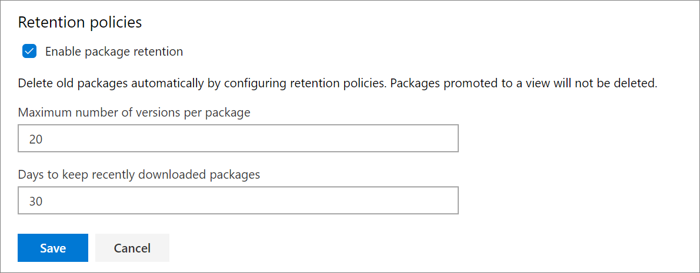

# Automatically delete old package versions using retention policies in Azure DevOps Services or TFS

**Azure DevOps Services** | **TFS 2018** | **TFS 2017**

Over time, the number of versions for each package being hosted in Azure DevOps Services or Team Foundation Server (TFS) can get grow quickly. You can configure retention policies to automatically delete old packages in Azure DevOps Services or TFS to improve client performance and release storage space. 

Retention policies allow the user to set a number of versions to retain per package, once that number is hit the oldest version of the package will be deleted. 

If you'd like to retain a package version indefinitely, you can promote it to a view. Versions that are promoted to views will not be deleted and do not count toward the version limit.

## Configure retention policy

To configure retention policies:

1. Edit your feed from the **Packages** page in the **Build and Release** page group: ```https://dev.azure.com/<organization_name>/<project_name>/_packaging?feed=<feed_name>&_a=settings```

    

2. From the **Retention** tab, select the maximum number of versions per package to retain:

    

