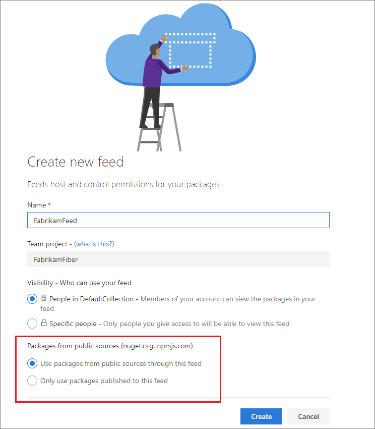
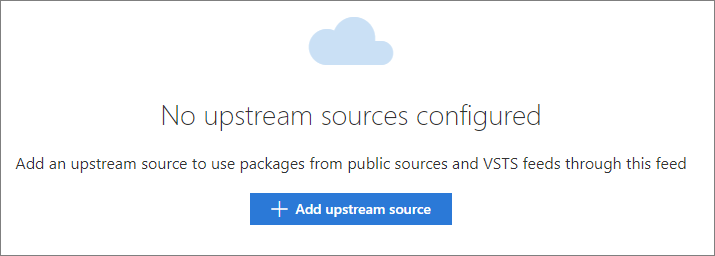
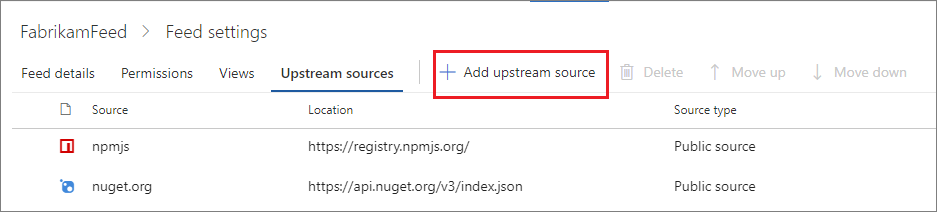
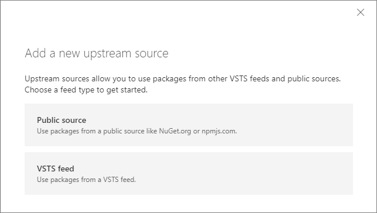
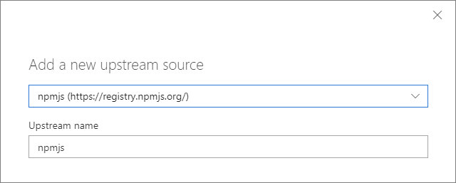
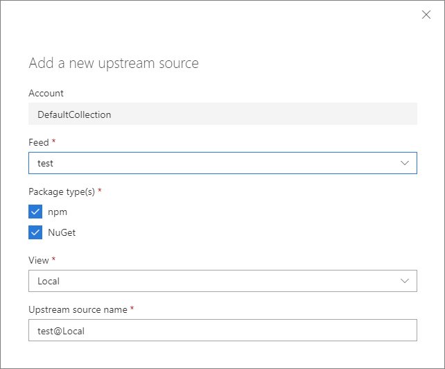
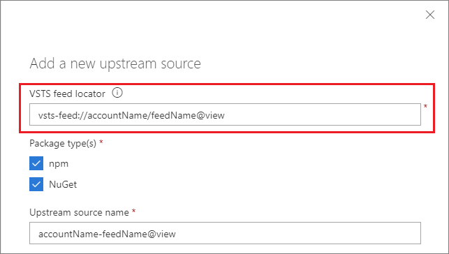
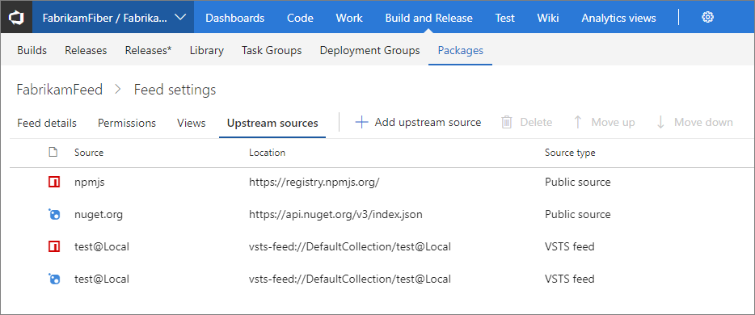

# Configure upstream sources for Azure DevOps Services and TFS packages

Upstream sources enable you to use a single feed to store both the packages you produce and the packages you consume from "remote feeds": both public feeds (e.g. npmjs.com and nuget.org) and authenticated feeds (i.e. other Azure DevOps Services feeds in your organization or organization). Once you've enabled an upstream source, any user connected to your feed can install a package from the remote feed, and your feed will save a copy.

For more in-depth information on the concepts and best practices regarding upstream sources, check out the [upstream sources concepts documentation](../concepts/upstream-sources.md).

## Create a new feed that uses upstream sources

Navigate to the **Packages** page and select "New Feed".

Underneath _Upstream Sources_, select _Use packages from public sources through this feed_.



Selecting this option now means **nuget.org** or **npmjs.org** do not have to be included in your nuget.config or npm config files to use packages from there.

> [!NOTE]
> You can add Azure DevOps Services feeds as upstream sources as well following the directions below.

## Add upstream sources to existing feed

1. From your feed page, go to **Feed settings**
2. On the upstream sources tab, if you don't have any upstream sources you will see the below dialog where you can choose _Add upstream source_:

    

    If you do already have upstreams, you can select "Add upstream source" in the top menu:

    

3. You will see the following menu, choose if you'd like to add public sources or Azure DevOps Services feeds 

    > Public sources may be greyed out if you chose to include public upstream sources when creating the feed and they already exist in your upstream sources.

    

    For public sources, choose **npmjs** or **nuget**:

    

    > [!NOTE] 
    > **Attention Microsoft Users:** For Azure DevOps Services feeds, the steps are different depending on whether or not your organization is in an enterprise.
    
    If your organization **isn't** in an enterprise, select the feed that you would like to configure as an upstream source, and the rest of the fields will populate automatically

    

    If your organization **is** in an enterprise, input the **Azure DevOps Services feed locator** (this can be found from the _Connect to feed_ panel of the feed you want to use as an upstream)

    

### Adding Azure DevOps Services feeds as upstream sources

The view we picked is the "default view". The default view is covered in the [views concepts page](../concepts/views.md), but simply put it's the set of packages that the feed owner believes should be consumed and has chosen to release by default.

Once you add an upstream source, you can see it in the list of upstream sources for your feed.



## Consuming NuGet packages from upstream sources

Now you can open Visual Studio and install packages from the upstream sources you've configured. As covered already on the [consume NuGet packages documentation](../nuget/consume.md), You'll need to use these instructions to install packages from the upstream:

1.	On the upstream source (e.g. nuget.org), copy the Install-Package command
2.	In Visual Studio, open the Package Manager Console from Tools > NuGet Package Manager
3.	Paste the Install-Package command into the Package Manager Console and run it

Remember that you must be a Collaborator, Contributor, or Owner to install new packages from the upstream, as a copy of each upstream package you use is saved to the feed on first use. Packages already saved from an upstream source can be used by Readers.

## Consuming npm packages from upstream sources

Now you can open your favorite shell and install packages from the upstream sources you’ve configured. Just run:

```
npm install --save <package>
```

See the [npm install docs](../get-started-npm.md) for more details.

Remember that you must be a Collaborator, Contributor, or Owner to install new packages from the upstream, as a copy of each upstream package you use is saved to the feed on first use. Packages already saved from an upstream source can be used by Readers.