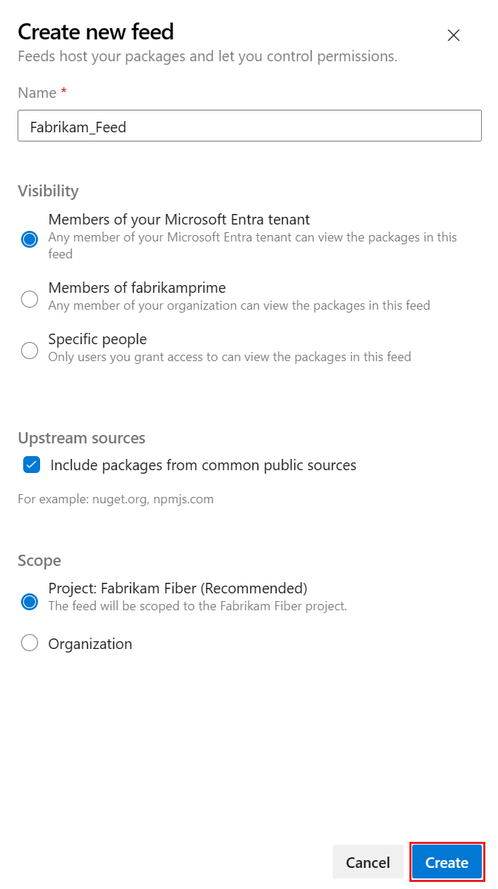
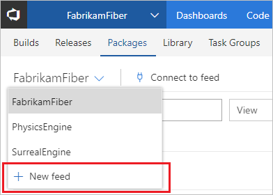

With Azure Artifacts, you can create two types of feeds: project-scoped and organization-scoped feeds. All public feeds are project-scoped and they inherit the hosting project's visibility settings. By default, any feed that's created by using the web UI is a project-scoped feed, as follows.

::: moniker range=">= azure-devops-2019"

1. From within your project, navigate to **Azure Artifacts**.

   > [!div class="mx-imgBorder"] 
   > 

1. Select **Create Feed**.

   > [!div class="mx-imgBorder"] 
   > 

1. Give your feed a **Name** and choose its **visibility**, **upstream sources**, and **scope** settings.

   > [!div class="mx-imgBorder"] 
   > 

1. Select **Create** when you are done.

::: moniker-end

::: moniker range=">= tfs-2017 <= tfs-2018"

Azure Artifacts is installed by default for TFS 2017 customers. You must upgrade to TFS 2017 in order to use Azure Artifacts. If this is the first time using your feed, you might be asked to [assign a license](../start-using-azure-artifacts.md?preserve-view=true&view=tfs-2018#assign-licenses-in-tfs)

1. Go to **Build & Release** and select **Packages**.

   > [!div class="mx-imgBorder"] 
   > 

1. Select **+ New feed**.

   > [!div class="mx-imgBorder"] 
   > 

1. Give your feed a **Name**, a **Description**, and set up **who can read**, **who can contribute** and if you want to **Include external packages**.

   > [!div class="mx-imgBorder"] 
   > 

1. Select **Create** when you are done.

::: moniker-end
