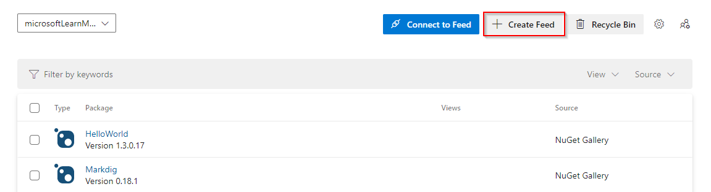

::: moniker range=">= azure-devops-2019"

1. Select **Artifacts**, and then select **Create Feed**.

   > [!div class="mx-imgBorder"] 
   > 

1. Give your feed a **Name** and choose its **visibility** (who can view packages in this feed), **upstream sources**, and **scope** (project-scoped or organization-scoped) settings.

   > [!div class="mx-imgBorder"] 
   > 

1. Select **Create** when you are done.

::: moniker-end

::: moniker range="tfs-2018"

Azure Artifacts is installed by default for TFS 2017 customers. You must upgrade to TFS 2017 in order to use Azure Artifacts. If this is the first time using your feed, you might be asked to [assign a license](../start-using-azure-artifacts.md?preserve-view=true&view=tfs-2018#assign-licenses-in-tfs)

1. Go to **Build & Release** and select **Packages**.

   > [!div class="mx-imgBorder"] 
   > 

1. Select **+ New feed**.

   > [!div class="mx-imgBorder"] 
   > 

1. Give your feed a **Name**, a **Description**, and set up **who can read**, **who can contribute** and if you want to **Include external packages**.

   > [!div class="mx-imgBorder"] 
   > 

1. Select **Create** when you are done.

::: moniker-end
