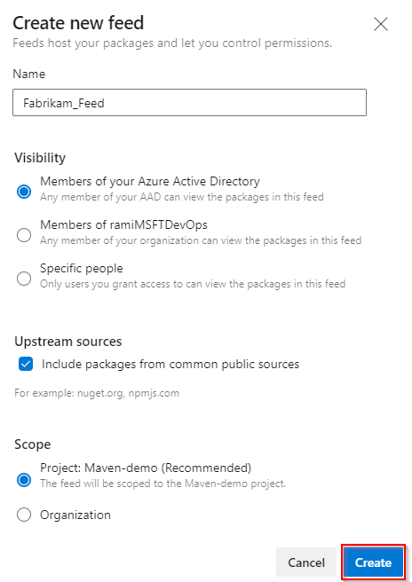

There are two types of feeds: project scoped and organization scoped feeds. All public feeds are project-scoped and they inherit the visibility settings of the hosting project.

::: moniker range=">= azure-devops-2019"

1. Go to **Azure Artifacts**.

   > [!div class="mx-imgBorder"] 
   > 

2. Select **Create Feed**.

   > [!div class="mx-imgBorder"] 
   > 

3. Give your feed a **Name** and choose its **visibility**, **upstream sources** and **scope**.

   > [!div class="mx-imgBorder"] 
   > 

   > [!NOTE]   
   > Enabling upstream sources allow you to use your favorite OSS packages and gives you more protection against outages and corrupted or compromised packages.

4. Select **Create**.

::: moniker-end

::: moniker range=">= tfs-2017 < azure-devops-2019 "

Azure Artifacts is installed by default for TFS 2017 customers. You must upgrade to TFS 2017 in order to use Azure Artifacts. If this is the first time using your feed, you might be asked to [assign a license](../start-using-azure-artifacts.md?preserve-view=true&view=tfs-2018#assign-licenses-in-tfs)

1. Go to **Build & Release** and select **Packages**.

   > [!div class="mx-imgBorder"] 
   > 

2. Select **+ New feed**.

   > [!div class="mx-imgBorder"] 
   > 

3. Give your feed a **Name**, a **Description**, and set up **who can read**, **who can contribute** and if you want to **Include external packages**.

   > [!div class="mx-imgBorder"] 
   > 

   > [!NOTE]   
   > Enabling upstream sources allow you to use your favorite OSS packages and gives you more protection against outages and corrupted or compromised packages.

::: moniker-end

See [Set feeds and views permissions ](../feeds/feed-permissions.md) to learn more about managing your feeds.