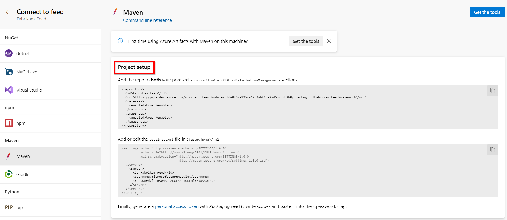

To talk to Azure Artifacts feeds, you'll need a token on your local machine that Maven can pick up and pass to Azure DevOps Services.  

   ::: moniker range=">= azure-devops-2019"

1. From the **Azure Artifacts** page, select **Connect to Feed**.
   
   > [!div class="mx-imgBorder"] 
   >
   > 

   ::: moniker-end

   ::: moniker range=">= tfs-2018 < azure-devops-2019"

2. From the **Packages** page, select **Connect to Feed**.

   

   ::: moniker-end

3. Open the **Maven** tab under the maven header.

   * Maven pulls credentials from your **settings.xml** file.
   
   * On Linux, the file path is usually `"${user.home}/.m2/settings.xml"`.
   
   * On macOS, the file path is usually `"~/.m2/settings.xml"`.
   
   * On Windows, the file path is usually `"%USERPROFILE%/.m2/settings.xml"`.
   
   * If the file doesn't exist, create one now.
   
   > [!TIP]
   > To make sure you create and save your new XML file in the correct format, set File Explorer to show file name extensions:
   > 1. In File Explorer, select the **View** tab.
   > 1. Under **Show/hide**, select the **File name extensions** check box to see your files extensions in File Explorer.

4. If you haven't installed Maven on your machine, you can select **Get the tools** to download and install it.

5. Follow the **Project setup** section including generating a personal access token.

   > [!div class="mx-imgBorder"] 
   >
   >

You can find more information about the settings.xml file in the [settings.xml reference](https://maven.apache.org/settings.html).
