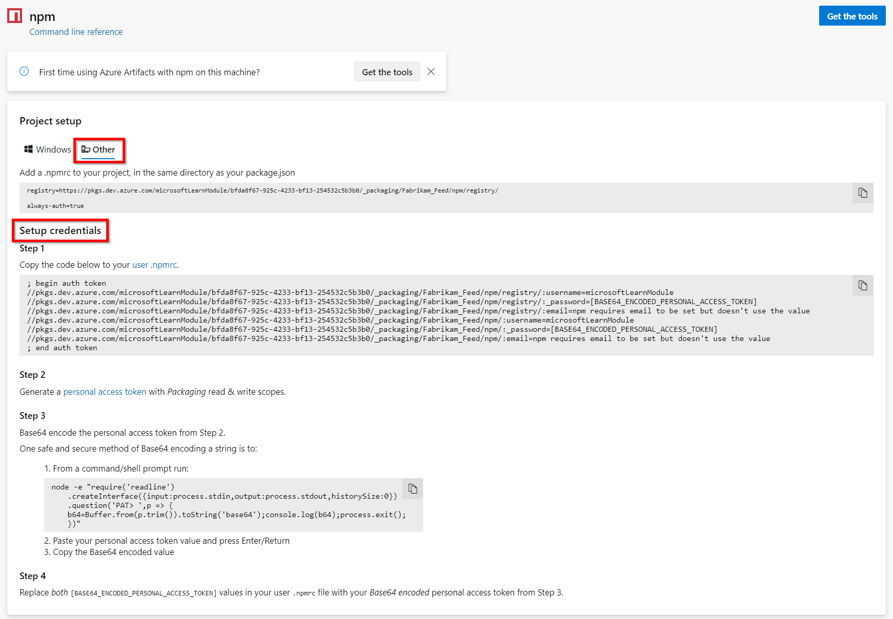

The **Connect to feed** dialog box generates an appropriately formatted token that you can place into your .npmrc file with a lifespan of 90 days.

<a id="tokenpast90"></a>

> [!TIP]
> If you want to create a token that lasts longer than 90 days, make sure you change the default expiration date.

**Project setup:**

::: moniker range=">= azure-devops-2019"

1. From **Azure Artifacts**, select **Connect to feed**.

1. Select **npm**.

1. Select **Other** in the **Project setup** section.

   > [!div class="mx-imgBorder"] 
   > 

1. Add a .npmrc to your project, in the same directory as your package.json

    ```JSON
    registry=https://pkgs.dev.azure.com/<yourOrganization>/_packaging/<yourFeed>/npm/registry/
    
    always-auth=true
    ```

**Set up credentials:**

Set up credentials by following these four steps:

1. **Step 1**:  
    Copy the code below to your user `.npmrc` file.

    ```
    ; begin auth token
    //pkgs.dev.azure.com/<yourOrganization>/_packaging/<yourFeed>/npm/registry/:username=[ANY_VALUE_BUT_NOT_AN_EMPTY_STRING]
    //pkgs.dev.azure.com/<yourOrganization>/_packaging/<yourFeed>/npm/registry/:_password=[BASE64_ENCODED_PERSONAL_ACCESS_TOKEN]
    //pkgs.dev.azure.com/<yourOrganization>/_packaging/<yourFeed>/npm/registry/:email=npm requires email to be set but doesn't use the value
    //pkgs.dev.azure.com/<yourOrganization>/_packaging/<yourFeed>/npm/:username=[ANY_VALUE_BUT_NOT_AN_EMPTY_STRING]
    //pkgs.dev.azure.com/<yourOrganization>/_packaging/<yourFeed>/npm/:_password=[BASE64_ENCODED_PERSONAL_ACCESS_TOKEN]
    //pkgs.dev.azure.com/<yourOrganization>/_packaging/<yourFeed>/npm/:email=npm requires email to be set but doesn't use the value
    ; end auth token
    ```

2. **Step 2**:  
    Generate a [personal access token](/azure/devops/organizations/accounts/use-personal-access-tokens-to-authenticate) with Packaging read & write scopes.

3. **Step 3**:  
    Base64 encode the personal access token from Step 2. Follow the steps below to safely encode your PAT:

    1. From a command/shell prompt run the following:
        
        ```
        node -e "require('readline') .createInterface({input:process.stdin,output:process.stdout,historySize:0}) .question('PAT> ',p => { b64=Buffer.from(p.trim()).toString('base64');console.log(b64);process.exit(); })"
        ```

        Other options to convert your personal access token to Base64:

        # [Windows](#tab/windows)
        ```powershell
        [Convert]::ToBase64String([system.Text.Encoding]::UTF8.GetBytes("YOUR_PAT_GOES_HERE"))
        ```
    
        # [Mac](#tab/mac)
        ```
        echo -n "YOUR_PAT_GOES_HERE" | base64
        ```

    2. Paste your personal access token value and press Enter/Return.
    3. Copy the Base64 encoded value.

4. **Step 4**:  
    Replace both `[BASE64_ENCODED_PERSONAL_ACCESS_TOKEN]` values in your user `.npmrc` file with your Base64 _encoded _personal access token_ from Step 3. You should also replace `yourOrganization` and `yourFeed`, and fill in your username, your PAT, and email.

::: moniker-end

::: moniker range=">=tfs-2017 < azure-devops-2019"

1. From the **Packages** page, select **Connect to feed**.

2. Select **npm**.

3. Select **Generate npm credentials**. Copy the credentials to add them to your user .npmrc file manually:
    > [!div class="mx-imgBorder"] 
    >

::: moniker-end
