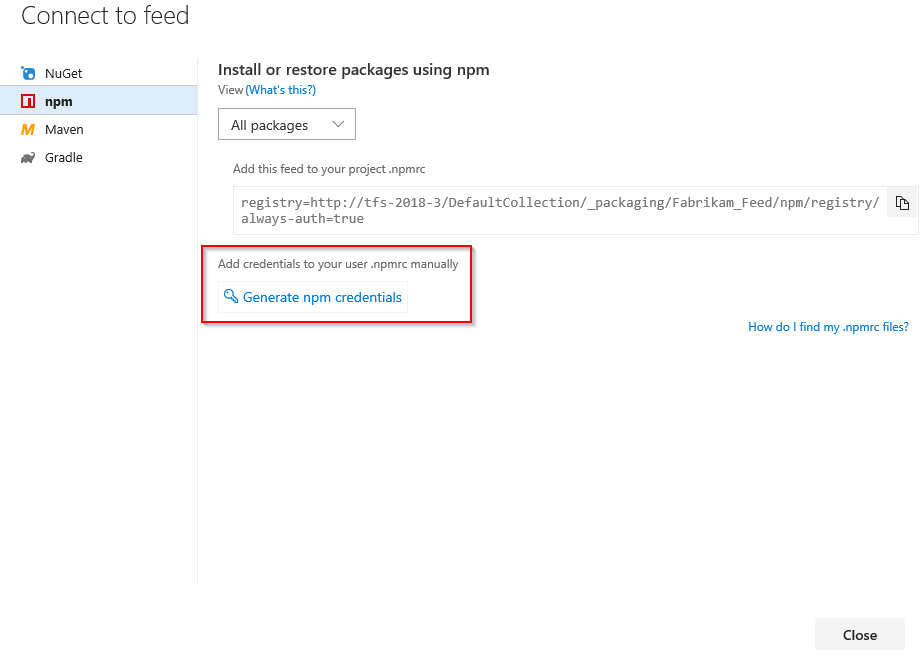

#### Project setup

The **Connect to feed** dialog box generates an appropriately formatted token that you can place into your .npmrc file. The token has a lifespan of 90 days.

<a id="tokenpast90"></a>

> [!TIP]
> If you want to create a token that lasts longer than 90 days, make sure you change the default expiration date.

::: moniker range=">= azure-devops-2019"

1. From within your project, select **Azure Artifacts**, and then select **Connect to feed**.

    :::image type="content" source="../../media/connect-to-feed-devops.png" alt-text="Select Artifacts and then Connect to feed":::   

1. Select **npm**.

1. In the **Project setup** section, select **Other** .

    :::image type="content" source="../../media/connect-to-feed-npm-creds-azure-devops-newnav.png" alt-text="Project setup, Other OS":::

1. Add a .npmrc file in the same directory as your package.json file.

    ```JSON
    registry=https://pkgs.dev.azure.com/<yourOrganization>/_packaging/<yourFeed>/npm/registry/
    
    always-auth=true
    ```

#### Credentials setup

1. Copy the following snippet to your user .npmrc file.

    ```
    ; begin auth token
    pkgs.dev.azure.com/<yourOrganization>/_packaging/<yourFeed>/npm/registry/:username=[ANY_VALUE_BUT_NOT_AN_EMPTY_STRING]
    pkgs.dev.azure.com/<yourOrganization>/_packaging/<yourFeed>/npm/registry/:_password=[BASE64_ENCODED_PERSONAL_ACCESS_TOKEN]
    pkgs.dev.azure.com/<yourOrganization>/_packaging/<yourFeed>/npm/registry/:email=npm requires email to be set but doesn't use the value
    pkgs.dev.azure.com/<yourOrganization>/_packaging/<yourFeed>/npm/:username=[ANY_VALUE_BUT_NOT_AN_EMPTY_STRING]
    pkgs.dev.azure.com/<yourOrganization>/_packaging/<yourFeed>/npm/:_password=[BASE64_ENCODED_PERSONAL_ACCESS_TOKEN]
    pkgs.dev.azure.com/<yourOrganization>/_packaging/<yourFeed>/npm/:email=npm requires email to be set but doesn't use the value
    ; end auth token
    ```

1. Generate a [personal access token](../../../organizations/accounts/use-personal-access-tokens-to-authenticate.md) with **packaging read and write** scopes.

1. Encode your newly generated personal access token as follows:

    1. Run the following command in an elevated command prompt window:
        
        ```Command
        node -e "require('readline') .createInterface({input:process.stdin,output:process.stdout,historySize:0}) .question('PAT> ',p => { b64=Buffer.from(p.trim()).toString('base64');console.log(b64);process.exit(); })"
        ```

        You can also use the following command to convert your personal access token to Base64 depending on your operating system:

        - **Windows**:
            ```powershell
            [Convert]::ToBase64String([system.Text.Encoding]::UTF8.GetBytes("YOUR_PAT_GOES_HERE"))
            ```
    
        - **LinuxMac**:
            ```Command
            echo -n "YOUR_PAT_GOES_HERE" | base64
            ```
    1. Copy the Base64 encoded value.

1. Replace the placeholder `[BASE64_ENCODED_PERSONAL_ACCESS_TOKEN]` with your user Base64 encoded personal access token you just created. 

::: moniker-end

::: moniker range=">=tfs-2017 < azure-devops-2019"

1. From **Packages**, select **Connect to feed**.

2. Select **npm**.

3. Select **Generate npm credentials**. Copy the credentials to add them to your user .npmrc file manually:
    > [!div class="mx-imgBorder"] 
    >

::: moniker-end