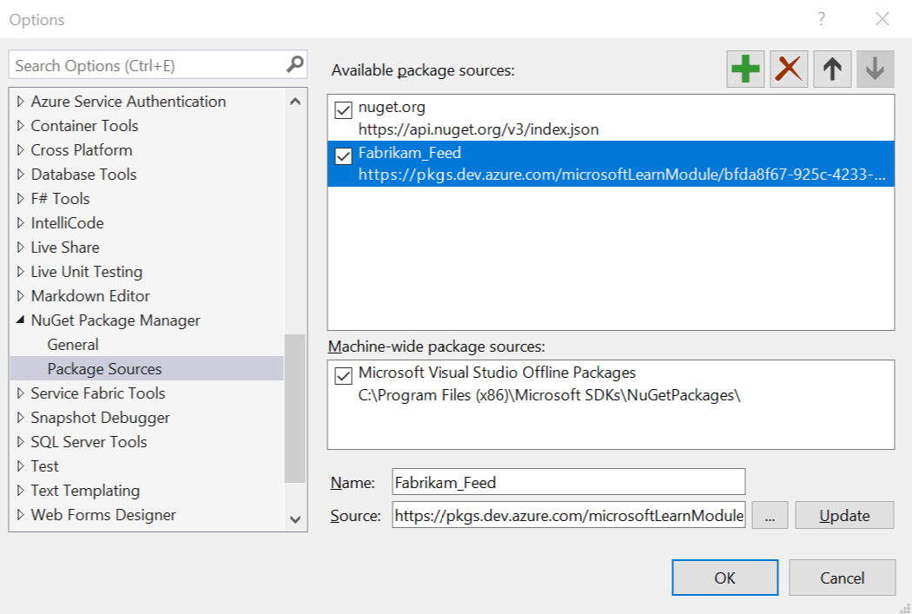

To consume NuGet packages from a feed, add the feed's NuGet endpoint as a package source in Visual Studio.

[!INCLUDE [Azure Artifacts and Visual Studio 2015](vs2015.md)]

## Get your feed's NuGet package source information

[!INCLUDE [get a NuGet URL](nuget-consume-endpoint.md)]

### Windows: Add the feed to your NuGet configuration

1. On the **Tools** menu, select **Options**.
2. Expand **NuGet Package Manager** and select **Package Sources**.
3. Select the green plus in the upper-right corner.
4. At the bottom of the dialog box, enter the feed's name and the URL that you got in the last step.
5. Select **Update**.
6. If you enabled the [nuget.org upstream source](../../nuget/upstream-sources.md), clear the check box for the **nuget.org** package source.
   
7. Select **OK**.
8. [Go to the steps for consuming packages](#consume-packages).

### macOS: Add the feed to your NuGet configuration

1. Get a [personal access token](../../../organizations/accounts/use-personal-access-tokens-to-authenticate.md) (PAT) and make a note of it.
2. Open the **Preferences** dialog box from the **Visual Studio** menu on the menu bar.
3. Select **NuGet** > **Sources**.
4. Select **Add**. Then enter your feed's name, the URL, any username, and your PAT as the password.
5. Select **OK**.
6. If you enabled the [nuget.org upstream source](../../nuget/upstream-sources.md), clear the check box for the **nuget.org** package source.
7. Select **OK** again.

   

## Consume packages

You can now discover and use packages in this feed. To add a package reference to a project:

1. Find your project in Solution Explorer.
2. Right-click **References**.
3. Select **Manage NuGet Packages**.
4. In the **Package source** drop-down list, select your feed.
5. Look for your package in the list.
   

If you're using [upstream sources](../../nuget/upstream-sources.md), package versions in the upstream source that haven't yet been saved into your feed (by using them at least once) won't appear in the NuGet Package Manager search. To install these packages:

1. On the upstream source (for example, nuget.org), copy the `Install-Package` command.
2. In Visual Studio, open the Package Manager Console from **Tools** > **NuGet Package Manager**.
3. Paste the `Install-Package` command into the Package Manager Console and run it.

## Use symbols to debug

Symbol servers enable debuggers to automatically retrieve the correct symbol files for packages without knowing product names, build numbers, or package names. If [symbols have been published](../../../pipelines/artifacts/symbols.md) for your packages, [connect Visual Studio to the symbol server in Azure Artifacts](../../symbols/debug-with-symbols-visual-studio.md) to use symbols as you debug your packages.

<!-- TODO can we make this an FAQ bit at the end, so it's out of the way? -->

## Using Visual Studio 2013 or earlier

You'll need to get a [personal access token](../../../organizations/accounts/use-personal-access-tokens-to-authenticate.md). When you're prompted for a username and password, use any username and your PAT as the password.