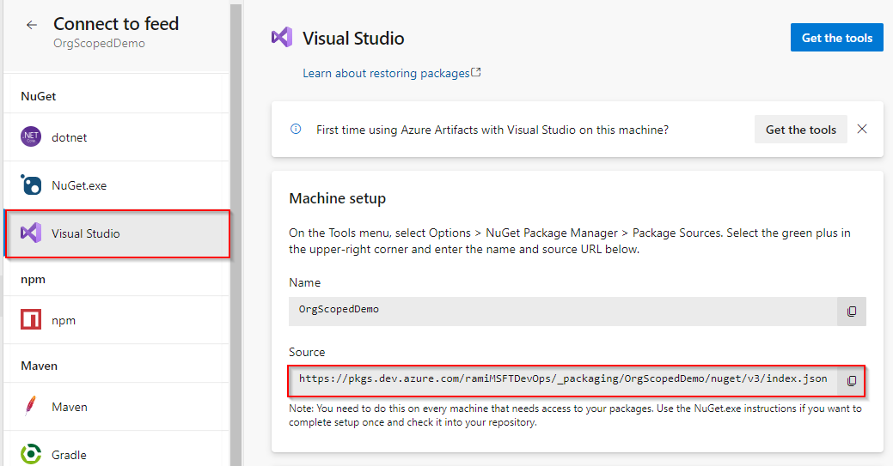

::: moniker range=">= azure-devops-2019"

1. Go to your feed ([or create a feed if you haven't](../../index.yml)). 

2. Select **Connect to feed**:

   > [!div class="mx-imgBorder"] 
   >
   >

3. Select the **Visual Studio** tab under the **NuGet** header 

4. Follow the instructions under **Machine setup**

   > [!div class="mx-imgBorder"] 
   >
   >

::: moniker-end

::: moniker range=">=tfs-2017 < azure-devops-2019"

1. Go to your feed ([or create a feed if you haven't](../../index.yml)). 

2. Select **Connect to feed**:

   
   
3. Copy the NuGet package source URL:

   

::: moniker-end