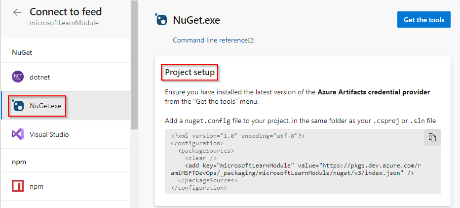

::: moniker range=">= azure-devops-2019"

1. Navigate to your feed or [create a feed](../../get-started-nuget.md#create-a-feed) if you haven't. 

1. Select **Connect to feed**:

   > [!div class="mx-imgBorder"] 
   > 

1. Select **NuGet.exe** under the **NuGet** header.

1. If you have NuGet and Visual Studio installed on your machine, you can *move to the next step*. Otherwise: 

    1. Select **Get the tools** in the upper-right corner.
    1. Download the latest NuGet version if you haven't yet.
    1. Download and install the credential provider.

1. Copy the `xml` code snippet in the **Project setup** section and add/create a `nuget.config` file for your project. Place your file in the same folder as your .`csproj` or `.sln` file.

1. Run the **Publish packages** command yo publish the package to your feed. 

   > [!div class="mx-imgBorder"] 
   > 

* The NuGet `push` command requires an API key. You can use any non-empty string for this variable. In our example, we used the string `key`.
* For more information on using credential providers with NuGet, see [Creating a NuGet credential provider](/nuget/reference/extensibility/nuget-exe-credential-providers#creating-a-nugetexe-credential-provider).
* For more information on using personal access tokens, see [Authenticate access with personal access tokens](../../../organizations/accounts/use-personal-access-tokens-to-authenticate.md).

## Publish a NuGet package with the NuGet CLI

To publish your package using the NuGet CLI, you will need the following variables:

- **SourceName**: The name of your feed (step 1).
- **SourceURL**: The feed URL (step 6).
- **UserName** and **PAT**: Your username and personal access token. For help with setting up your credentials, see [Authenticate access with personal access tokens](../../../organizations/accounts/use-personal-access-tokens-to-authenticate.md).

::: moniker-end

::: moniker range=">=tfs-2017 < azure-devops-2019"

1. Go to your feed or [create a feed](../../get-started-nuget.md#create-a-feed) if you haven't. 

2. Select **Connect to feed**:

   > [!div class="mx-imgBorder"] 
   > 

3. Follow steps 1 and 2 to get the tools, add the feed to your local NuGet configuration, and push the package.

   > [!div class="mx-imgBorder"]
   > 

::: moniker-end

> [!NOTE]
> You can use the symbols of your NuGet packages to debug your application. You can publish your symbols to a file share using the [index sources and publish symbols task](../../../pipelines/tasks/build/index-sources-publish-symbols.md) as well as in your build pipeline that produces the NuGet packages. See [Symbol files overview](../../concepts/symbols.md) and [How to publish your symbols for debugging](../../../pipelines/artifacts/symbols.md) for more information.
> Publishing your symbols to Azure Artifact feeds from the command line is not currently supported.