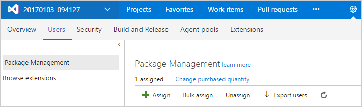

# License Azure Artifacts for TFS 2017 and 2018

**TFS 2018** | **TFS 2017**

Azure Artifacts is an *extension* to TFS. The Azure Artifacts extension comes pre-installed in TFS 2017 and 2018.

Azure Artifacts is required for each user that consumes packages from (e.g., nuget restore or npm install) or produces packages to (e.g., nuget push or npm publish) Azure Artifacts feeds. Azure Artifacts is also required for each user that consumes or publishes symbols.

## Install Azure Artifacts in TFS

Azure Artifacts is installed by default for TFS 2017 customers.  You must upgrade to TFS 2017 in order to use Azure Artifacts.

> If the Azure Artifacts extension has been removed, you can install it from the [Marketplace page for Azure Artifacts](https://marketplace.visualstudio.com/items?itemName=ms.feed).

## Assign licenses in TFS

1. From any collection in TFS, hover over the settings menu and select the **Users** page. Then, select **Azure Artifacts**.

   

2. Select **Assign**, enter the user to whom you want to assign licenses, and then select **Ok.**

   * Users with Visual Studio Enterprise subscriptions get Azure Artifacts automatically.  
   * [Ensure that your Visual Studio Enterprise subscribers are assigned VSE access level](../organizations/security/change-access-levels.md).

