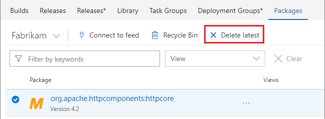

# Delete or recover a Maven artifact

**Azure DevOps Services** | **TFS 2018**

Deleting a version of an artifact makes it unavailable for install. After deleting, an artifact can be [restored from the _Recycle Bin_](#recover-a-deleted-maven-artifact) within 30 days of deletion. After 30 days, it is permanently unavailable to restore. Deleting an artifact will cause others that depend on it to break.

## Delete a Maven artifact in Azure DevOps Services

You must be an **owner** to delete an artifact.

Choose the artifact from the **Packages** page in the **Build and Release** page group and select the appropriate option from the menu:

## Recover a deleted Maven artifact

[!INCLUDE ]

