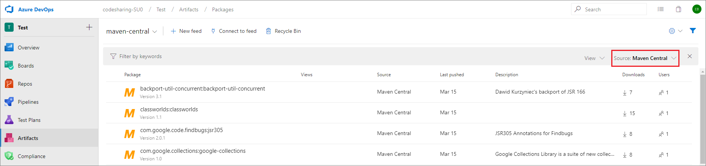

# Use packages from Maven Central

**Azure DevOps Services** | **Azure DevOps Server 2019 Update 1**

If you want to use both private packages you've created **and** public packages from Maven Central, we recommend using upstream sources. 

The Maven Central upstream source allows you to merge the contents of Maven Central into your feed such that the Maven client can install packages from both locations.  Enabling upstream sources also automatically enables saving of packages you use from the upstream source. **This is the recommended way to use Azure Artifacts with Maven.**

To learn more about the concept of upstream sources, please see the [concepts page](../concepts/upstream-sources.md).

## Enable Maven Central as an upstream
To use Maven Central as an upstream source, either create a new feed or edit an existing feed.

### On a new feed

1. [Create a new feed](../feeds/create-feed.md). Ensure you leave the "Use packages from public sources through this feed" radio button selected.

### On an existing feed

1. Edit your feed. Select the **gear icon** in the top right of the page to open feed settings.
2. Select the **Upstream sources** pivot.
3. Select **Add upstream source** in the CommandBar.
4. Select **Select a feed URL** and select **Maven Central (https://repo.maven.apache.org/maven2/)**. If you like, customize the upstream name.
5. Select **Add**.

## Filter to saved packages

You can see the packages you have saved in your feed by selecting the appropriate Source filter.

