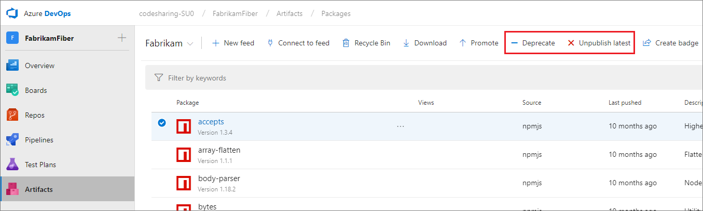
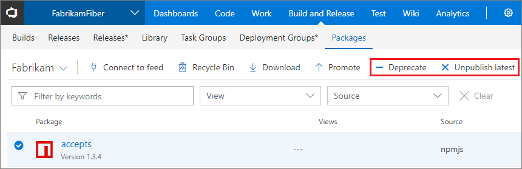

# Deprecate, unpublish, or recover an npm package

**Azure DevOps Services** | **TFS 2018** | **TFS 2017**

There are two options available to remove a version of an npm package from a feed.

1. **Deprecate:** deprecating a version of a package adds a deprecation message that most npm clients, and Azure DevOps Services, will show whenever the package is viewed or installed. 
Deprecating a version can help you discourage new usage of it by presenting a warning message when the package is installed.
2. **Unpublish:** Unpublishing a version of a package makes it unavailable for install. After unpublishing, a package can be [restored from the _Recycle Bin_](#recover-an-unpublished-npm-package) within 30 days of deletion. After 30 days, it is permanently unavailable to restore. Unpublishing a package will cause others that depend on it to break.

::: moniker range="vsts"

## Deprecate or unpublish an npm package in Azure DevOps Services

You must be a **contributor** to deprecate and an **owner** to unpublish.

# [New navigation](#tab/new-nav)
Choose the package from **Azure Artifacts** select the appropriate option from the menu:

# [Previous navigation](#tab/previous-nav)
Choose the package from the **Packages** page in the **Build and Release** page group and select the appropriate option from the menu:

---

::: moniker-end

::: moniker range=">=tfs-2017 < vsts"

## Deprecate or unpublish an npm package in TFS

You must be a **contributor** to deprecate and an **owner** to unpublish.

Choose the package from the **Packages** page in the **Build and Release** page group and select the appropriate option from the menu:

::: moniker-end

## Deprecate or unpublish an npm package using npm
1. [Set up the npm client with your feed](npmrc.md).
2. Deprecate a package by running `npm deprecate <package>[@<version>] <message>`.
3. Unpublish a package by running `npm unpublish <package>@<version>`. 

At this time, it's not possible to use `npm unpublish <package>` to unpublish all versions.

See the [deprecate](https://docs.npmjs.com/cli/deprecate) or [unpublish](https://docs.npmjs.com/cli/unpublish) CLI docs for more info.

## Recover an unpublished npm package

[!INCLUDE ]

