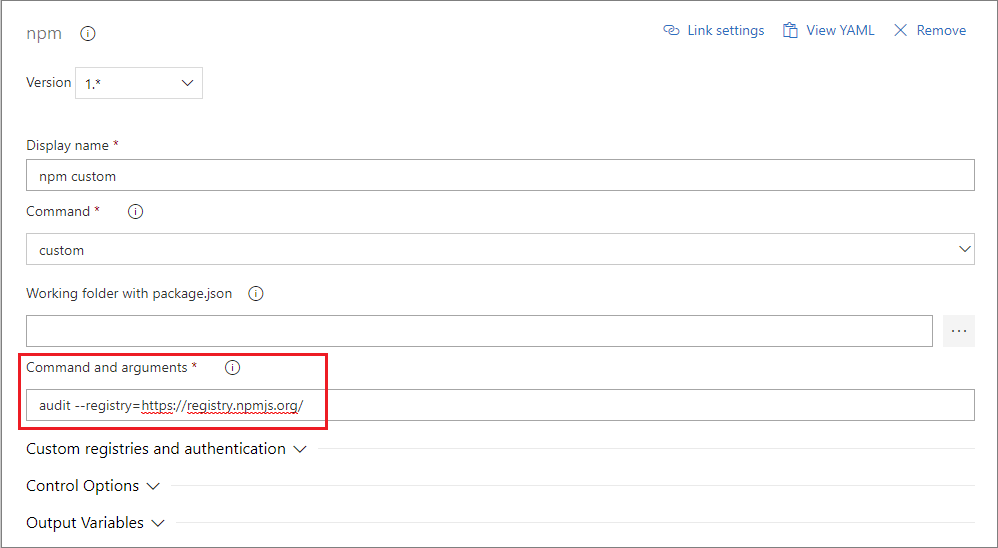

# Use npm audit

The `npm audit` command assesses your package dependencies for security vulnerabilities. Performing security audits helps protect your package's users by helping you find and fix known vulnerabilities in dependencies. Fixing these vulnerabilities could prevent things like data loss, service outages, unauthorized access to sensitive information, or other issues.

Currently, Azure DevOps Services does not support the `npm audit` command, if you run `npm audit` to analyze your packages in Azure DevOps Services, you will get a failure with the message: `Unexpected end of JSON input while parsing near..`.

As a workaround, you can run `npm audit` with the `--registry=https://registry.npmjs.org/` set. This will route the `npm audit` command directly to **npmjs**.

>[!WARNING]
> Running the `npm audit` command will send the name of any private packages in your **package.json** to npmjs.com. You shouldn't do this if your private package names are confidential or proprietary.

## Run 'npm audit' in your pipeline

Below you will find instructions on how to run `npm audit` in your pipeline with both YAML and the designer.

# [YAML](#tab/yaml)

```yaml
steps:
- task: Npm@1
  displayName: 'npm custom'
  inputs:
    command: custom
    verbose: false
    customCommand: 'audit --registry=https://registry.npmjs.org/'
```

# [Designer](#tab/designer)

Adding the **npm** task and select _custom_ as the Command:



---

## Run 'npm audit' on your developer machine

To run `npm audit` from your developer machine, add the `--registry=https://registry.npmjs.org/` flag to your command. The full command will look like:

```
npm audit --registry=https://registry.npmjs.org/
```
