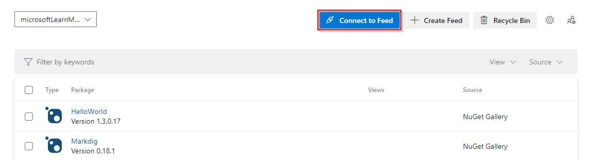
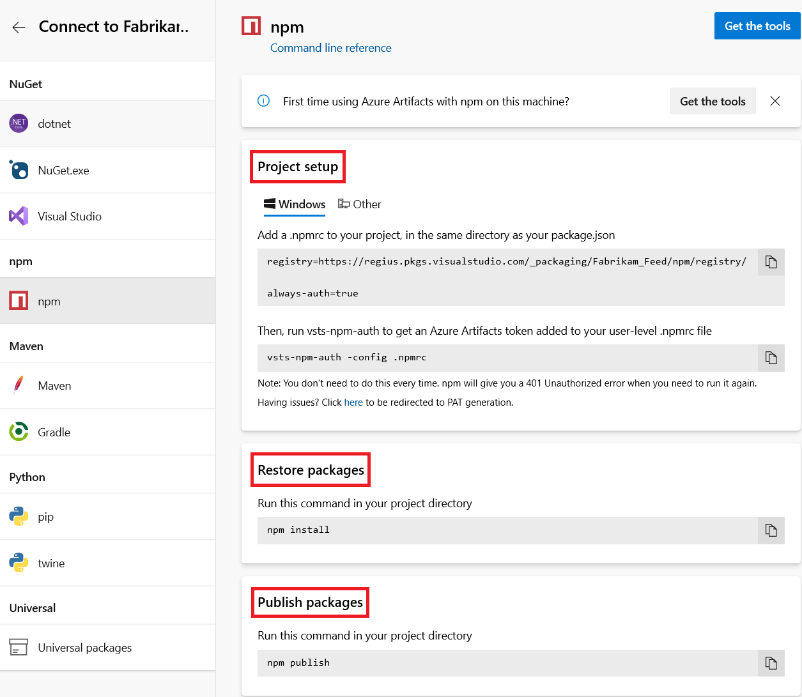
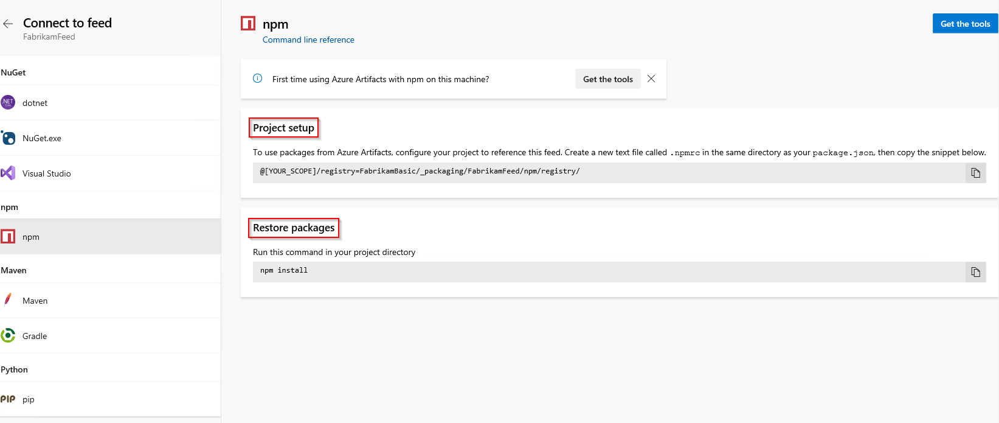
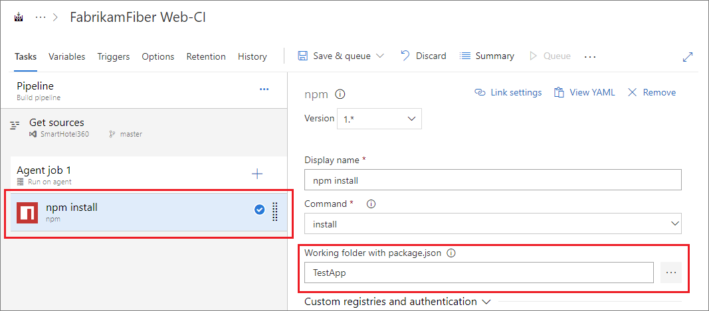
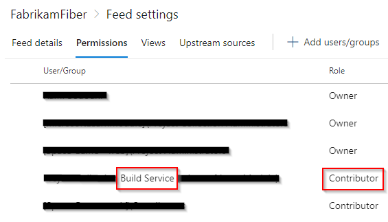
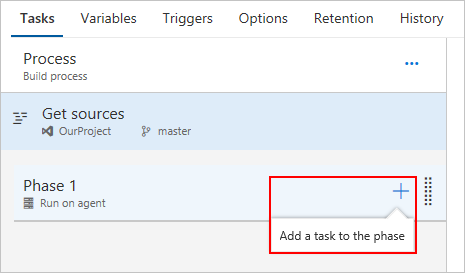
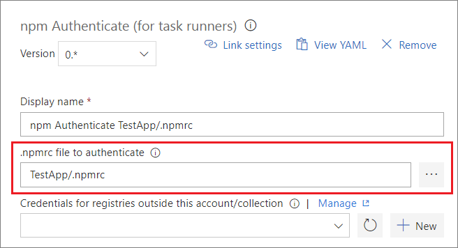

# Set up your client's npmrc

**Azure DevOps Services | TFS 2018 | TFS 2017**

Azure Artifacts is an extension to Azure DevOps Services and Azure DevOps Server that makes it easy to discover, install, and publish different types of packages. Check out [Start using Azure Artifacts](../start-using-azure-artifacts.md) for more details.

All Azure Artifacts feeds require authentication, so you'll need to store credentials for the feed before you can install or publish packages. npm uses [.npmrc configuration files](https://docs.npmjs.com/files/npmrc) to store feed URLs and credentials.

## Where are my **_.npmrc_** files?

Azure DevOps Services recommends using two **_.npmrc_** files:

1. One **_.npmrc_** should live at the root of your git repo adjacent to your project's **_package.json_**.

   1. From your **Packages** page, click _Connect to Feed_

      ::: moniker range=">= azure-devops-2019"
    
         > [!div class="mx-imgBorder"] 
         > 

      ::: moniker-end

      ::: moniker range=">= tfs-2017 < azure-devops-2019"

         > [!div class="mx-imgBorder"]
         > 

      ::: moniker-end

   2. Select **npm**.

   3. Select **Get the tools** in the top-right corner.
 
   ::: moniker range=">= azure-devops"   
   
      4. Follow steps **1** and **2** to download Node.js, npm, and the artifacts credential provider.
   
      5. Follow the instructions under the **Project setup** section to set up your project. See the **Restore packages** and **Publish packages** sections if you want to publish or restore your packages.
   
         > [!div class="mx-imgBorder"] 
         > 
   
   ::: moniker-end

   ::: moniker range="> tfs-2018 < azure-devops"

      4. Follow the instructions in the **Project setup** and **Restore packages** sections.

         > [!div class="mx-imgBorder"] 
         > 

   ::: moniker-end

   ::: moniker range=">= tfs-2017 < azure-devops-2019"

      4. Follow steps **1** and **2** to download Node.js, npm, and the artifacts credential provider.

      5. Follow the instructions under the **Project setup** section to set up your project. See the **Restore packages** and **Publish packages** sections if you want to publish or restore your packages.

         > [!div class="mx-imgBorder"] 
         > 

   ::: moniker-end
        
2. On your development machine, you will also have a **_.npmrc_** in $HOME for Linux or Mac systems or $env.HOME for win systems.  This **_.npmrc_** should contain credentials for all of the registries that you need to connect to.  The NPM client will look at your project's **_.npmrc_**, discover the registry, and fetch matching credentials from $HOME/.npmrc or $env.HOME/.npmrc.  Credential acquisition will be discussed in the next section.

This enables you to share project's **_.npmrc_** with the whole team while keeping your credentials secure.

## Set up authentication on your dev box

You should have a project specific **_.npmrc_** containing only your feed's registry information that you discovered from the "Connects to Feed" dialog.  There should be no credentials in this file and the file itself is adjacent to your project's **_package.json_**.

> [!IMPORTANT]
> There can only be a single "registry=" line in your **_.npmrc_**.  Multiple registries are possible with [upstream sources](../concepts/upstream-sources.md), or by using [scopes](..//npm/scopes.md) (not recommended).

::: moniker range=">= azure-devops"

### Windows

If you are developing on Windows, we recommend that you use `vsts-npm-auth` to fetch credentials and inject them into your **_%USERPROFILE%\\.npmrc_** on a periodic basis.  The easiest way to set this up is to install `vsts-npm-auth` globally (i.e. `npm install -g vsts-npm-auth`) and then add a run script in your project's **_package.json_**.

```json
"scripts": {
    "refreshVSToken" : "vsts-npm-auth -config .npmrc"
}
```

### Linux or Mac

`vsts-npm-auth` is not supported for Linux/Mac. We recommend generating a token and saving it in your **_$HOME/.npmrc_** as follows.

[!INCLUDE [npmrc.md](../includes/npm/npmrc.md)]

> [!NOTE]
> `vsts-npm-auth` is not supported on on-premises TFS and Azure DevOps Server.

::: moniker-end

::: moniker range=">= azure-devops-2019 < azure-devops"

To work with packages from Azure Artifacts, set up your project to reference this feed. Create a new text file `.npmrc` in the same directory as your `package.json` and copy the snippet below:

```
@[YOUR_SCOPE]/registry=FabrikamBasic/_packaging/FabrikamFeed/npm/registry/
```

To restore your packages, run the following command in your project directory:

```cmd
npm install
```

::: moniker-end

## Set up authentication in a build task

There are two options for setting up authentication in a build task:
* [Without a task runner](#without-a-task-runner)
* [With a task runner (e.g. gulp)](#with-a-task-runner-eg-make-gulp-work)

### Without a Task Runner
To set up **npm** authentication in a build task _without_ a task runner, follow the directions below.

::: moniker range=">= azure-devops-2019"

1. Select **Azure Pipelines**, it should automatically take you to the **Builds** page.

   > [!div class="mx-imgBorder"] 
   > 

1. Create a new pipeline.

   > [!div class="mx-imgBorder"] 
   > 

1. Choose your source **Project**, **Repository**, and **Default branch** and select _Continue_.

1. Start with an **Empty job**.

1. On the left side, select the plus sign **( + )** to add a task to **Job 1**. On the right side, select the **Package** category, select the **npm** task from the list, and then choose **Add**.

   > [!div class="mx-imgBorder"] 
   > 

1. Select the **npm install** task, then browse to and select your **Working folder with package.json**:

   > [!div class="mx-imgBorder"] 
   > 

1. Expand **Custom registries and authentication**, here you have a few options: 

   * Registries in my **_.npmrc_**
    
      > [!div class="mx-imgBorder"] 
      > 

      > [!TIP]
      > You can choose credentials to authenticate to services outside of your current organization/collection by setting up [service connections.](../../pipelines/library/service-endpoints.md#sep-npm)

   * Registry I select here

      > [!div class="mx-imgBorder"] 
      > 

      When you choose this option, the task will create a temporary **_.npmrc_** with credentials for the registry you've selected and it will override the project's **_.npmrc_**. This is useful when you want to publish to a specific feed. 
   
1. Select **Save & queue**, and then select **Save**.

> [!TIP]
> If your NPM Install build task is failing with Error 403, then make sure you set your build service as a contributor. To do so, go to Azure Artifacts -> Select your feed -> Settings -> Permissions -> set your build service role to contributor.

> [!div class="mx-imgBorder"]
> 


::: moniker-end

::: moniker range=">= tfs-2017 < azure-devops-2019"

1. Select **Build and Release**, and then choose **Builds**.

   > [!div class="mx-imgBorder"]
   > 

1. Create a new pipeline.

   > [!div class="mx-imgBorder"]
   > 

1. Choose your source **Project**, **Repository**, and **Default branch** and select _Continue_.

1. Start with an **Empty job**.

1. On the left side, select the plus sign **( + )** to add a task to **Job 1**. On the right side, select the **Package** category, select the **npm** task from the list, and then choose **Add**.

   > [!div class="mx-imgBorder"]
   > 

1. Select the **npm install** task, then browse to and select your **Working folder with package.json**:

   > [!div class="mx-imgBorder"]
   > 

1. Expand **Custom registries and authentication**, here you have a few options: 

   * Registries in my **_.npmrc_**

      > [!div class="mx-imgBorder"]
      > 

      > [!TIP]
      > You can choose credentials to authenticate to services outside of your current organization/collection by setting up [service connections.](../../pipelines/library/service-endpoints.md#sep-npm)

   * Registry I select here

      > [!div class="mx-imgBorder"]
      > 

      When you choose this option, the task will create a temporary **_.npmrc_** with credentials for the registry you've selected and it will override the project's **_.npmrc_**. This is useful when you want to publish to a specific feed. 
   
1. Select **Save & queue**, and then select **Save**.

::: moniker-end

### With a Task Runner (e.g. make gulp work)

When using a task runner, you'll need to add the **npm Authenticate** build task at the beginning of your build pipeline. This will inject credentials into your project's **_.npmrc_** and persist them for the lifespan of the build. This allows subsequent build steps to use the credentials in the **_.npmrc_**.

::: moniker range=">= azure-devops-2019"

1. Select **Azure Pipelines**, it should automatically take you to the **Builds** page.

   > [!div class="mx-imgBorder"] 
   > 

1. Create a new pipeline.

   > [!div class="mx-imgBorder"] 
   > 

1. Choose your source **Project**, **Repository**, and **Default branch** and select _Continue_.

1. Start with an **Empty job**.

1. On the left side, select the plus sign **( + )** to add a task to **Job 1**. On the right side, select the **Package** category, select the **npm Authenticate** task from the list, and then choose **Add**.

   > [!div class="mx-imgBorder"] 
   > 

1. Select the **npm Authenticate** task underneath **Phase 1**:

   > [!div class="mx-imgBorder"] 
   > 

1. Browse to and select your **.npmrc file to authenticate**:

   > [!div class="mx-imgBorder"]
   > 

   > [!TIP]
   > You can choose credentials to authenticate to services outside of your current organization/collection by setting up [service connections.](../../pipelines/library/service-endpoints.md#sep-npm)

1. After setting up your **npm Authenticate** task, you can add other build task(s) for your task runner like **Gulp**.

::: moniker-end

::: moniker range=">= tfs-2017 < azure-devops-2019"

1. Select **Build and Release**, and then choose **Builds**.

   > [!div class="mx-imgBorder"]
   > 

1. Create a new pipeline.

   > [!div class="mx-imgBorder"]
   > 

1. Choose your source **Project**, **Repository**, and **Default branch** and select _Continue_.

1. Start with an **Empty job**.

1. On the left side, select the plus sign **( + )** to add a task to **Job 1**. On the right side, select the **Package** category, select the **npm Authenticate** task from the list, and then choose **Add**.

   > [!div class="mx-imgBorder"]
   > 

1. Select the **npm Authenticate** task underneath **Phase 1**:

   > [!div class="mx-imgBorder"]
   > 

1. Browse to and select your **npmrc file to authenticate**:

   > [!div class="mx-imgBorder"]
   > 

   > [!TIP]
   > You can choose credentials to authenticate to services outside of your current organization/collection by setting up [service connections.](../../pipelines/library/service-endpoints.md#sep-npm)

1. After setting up your **npm Authenticate** task, you can add other build task(s) for your task runner like **Gulp**.

::: moniker-end

::: moniker range="= tfs-2017 || = tfs-2018 || = azure-devops"

> [!NOTE]
> If you are using Yarn, run the following command to set the yarn registry:
> `yarn config set registry "https://pkgs.dev.azure.com/<yourOrganization>/_packaging/<yourFeed>/npm/registry/"`

## Troubleshooting `vsts-npm-auth`

- If you receive an error like:

    - Command Prompt: `'vsts-npm-auth' is not recognized as an internal or external command, operable program or batch file.`
    - PowerShell: `vsts-npm-auth : The term 'vsts-npm-auth' is not recognized as the name of a cmdlet, function, script file, or operable program.`
    
    then it's likely that the npm modules folder is not in your path. 
    
    To fix this issue, rerun Node.js setup and ensure the `Add to PATH` option and its child options are selected for installation.
    
    > [!div class="mx-imgBorder"]
    > 
    
    Alternatively, you can edit the PATH variable to add `%APPDATA%\npm` (Command Prompt) or `$env:APPDATA\npm` (PowerShell).

- If you are running into a E401 error: `code E401 npm ERR! Unable to authenticate`

    run the `vsts-npm-auth` command with the -F argument to re-authenticate.

    ```
    vsts-npm-auth -config .npmrc -F
    ```

::: moniker-end

## Related articles

- [npm scopes](./scopes.md)
- [npm audit](./npm-audit.md)
- [Publish npm packages](../../pipelines/artifacts/npm.md)
