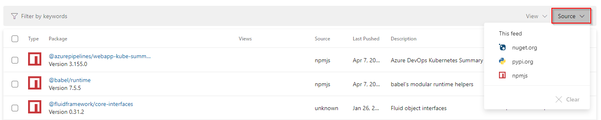
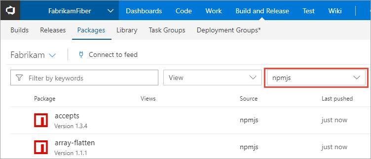

# Use packages from npmjs.com

**Azure DevOps Services | Azure DevOps Server 2020 | Azure DevOps Server 2019 | TFS 2018 - TFS 2017**

The npm client is designed to work with a single primary *registry* (what Azure Artifacts calls a *feed*). It also supports secondary *scoped* registries. Scoped registries can only be used to install packages whose names begin with the scope prefix, so their usage is more restrictive. If you want to use both private packages you've created **and** public packages from npmjs.com, we recommend using upstream sources. 

The npmjs.com upstream source allows you to merge the contents of npmjs.com into your feed such that the npm client can install packages from both locations.  Enabling upstream sources also automatically enables saving of packages you use from the upstream source. **This is the recommended way to use Azure Artifacts with npm.** Upstreams give you the most flexibility to use a combination of scoped- and non-scoped packages in your feed, as well as scoped- and non-scoped packages from npmjs.com.

## Enable npmjs.com as an upstream

You can use npmjs.com as an upstream source with new and existing feeds.

### On a new feed

1. [Create a new feed](../get-started-npm.md#create-a-feed). Make sure you check the **Include packages from common public sources** checkbox.

    :::image type="content" source="media/include-upstream-sources.png" alt-text="Screenshot showing how to enable upstream sources":::

### On an existing feed

1. Edit your feed. Select the **gear icon** in the top right of the page to open feed settings.
2. Select the **Upstream sources** pivot.
3. Select **Add upstream source** in the CommandBar.
4. Select **Select a feed URL** and select **npmjs.com (https://registry.npmjs.org)**. If you like, customize the upstream name.
5. Select **Add**.

## Filter to saved packages

You can see the packages you have saved in your feed by selecting the appropriate Source filter.

> [!NOTE]
> Legacy feeds do not guarantee that every package `npm install`ed via a feed with upstreams enabled will be saved. Check if your feed is a [legacy feed](/previous-versions/azure/devops/artifacts/reference/feed-upgrade-learn-more?view=azure-devops&preserve-view=true) and consider upgrading it, if needed.

::: moniker range=">= azure-devops-2019"  

::: moniker-end

::: moniker range="<= tfs-2018"

::: moniker-end

::: moniker range=">=tfs-2017 < azure-devops"

::: moniker-end

## Scopes

If you prefer to use scopes, which limit your private packages to those with the `@<scope>` prefix e.g. `@fabrikam/core` but enable you to consume public packages **directly** from npmjs.com, see [Scopes](scopes.md).