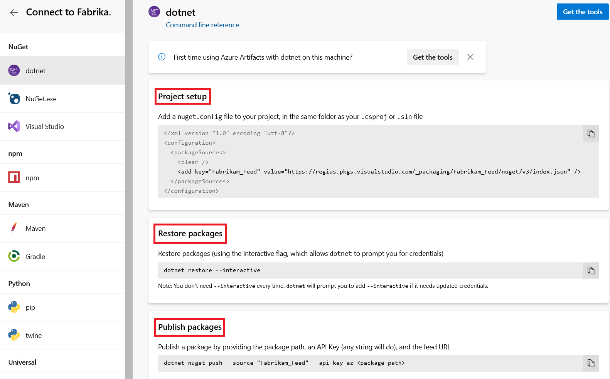

# use dotnet with Azure Artifacts

**Azure DevOps Services | Azure DevOps Server 2020 | Azure DevOps Server 2019 | TFS 2018 - TFS 2017**

With Azure Artifacts you can connect to a feed, publish your .NET packages, and control who can access them. You can use the dotnet command line interface to publish and restore your packages. Follow the instructions below to set up your project:

1. From within your project select **Artifacts**, and then select your feed from the dropdown menu. [Create a feed](../get-started-nuget.md#create-a-feed), if you don't have one already. 

1. Select **Connect to feed**.

    :::image type="content" source="../media/connect-to-feed-azure-devops-newnav.png" alt-text="Screenshot showing the connect to feed button":::

1. Select **dotnet** from the **NuGet** section.

1. If this is your first time using Azure Artifacts with dotnet, select **Get the tools** to set up the credential provider and the .NET Core SDK.

1. Add a *nuget.config* file to your project, in the same folder as your .csproj or .sln file. Paste the following snippet into your new file and replace the placeholders with the appropriate information.

```yml
<?xml version="1.0" encoding="utf-8"?>
<configuration>
  <packageSources>
    <clear />
    <add key="<FEED_NAME>" value="https://pkgs.dev.azure.com/<ORGANIZATION_NAME>/_packaging/<FEED_NAME>/nuget/v3/index.json" />
  </packageSources>
</configuration>
```

5. Follow steps **1**, **2**, and **3** to download and install the latest .NET Core SDK and credential provider.

6. Follow the instructions in the **Project setup**, **Restore packages**, and **Publish packages** sections to publish.

   > [!div class="mx-imgBorder"] 
   >
   > 

   > [!NOTE]
   > You can also paste the **Project setup** XML snippet in your default nuget.config file to use outside of a project.
## On build machines and in non-interactive scenarios

In Azure Pipelines, use the [.NET Core step's restore command](../../pipelines/tasks/build/dotnet-core-cli.md), which automatically handles authentication to Azure Artifacts feeds. Otherwise, use the [Azure Artifacts Credential Provider](https://github.com/Microsoft/artifacts-credprovider) and pass in credentials using the `VSS_NUGET_EXTERNAL_FEED_ENDPOINTS` [environment variable](https://github.com/Microsoft/artifacts-credprovider/blob/master/README.md#environment-variables).