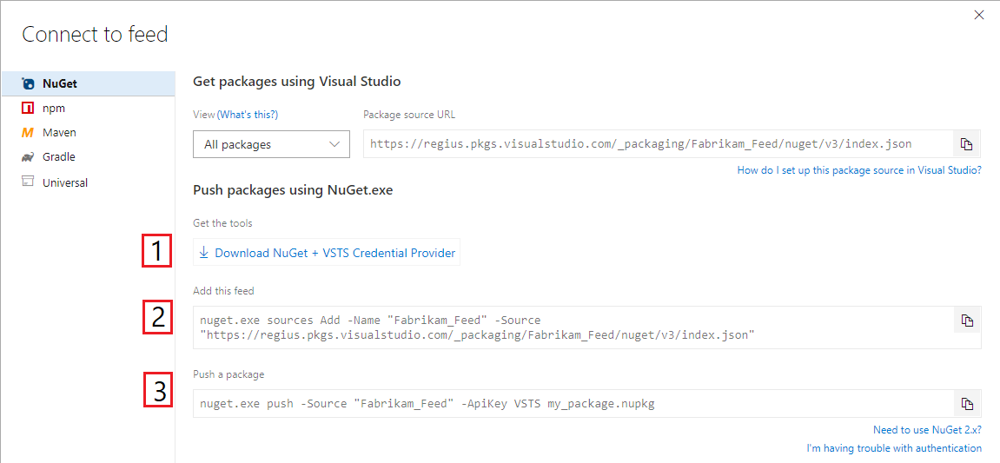
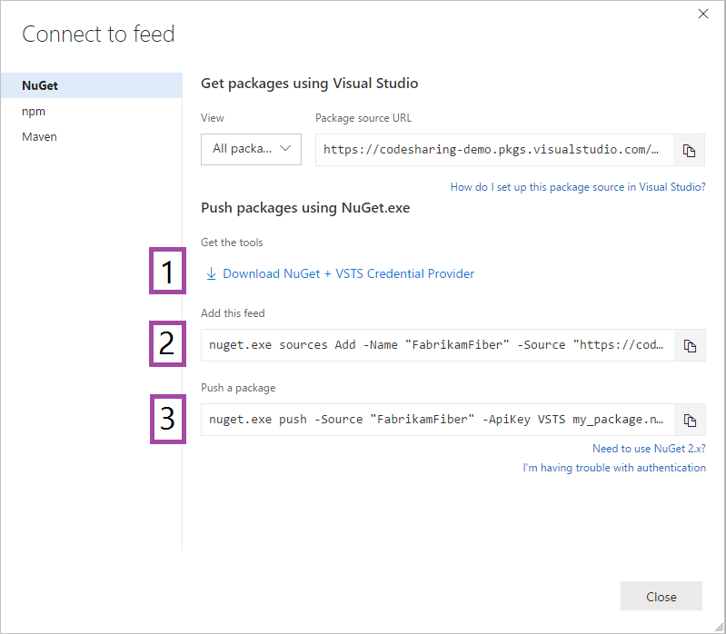
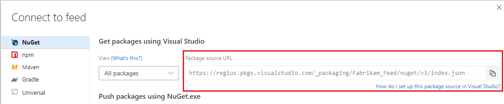

# Use NuGet with Azure DevOps Services feeds

**Azure DevOps Services**

> [!NOTE]
> This page covers interactive scenarios. In Azure Pipelines, use the NuGet step to [restore](/azure/devops/pipelines/packages/nuget-restore) and [publish](/azure/devops/pipelines/artifacts/nuget) packages. 

[!INCLUDE [nuget-3x](../_shared/nuget/nuget-3x.md)]

## Add a feed to NuGet 3 or later
NuGet 3 and later supports the Credential Provider, which automatically acquires feed credentials when needed.

1. Navigate to your feed ([or create a feed if you haven't](../feeds/create-feed.md)). 

1. Select **Connect to feed**:

   ::: moniker range=">= azure-devops-2019"
    
   > [!div class="mx-imgBorder"] 
   >
   > 

   ::: moniker-end

   ::: moniker range="<= tfs-2018"

   

   ::: moniker-end

1. Follow steps 1, 2, and 3 to get the tools, add the feed to your local NuGet configuration, and push the package.

   ::: moniker range=">= azure-devops-2019"

   > [!div class="mx-imgBorder"] 
   >
   > 

   ::: moniker-end

   ::: moniker range="<= tfs-2018"

   

   ::: moniker-end

Then, run any [nuget command](/nuget/tools/nuget-exe-cli-reference).

## Add a feed to NuGet 2
NuGet 2 uses Personal Access Tokens to access feeds.

To use a 2.x client, first get the v3 feed URL: 

1. Navigate to your feed ([or create a feed if you haven't](../feeds/create-feed.md)). 

1. Select **Connect to feed**:

   ::: moniker range=">= azure-devops-2019"

   > [!div class="mx-imgBorder"] 
   >
   > 

   ::: moniker-end

   ::: moniker range="<= tfs-2018"

   

   ::: moniker-end
   
1. Copy the NuGet package source URL:

   ::: moniker range=">= azure-devops-2019"

   > [!div class="mx-imgBorder"] 
   >
   > 

   ::: moniker-end

   ::: moniker range="<= tfs-2018"

   

   ::: moniker-end

Then, at the end of the URL, replace `/v3/index.json` with `/v2`. 

[!INCLUDE [generate-pat](../_shared/generate-pat.md)]

Run 

```no-highlight
nuget.exe sources add -name {your feed name} -source {your feed URL} -username {anything} -password {your PAT}
```

Then, run any [nuget command](/nuget/tools/nuget-exe-cli-reference).

## Download the credential provider directly
You can download the credential provider directly from this link. Replace `{org_name}` with your organization name:
`https://pkgs.dev.azure.com/{org_name}/_apis/public/nuget/client/CredentialProviderBundle.zip` 

## Advanced credential provider scenarios
### Install the credential provider
By default, the credential provider works alongside NuGet.exe.  

For advanced scenarios, you can choose where to install the provider:

  - **Projects with a developer command prompt or enlistment:** Use the provider from an 
    [environment variable](http://docs.nuget.org/Consume/Credential-Providers#using-a-credential-provider-from-an-environment-variable) by copying `CredentialProvider.Vss.exe` to any folder, then run this command in PowerShell: `$env:NUGET_CREDENTIALPROVIDERS_PATH = {your folder}`
  - **Projects using a non-Azure DevOps Services CI server:** Use the provider from an 
    [environment variable](http://docs.nuget.org/Consume/Credential-Providers#using-a-credential-provider-from-an-environment-variable)
  - **Work on an individual machine:** Install the provider 
    [globally](http://docs.nuget.org/Consume/Credential-Providers#installing-a-credential-provider-globally) by copying `CredentialProvider.Vss.exe` to `$env:LOCALAPPDATA\NuGet\CredentialProviders`

### Bootstrap into your workflow

You can also add the provider to your enlistment or developer command prompt using our [bootstrap tools](bootstrap-nuget.md).
This is recommended if you're using the provider in a multi-engineer development environment.
