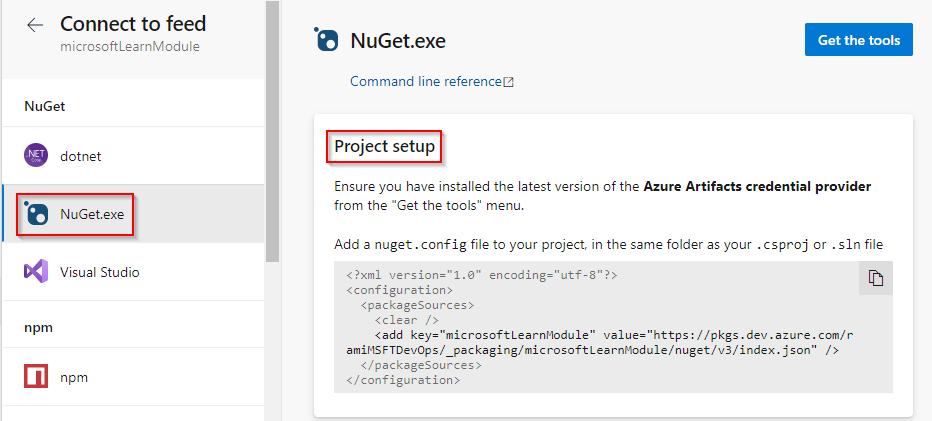
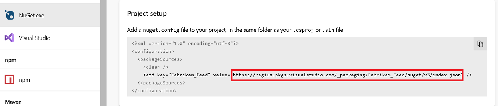
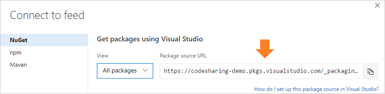

# Use NuGet with Azure DevOps Services feeds

**Azure DevOps Services**

> [!NOTE]
> This page covers interactive scenarios. In Azure Pipelines, use the NuGet step to [restore](../../pipelines/packages/nuget-restore.md) and [publish](../../pipelines/artifacts/nuget.md) packages. 

[!INCLUDE [nuget-recommended-version](../includes/nuget/nuget-recommended-version.md)]

## Add a feed to NuGet 4.8.2 or later
NuGet 4.8.2 and later supports the Azure Artifacts Credential Provider, which automatically acquires feed credentials when needed. For more information on using credential providers with NuGet, see [Creating a NuGet credential provider](/nuget/reference/extensibility/nuget-exe-credential-providers#creating-a-nugetexe-credential-provider).

1. Navigate to your feed ([or create a feed if you haven't](../index.yml)). 

2. Select **Connect to feed**:

::: moniker range=">= azure-devops-2019"

   > [!div class="mx-imgBorder"] 
   >
   > 

3. Select **NuGet.exe** under the **NuGet** header

4. Select **Get the tools** in the top-right corner

5. Follow steps **1** and **2** to download the latest NuGet version and the credential provider.

6. Follow the instructions in the **Project setup**, **Restore packages**, and **Publish packages** sections to publish.

   > [!div class="mx-imgBorder"] 
   >
   > 

   > [!NOTE]
   > You can also paste the **Project setup** XML snippet in your default nuget.config file to use outside of a project.

::: moniker-end

::: moniker range="<= tfs-2018"

   

3. Follow steps 1, 2, and 3 to get the tools, add the feed to your local NuGet configuration, and push the package.

   

   ::: moniker-end

Then, run any [NuGet command](/nuget/tools/nuget-exe-cli-reference).

::: moniker range="<= tfs-2018 || azure-devops"

## Add a feed to NuGet 2

::: moniker-end

::: moniker range="azure-devops"

NuGet 2 uses Personal Access Tokens to access feeds.

To use a 2.x client, first get the v3 feed URL: 

1. Navigate to your feed ([or create a feed if you haven't](../index.yml)). 

2. Select **Connect to feed**:
   
   > [!div class="mx-imgBorder"] 
   >
   > 
3. Copy the NuGet package source URL:

   > [!div class="mx-imgBorder"] 
   >
   > 

Then, at the end of the URL, replace `/v3/index.json` with `/v2`. 

[!INCLUDE [generate-pat](../includes/generate-pat.md)]

Run 

```Command
nuget sources add -name {your feed name} -source {your feed URL} -username {anything} -password {your PAT}
```

Then, run any [NuGet command](/nuget/tools/nuget-exe-cli-reference).

::: moniker-end

::: moniker range="<= tfs-2018"

NuGet 2 uses Personal Access Tokens to access feeds.

To use a 2.x client, first get the v3 feed URL: 

1. Navigate to your feed ([or create a feed if you haven't](../index.yml)). 

2. Select **Connect to feed**:

   

3. Copy the NuGet package source URL:

   

   
Then, at the end of the URL, replace `/v3/index.json` with `/v2`. 

[!INCLUDE [generate-pat](../includes/generate-pat.md)]

Run 

```Command
nuget sources add -name {your feed name} -source {your feed URL} -username {anything} -password {your PAT}
```

Then, run any [NuGet command](/nuget/tools/nuget-exe-cli-reference).

   ::: moniker-end