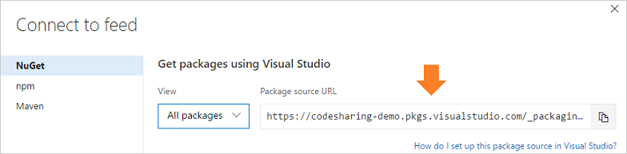

# Use NuGet or dotnet with Team Foundation Server feeds

**TFS 2018** | **TFS 2017**

Authentication from command-line clients like `nuget` and `dotnet` is a little different for Team Foundation Server users.

## Domain users on domain-joined machines

You can use [consume packages with Visual Studio](consume.md), [publish with nuget](publish.md), and use [nuget](nuget-exe.md) and [dotnet](dotnet-exe.md). Ignore any content about the Credential Provider or Personal Access Tokens&mdash;everything will work using your domain credentials.

## Non-domain users (e.g. service accounts, users on non-domain-joined machines)

> This workflow is **not recommended**, because it requires that you store **your encrypted domain password** on disk. Please consider the security implications before continuing.

1. Navigate to your feed ([or create a feed if you haven't](../feeds/create-feed.md)). 

1. Select **Connect to feed**:

    
   
1. Copy the NuGet package source URL:

    

Then, run the following command (replacing {values} where applicable):

```no-highlight
nuget sources add -name {your feed name} -source {your feed URL} -username {your domain username} -password {your domain password}
```
