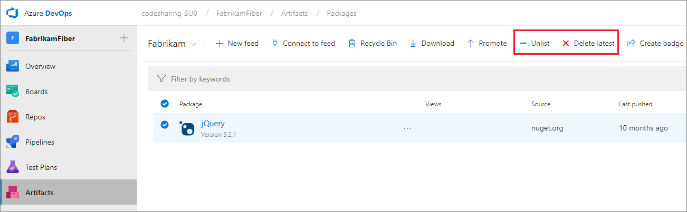

# Unlist, delete, or recover a NuGet package

**Azure DevOps Services** | **TFS 2018** | **TFS 2017**

There are two options available to remove a version of a NuGet package from a feed.

1. **Unlist:** Unlisting a version of a package modifies how the package appears in NuGet clients (see the [NuGet docs](/nuget/policies/deleting-packages) for a full description of how unlist works). Unlisting a version can help you prevent new usage of it without breaking dependent projects and builds.
2. **Delete:**  Deleting a version of a package makes it unavailable for install. After deleting, a package can be [restored from the _Recycle Bin_](#recover-a-deleted-nuget-package) within 30 days of deletion. After 30 days, it is permanently unavailable to restore. Deleting a package will cause others that depend on it to break.

Unlist and delete both respect [feed immutability](../feeds/immutability.md). Once you publish a particular version of a package to a feed, that version number is permanently reserved. 
You cannot upload a newer revision package with that same version number, or delete it and upload a new package at the same version.

::: moniker range="vsts"

## Unlisting or deleting a NuGet package in Azure DevOps Services

You must be a **contributor** to unlist and an **owner** to delete.

# [New navigation](#tab/new-nav)
Choose the package from **Azure Artifacts** select the appropriate option from the menu:



# [Previous navigation](#tab/previous-nav)
Choose the package from the **Packages** page in the **Build and Release** page group and select the appropriate option from the menu:


---

::: moniker-end

::: moniker range=">=tfs-2017 < vsts"

## Unlisting or deleting a NuGet package in Team Foundation Server

You must be a **contributor** to unlist and an **owner** to delete.

Choose the package from the **Packages** page in the **Build and Release** page group and select the appropriate option from the menu:


::: moniker-end

## Unlisting a NuGet package using NuGet.exe
First, get the tools (make sure you're using NuGet 3.5 or later) and your feed URL:

[!INCLUDE [](../_shared/nuget/nuget-publish-endpoint.md)]

Then, run

```no-highlight
nuget.exe delete {your_package_id} {version} -Source {feed URL} -ApiKey key
```

Currently, NuGet.exe can only **unlist** packages; Azure DevOps Services and TFS interpret `nuget.exe delete` as an unlist operation to be consistent with NuGet.org. To **delete** a package, you must use either the REST APIs or the web interface. 

## Recover a deleted NuGet package

[!INCLUDE [](../_shared/recover-deleted-package.md)]