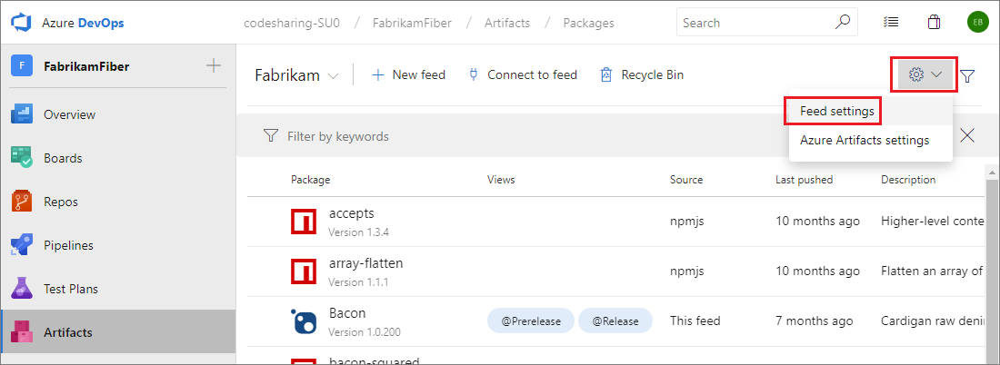
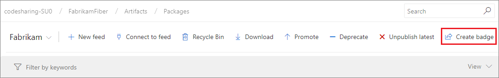
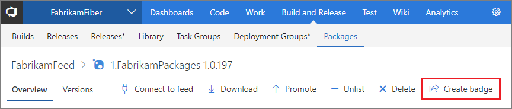

# Share your NuGet, npm, and Maven packages from Azure DevOps Services with badges

**Azure DevOps Services**

You can share your packages anywhere you can share an image with badges. You can put a badge directly into your project's home page in Azure DevOps Services or in any Markdown/README file so readers can easily discover and consume your package.

Example NuGet package badge:  

## Enable package sharing

To start sharing your Azure DevOps Services-hosted packages with badges you'll first have to turn on **Package sharing** in your feed settings.

> Only feed administrators can edit the feed.

1. Go to your Feed settings page by clicking on the gear icon from your feed page: 

   ::: moniker range=">= azure-devops-2019"

   

   ::: moniker-end

   ::: moniker range="<= tfs-2018"

   

   ::: moniker-end

2. Find the **Package sharing** section and select *Enable package badges*.

This will enable the **Create badge** button for every package in that feed.

::: moniker range=">= azure-devops-2019"

::: moniker-end

::: moniker range="<= tfs-2018"

::: moniker-end

## Create badge

You can create a badge for any package that is in a feed with package sharing enabled. You can only create a badge for the latest version of each package.

1. Go to your package in Azure DevOps Services and click the **Create badge** option. 

2. Select a *Feed view* for your package badge. If you're using release views, select the view that contains the packages you want to share; otherwise, just use `No view`.

3. You'll see a preview of your badge. You can copy the Markdown version of your badge that includes alt text, or a direct image link. 

Add the markdown or direct image link to your README or any other place you want to share your package!
