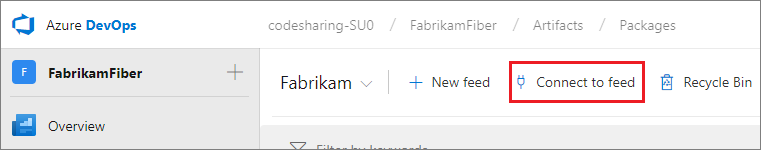
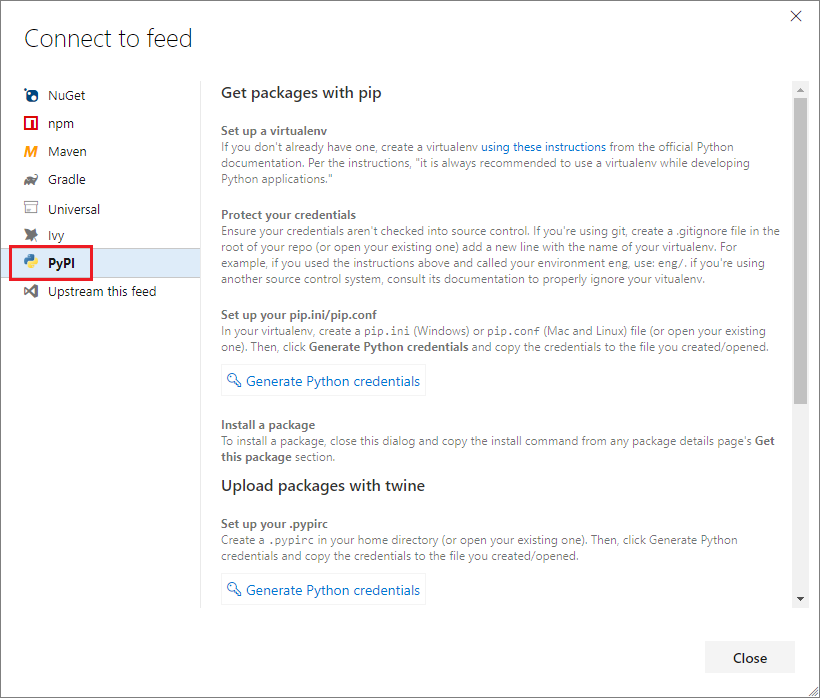

# PRIVATE PREVIEW: Using Python packages with Azure Artifacts

> [!NOTE]
> Python packages are in private preview. You will not be able to use this functionality unless this feature is turned on for your organization. If you do not see **PyPI** as an option when connecting to a feed, then this functionality has not been turned on. Please reach out to Jan.Vandenbos@microsoft.com and HDixon@microsoft.com with your Azure DevOps organization name if you would like to request access to this feature.

## Navigate to Azure Artifacts

1. Go to your Azure DevOps organization: **https://dev.azure.com/[organization_name]** (**https://[organization_name].visualstudio.com** for older URLs)
2. Select your project
3. Navigate to **Azure Artifacts**
    * _New navigation_: Select **Artifacts** on the left side.
    * _Previous navigation_: Select the **Packages** page under the **Build & Release** page group. 

## Create a feed

If you don't already have a Azure Artifacts feed, [create one now](../feeds/create-feed.md)

## Connect to feed

1. Connect to the feed you've just created: 

    

2. Choose **PyPl** from the menu on the left

    

3. Follow the instructions to upload, download, or view a Python package.

If the instructions do not work for you, please let us know as this is part of our testing. There are two walkthroughs – one for installing packages via pip, and one for uploading packages to the feed via twine.

**All feedback appreciated. Thanks for helping us out.**

