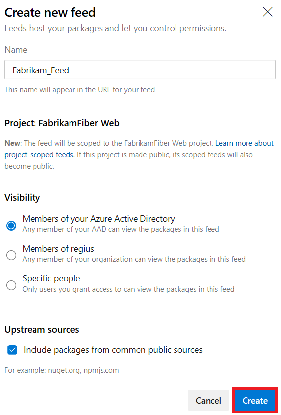

# Get started with Python packages in Azure Artifacts

This quickstart guides you through using Azure Artifacts to consume and publish Python packages in Azure DevOps Services. It covers license assigning and setup.

> [!NOTE]
> Python package functionality in Azure Artifacts is currently in public preview.

## Step 1: License the Azure Artifacts extension

### Assign Azure Artifacts in Azure DevOps Services

Each organization gets five free licenses. If you need more than five licenses, go to the [Marketplace page for Azure Artifacts](https://marketplace.visualstudio.com/items?itemName=ms.feed) and select **Get**. Select **Buy** and purchase the additional licenses that you need.  

Assign your licenses by following these instructions:

::: moniker range=">= azure-devops-2019"

1. Go to your organization and select **Admin settings** on the lower left of the UX.
2. Select **Users**.
3. Select the user or users you want to assign the Azure Artifacts extension to, and select **Manage extensions**.
4. If you're selecting multiple users, select **Assign extensions** and choose the Azure Artifacts extension. If you're selecting only one user, select the Azure Artifacts box under **Extensions** and select **Save changes**.

If you have a Visual Studio Enterprise license, you already have access to Azure Artifacts and don't need to be assigned a license. Just ensure that you've been assigned the "Visual Studio Enterprise" access level.

::: moniker-end

::: moniker range="<= tfs-2018"

1. Go to your account, go to the **Users** page, and select **Package Management**.
2. Select **Assign**, type the users you want to assign licenses to, and then select **Ok**.

If you have a Visual Studio Enterprise license, you already have access to Package Management and don't need to be assigned a license. Just ensure that you've been assigned the "Visual Studio Enterprise" access level.

::: moniker-end

## Step 2: Create a feed

On your first visit to Azure Artifacts, you're welcomed with an image that prompts you to create a new feed. Select the **+ New feed** button.

In the dialog box:
* **Name**: Give the feed a name. "PyPI" is the default repository name for `twine`, which is a tool for publishing Python packages. We recommend that you don't name your feed "PyPI," because you might accidentally push to the wrong repository if you don't provide a repository name with `-r`. 
* **Visibility**: Choose who can read and contribute (or update) packages in your feed.  An organization-visible feed is created with permissions that allow all users in the organization to see and use your feed (recommended).  A private feed is created with permissions such that only you have access.
* **Packages from public sources**: Selecting **Use packages from public sources through this feed** will add the public npm, NuGet, and PyPI registries as upstreams to your feed. When upstreams are enabled, your client will be able to fetch packages from the public registry through your private feed, and your private feed will cache those packages for you. If you select **Use packages published to this feed**, your feed will be created without connectivity to public registries. You can connect them later if you want.
* When you're done, select **Create**.

::: moniker range=">= azure-devops-2019"

> [!div class="mx-imgBorder"] 
>
> 

::: moniker-end

::: moniker range="<= tfs-2018"

::: moniker-end

You can change these settings later by [editing the feed](../feeds/edit-feed.md).

## Step 3: Connect to your feed

1. From your feed in **Azure Artifacts**, select **Connect to feed**.

   ::: moniker range=">= azure-devops-2019"

   > [!div class="mx-imgBorder"] 
   >
   > 

   ::: moniker-end

   ::: moniker range="<= tfs-2018"

   

   ::: moniker-end

2. When the **Connect to feed** dialog box opens, choose Python from the left menu. 

This will bring up instructions on how to publish a package to your feed by using [Python’s twine command](https://pypi.org/project/twine/), and how to consume and download packages by using [pip](https://pypi.org/project/pip/).

## Next steps

### Publish Python packages from your builds

If you want to consume or publish Python packages as part of your continuous integration/continuous delivery (CI/CD) pipeline, check out the [Publish Python packages from Azure Pipelines guide](/azure/devops/pipelines/targets/pypi).

### Build Python apps with Azure Pipelines

To learn more about how to create, configure, and use Python packages as part of your project or pipeline, check out the [Build Python apps with Azure Pipelines guide](https://docs.microsoft.com/azure/devops/pipelines/languages/python?view=azure-devops).

## Resources

If you’d like to learn more about how Python packages work, there’s a great write-up in the *Architecture of Open Source Applications* book. Here's an excerpt:

* [The Architecture of Open Source Applications: Python Packaging](http://www.aosabook.org/en/packaging.html)
