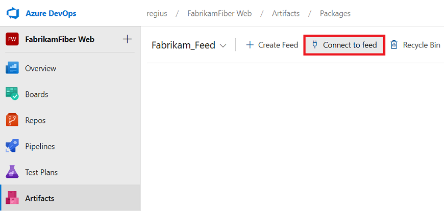

# Get started with Python packages in Azure Artifacts

**Azure DevOps Services** | **Azure DevOps Server 2019 Update 1**

This quickstart guides you through using Azure Artifacts to consume and publish Python packages by creating and connecting to a feed.

## Create a feed

1. In the left navigation of your Azure DevOps project, select **Artifacts**. 

2. On the **Artifacts** page, select **Create Feed**.

3. In the **Create new feed** dialog box:

   - In the **Name** field, give the feed a name. 
     
     *PyPI* is the default repository name for `twine`, which is a tool for publishing Python packages. It's best not to name your feed *PyPI*, because if you don't use `-r` to specify a repository name when pushing, you might accidentally push to the wrong repository. 
     
   - Under **Visibility**, select who can read and contribute, or update, packages in your feed. The recommended **People in \<your organization>** setting lets all members in the organization see and use your feed. 
   
   - Under **Packages from public sources**, select **Use packages from public sources through this feed** to add the public `npm`, `NuGet`, and `PyPI` registries as upstreams to your feed. 
     
     When these upstreams are enabled, your client will be able to fetch packages from the public registry through your private feed, and your private feed will cache those packages for you. If you select **Only use packages published to this feed**, your feed won't be connected to public registries, but you can connect to them later if you want.
   
4. Select **Create**.

   

To edit your feed settings, select the gear icon at upper right on the feed page, and then select **Feed settings**. 

## Connect to your feed

There are two primary ways to connect to a feed to push or pull Python packages:

- Install and use the [Python Credential Provider (artifacts-keyring) (preview)](https://github.com/microsoft/artifacts-keyring), which sets up authentication for you.
- Manually set up credentials for `pip.ini`/`pip.conf` for pushes, or `.pypirc` for pulls, through a personal access token (PAT).

### Option 1: Use Python Credential Provider (preview) to automate authentication

The Python Credential Provider is an `artifacts-keyring` package in public preview that you can install from the Python Package Index (PyPI). The Python Credential Provider lets the [pip](https://pypi.org/project/pip/) and [twine](https://pypi.org/project/twine/) commands authenticate by sending you through an authentication flow in your web browser. 

The Python Credential Provider is a manual interaction. If you want to set up authentication in an Azure Pipelines pipeline, use the [Pip Authenticate task](../../pipelines/tasks/package/pip-authenticate.md) to install packages, or the [Twine Upload Authenticate task](../../pipelines/tasks/package/twine-authenticate.md) to push packages.

> [!IMPORTANT]
> You must have `pip` version 19.2 and `twine` version 1.13.0 or higher installed to use the Python Credential Provider.

1. From your command line, install the [artifacts-keyring](https://github.com/microsoft/artifacts-keyring) package:
   
   ```bash
   pip install artifacts-keyring --pre
   ```
   
2. Install or upload packages to your feed. 
   
   For `pip` installs, run the following command:
   
   ```bash
   pip install <package-name> --index-url https://pkgs.dev.azure.com/<your organization name>/_packaging/<your feed name>/pypi/simple
   ```
   
   For `twine` uploads, run the following command:
   
   ```bash
   twine upload --repository-url https://pkgs.dev.azure.com/<your organization name>/_packaging/<your feed name>/pypi/upload <package wheel or other dist format>
   ```
   
3. Follow the authentication flow in your browser.

### Option 2: Manually configure authentication

1. From your feed in **Azure Artifacts**, select **Connect to feed**.

   
   
2. In the **Connect to feed** dialog box, select **Python** from the left menu. 
   
3. Follow the instructions to **Get packages with pip** or **Upload packages with twine**. 

## Next steps

To consume or publish Python packages as part of your continuous integration/continuous delivery (CI/CD) pipeline, see [Publish Python packages in Azure Pipelines](../../pipelines/targets/pypi.md).

To learn more about how to create, configure, and use Python packages as part of your project or pipeline, see [Build Python apps](../../pipelines/ecosystems/python.md).

If you’d like to learn more about how Python packages work, see [The Architecture of Open Source Applications: Python Packaging](http://www.aosabook.org/en/packaging.html), an excerpt from the book *Architecture of Open Source Applications*.
