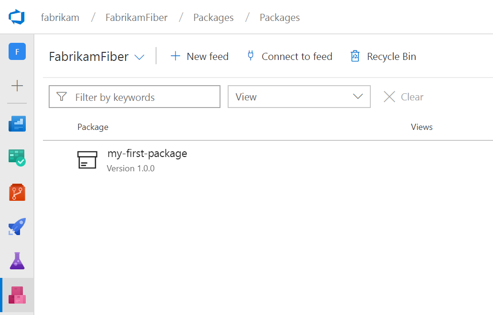

# Publish and then download a Universal Package

> [!NOTE]
> Universal Packages are currently in public preview.

Universal Packages store one or more files together in a single unit that has a name and version. You can publish Universal Packages from the command line by using the [Azure CLI](https://docs.microsoft.com/en-us/cli/azure/?view=azure-cli-latest). 

This quickstart shows you how to publish your first Universal Package by using the CLI, and how to download it by using the CLI. To see your package, you can go to your feed in Azure Artifacts.

## Prerequisites

1. Download and install the latest [build](https://docs.microsoft.com/en-us/cli/azure/?view=azure-cli-latest) of the Azure CLI.
2. If you're using Linux, ensure you've installed the [.NET Core Linux prerequisites](/dotnet/core/linux-prerequisites).
3. Install the Azure DevOps extension for the Azure CLI using the command ```az extension add --name azure-devops```

## Prepare files for publishing

Create a new directory, and copy the files you want to publish as a package into that directory.

## Create a feed

If you don't already have a Azure Artifacts feed, [create one now](../feeds/create-feed.md) and note its name. If you already have a feed, just note the name.

## Log in to Azure DevOps

The following sections vary based on whether you've opted in to the new [Azure DevOps Services URLs](/azure/devops/extend/develop/work-with-urls).

# [New URLs](#tab/azuredevops)

After you've installed the CLI, open your shell of choice (for example, PowerShell or cmd) and browse to the directory that you just created. Then, log in to Azure DevOps by using the following command. Replace the items in square brackets (`[]`) with appropriate values.

```azurecli
az login
```

Next, set the organization that you just logged in to as the CLI's default. Again, replace the item in square brackets.

```azurecli
az devops configure --defaults organization=https://dev.azure.com/[your-organization] project=ContosoWebApp
```

#  [Legacy URLs](#tab/vsts)

After you've installed the CLI, open your shell of choice (for example, PowerShell or cmd) and browse to the directory that you just created. Then, log in to Azure DevOps by using the following command. Replace the items in square brackets (`[]`) with appropriate values.

```azurecli
az login
```

Next, set the organization that you just logged in to as the CLI's default. Again, replace the item in square brackets.

```azurecli
az devops configure --defaults organization=https://[your-organization].visualstudio.com project=ContosoWebApp
```

---

## Publish a Universal Package

Publish a package with `az artifacts universal publish`. The following example publishes a package named *my-first-package* with version *1.0.0* to the *FabrikamFiber* feed in the *fabrikam* organization with a placeholder description.

Update these values as desired, and use the feed name that you noted earlier. You must use [Semantic Versioning (SemVer)](https://semver.org) for the version. Package names must be lowercase and can use only letters, numbers, and dashes (`-`).

# [New URLs](#tab/azuredevops)

```azurecli
az artifacts universal publish --organization https://dev.azure.com/fabrikam --feed FabrikamFiber --name my-first-package --version 1.0.0 --description "Your description" --path .
```

#  [Legacy URLs](#tab/vsts)

```azurecli
az artifacts universal publish --organization https://fabrikam.visualstudio.com --feed FabrikamFiber --name my-first-package --version 1.0.0 --description "Your description" --path .
```

---

## View the package in your feed

To see the package that you just published, go to the organization that you specified in the publish command, select any project, and then select the **Packages** page under the **Build & Release** page group. Or, if you've enabled the [new navigation preview](https://blogs.msdn.microsoft.com/devops/2018/06/19/new-navigation/), just select **Packages** on the left side.



## Download a Universal Package

Now that you've published a package, you can download it to a different directory on your machine. To do that, make a new directory and switch to it. Then, download your package.

The following example downloads a package with the same metadata as the publish example. Update these values to match the values that you selected when you published your package.

# [New URLs](#tab/azuredevops)

```azurecli
az artifacts universal download --organization https://dev.azure.com/fabrikam --feed FabrikamFiber --name my-first-package --version 1.0.0 --path .
```

#  [Legacy URLs](#tab/vsts)

```azurecli
az artifacts universal download --organization https://fabrikam.visualstudio.com --feed FabrikamFiber --name my-first-package --version 1.0.0 --path .
```

---

## Next steps

In this quickstart, you published your first Universal Package and then downloaded back to your machine. To learn more about the Universal Package CLI, append `-h` to any CLI command. To use Universal Packages in a build, see the [Azure Pipelines doc for Universal Packages](../../pipelines/artifacts/universal-packages.md).
