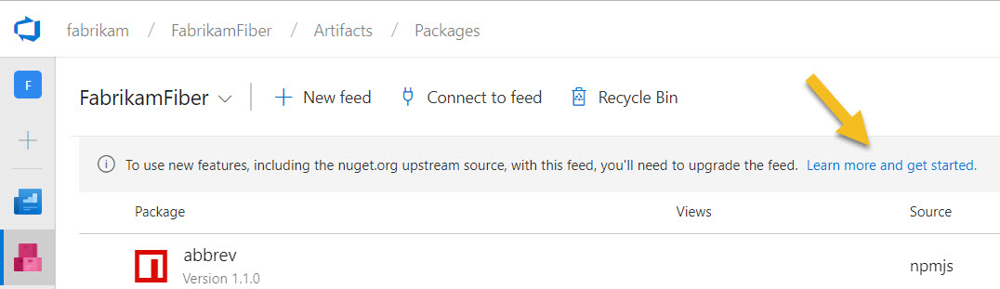
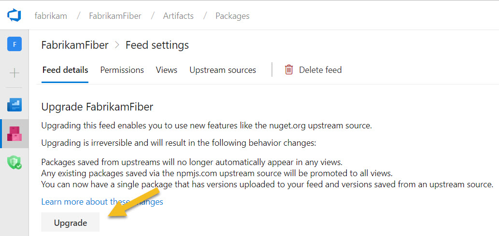

# Upgrading a legacy feed

As part of adding the ability to use [upstream sources](../concepts/upstream-sources.md) with more public sources (like nuget.org) and with other Azure DevOps Services feeds, we made some changes to how packages are cached/saved from those sources. We also made some changes to how upstream packages are used in [views](../concepts/views.md). Before upgrading a feed that previously used views, you should be aware of the behavior changes outlined in this article.

## Determine if your feed is a legacy feed

You can check if your feed is using the legacy upstream sources feature by attempting to [add the nuget.org upstream source](../nuget/upstream-sources.md#existing-feed). You may also see a banner in your feed.

If you're unable to do so, your feed is a legacy feed. You can also determine if your feed is a legacy feed using the criteria below:

- **TFS users:** all feeds created using TFS 2018 RTM and earlier are legacy feeds. 
- **Azure DevOps Services users** who enabled the **nuget.org upstream source** preview feature: all feeds created before the preview feature was enabled are legacy feeds
- **Azure DevOps Services users** who didn't enable the preview feature: all feeds created before the February update are legacy feeds

## Upgrade a legacy feed

If you have a legacy feed, you can upgrade it by going to feed settings (the gear icon in the upper right of the feed page) and clicking the button to upgrade.

## Behavior differences in legacy feeds

### nuget.org upstream source

Legacy feeds are unable to use the nuget.org upstream source. When you upgrade your feed, you'll be able to add the nuget.org upstream source.

### Shadowing

In the legacy npmjs.com upstream source, when a feed with upstreams enabled receives a query (e.g. `npm install lodash`), it will first check for local packages with that package ID. If there is at least one local version of that package ID, the upstream source will not be used. So, for example, if you publish `lodash@1.0.0` and run `npm install lodash@2.0.0`, the request will fail, even if 2.0.0 exists on npmjs.com and upstream sources are enabled.

For the legacy upstream source, shadowing is permanent. So, in the example above, even if you later unpublish `lodash@1.0.0`, requests for any `lodash` version will only check the local feed. After you upgrade your feed, this shadowing happens at the [package-version level](../concepts/upstream-sources.md#overriding-packages).

### Upstream packages in views

In the legacy upstream source, all packages saved from the upstream automatically appeared in all views (e.g. `@release`). When you upgrade your feed, you'll need to manually promote any upstream packages you want to make available via a view.

### Online requirement for the npmjs.com upstream source

In legacy feeds, when you run an `npm install` command, the feed will check to see if it has a cache of the package(s) requested by the `npm` client. If it does not, it will redirect the client to download the package from npmjs.com directly, and also cache the package in the background. The first client (where client is a developer machine or a build agent) to install a given npm package **will** need Internet access to successfully retrieve the package *or* they will have to run `npm install` twice. The first install will fail but cause the package to be cached; the second install will return the package from the cache.

After you upgrade your feed, Azure DevOps Services automatically handles the saving of all packages. If you're using TFS, only your TFS server needs access to the internet to save packages from upstream.

## How to upgrade a legacy feed

You'll be able to upgrade a legacy feed to take advantage of the new upstream sources support in the next month or two. Keep an eye on the [release notes](/azure/devops/release-notes/) for more information.