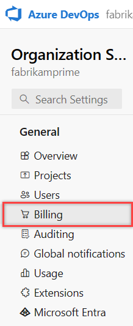
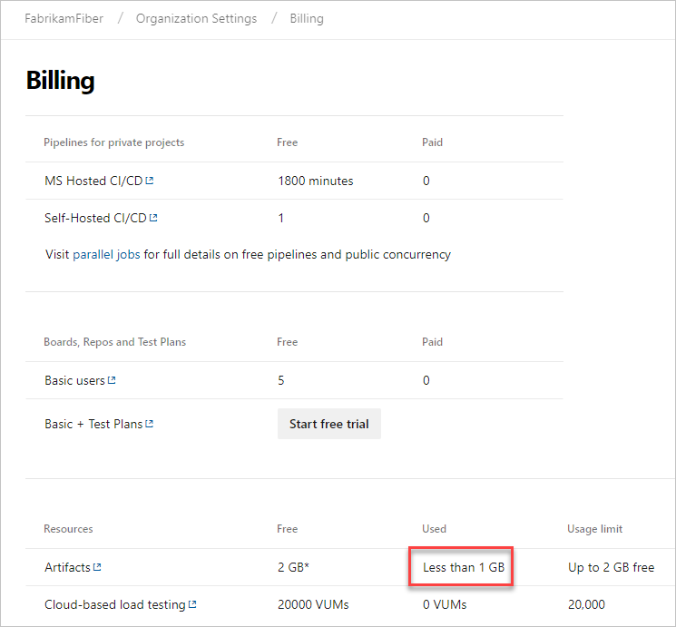

# Azure Artifacts Overview

Azure Artifacts enable developers to share and consume packages from different feeds and public registries. Packages can be shared within the same team, the same organization, and even publicly. Azure Artifacts supports multiple package types such as NuGet, Npm, Python, Maven, and Universal Packages.

Azure Artifacts gets billed on a consumption basis, and is free up until 2 GiB of storage. If your organization needs more storage, you must [set up billing](../organizations/billing/set-up-billing-for-your-organization-vs.md).

Azure Artifacts comes pre-installed in Azure DevOps Services, Azure DevOps Server 2019 and 2020, and TFS 2017 and 2018.

## Prerequisites

- A Project Collection Administrator or an Organization Owner [access permissions](../organizations/security/lookup-organization-owner-admin.md).
- [Whitelist IP addresses and domain URLs](../organizations/security/allow-list-ip-url.md) if your organization is using a firewall or a proxy server.
- If you plan to use more than the free 2 GiB storage, you must [set up billing](../organizations/billing/set-up-billing-for-your-organization-vs.md) for your organization.

> [!NOTE]
> Azure Artifacts license is included with every basic license for TFS 2017, 2018, and Azure DevOps Server 2019 and 2020.

::: moniker range=">= tfs-2017 <= tfs-2018"

## Install Azure Artifacts in TFS

Azure Artifacts comes pre-installed in TFS 2017 and 2018. If the extension has been removed, you can install it from the [Visual Studio Marketplace](https://marketplace.visualstudio.com/items?itemName=ms.feed).

## Assign licenses in TFS

1. From any collection in TFS, hover over the settings menu and select the **Users** page. Then, select **Azure Artifacts**.

   > [!div class="mx-imgBorder"]
   > 

2. Select **Assign**, enter the user to assign licenses, and then select **Ok.**

   * Users with Visual Studio Enterprise subscriptions get Azure Artifacts automatically.  
   * Ensure that your Visual Studio Enterprise subscribers are assigned **VS Enterprise** [Access level](../organizations/security/change-access-levels.md).

::: moniker-end

::: moniker range=">=azure-devops-2019"

## Billing and free monthly usage

Azure Artifacts includes a free usage tier of 2 GB. Any usage below this level isn't billed to your subscription. Above this limit, we charge you for your actual usage. The usage limit allows you to control the maximum volume of storage that you're billed for. Once the maximum usage limit is reached, you can no longer upload artifacts and will need to either reduce your artifact storage, or increase your usage limit. For more information on usage tiers, see the [Azure Artifacts pricing page](https://azure.microsoft.com/pricing/details/devops/azure-devops-services/). For Microsoft-internal customers, please refer to internal documentation on Microsoft pricing. 

> [!NOTE]
> Organizations created before May 6, 2019 will remain on the per-user billing model, and will be switched over to storage-based charging as soon as November 1, 2020. More details on billing changes can be found on [the Azure DevOps blog](https://devblogs.microsoft.com/devops/azure-artifacts-billing-changes-coming-october-2020/). 

## View artifact and billed storage

To see your storage bill for Azure Artifacts:
 
1. Sign in to your organization (```https://dev.azure.com/{yourorganization}```). 
 
2. Select  **Organization settings**. 
   > [!div class="mx-imgBorder"]
   >  
 
3. Select **Billing**. 
 
   > [!div class="mx-imgBorder"]
   > 
 
4. Find Artifacts and see your current billed usage from Azure Artifacts, or review a breakdown of the different types of storage your organization is currently using. See the [FAQs](#faqs) further in this article for information on which artifacts count towards your storage total. 

   > [!div class="mx-imgBorder"]
   > 

> [!NOTE]
> Based on community feedback, we're working on more granular drilldowns and views into your artifact storage. More information to come. 

## Pay for Azure Artifacts

Each organization gets Azure Artifacts for free, up until 2 GiB of storage is used. If you need more than 2 GiB, [set up billing](../organizations/billing/set-up-billing-for-your-organization-vs.md).

If you've reached your storage limit, you'll be blocked from making additional uploads. It can take up to 1 hour after increasing your limit for uploads to be re-enabled. 

## FAQs

### Q: Which artifacts count toward my total billed storage?

A: Currently, the following get counted in your Azure Artifacts billed cost: 
* All packages (npm, NuGet, Python, Maven, and Universal Packages), including those packages stored from upstream sources.

You're not billed by Azure Artifacts for storage of Pipeline Artifacts, Build Artifacts, and Pipeline Caching.

> [!NOTE]
> Packages that are placed in the recycle bin will be deleted permanently after 30 days. However, these packages still count as part of your storage bill. If you want to delete them sooner, you can navigate to the recycle bin and delete them manually.

### Q: Why do I see 0 GiB of storage, even though I'm storing artifacts?

A: 1 GiB is currently our lowest granularity, so you most likely haven't reached 1 GiB yet. 

### Q: How can I control how long artifacts are stored?

A: Retention for stored packages can be set via the feed retention policy. See how to [automatically delete old package versions with retention policies](how-to/delete-and-recover-packages.md#automatically-delete-old-package-versions-with-retention-policies).

### Q: How can I delete my artifacts? 

A: To delete packages within your feeds, see [delete and recover packages in Azure Artifacts](how-to/delete-and-recover-packages.md). 

### Q: How long does it take for deleted artifacts to affect the amount of billed storage?

A: Deletion of artifacts doesn't register immediately. Storage usage should be updated within 24 hours, but in some cases it may take up to 48 hours maximum. If you're blocked from uploading artifacts, you can temporarily increase your usage level to continue publishing artifacts. Then, reduce the level once the storage metrics are updated.

The `used` value on the Billing tab of your Organization Settings page gets updated once per day. When you delete artifacts, it may not reflect immediately on your billing page. The Artifact Storage tab gets updated more frequently, so you may see a small discrepancy between the two.  

### Q: What happens if I remove my Azure Subscription from my Azure DevOps organization?

A: When you remove your Azure Subscription from your Azure DevOps organization, you only have access to the free tier of storage (< 2 GiB). If you have above 2 GiB of used storage, you can only read packages. You can't push packages until you lower your usage below 2 GiB, or you can reconnect an Azure subscription to your organization and increase your storage tier appropriately.

### Q: What about customers who were using Artifacts before May 6, 2019 under the previous per user model?

A: Customers from before May 6, 2019 aren't charged for Artifacts storage until November 1, 2020. You can opt in to the new storage model by setting a paid limit above the amount of storage you're currently using. If you opt in, your Azure bill will include the storage cost calculated from November 1 onward. 

::: moniker-end

## What's next?

* [Artifacts Storage breakdown](artifact-storage.md)