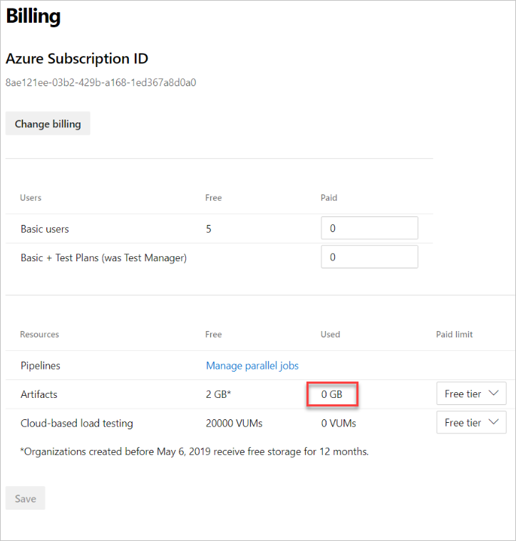
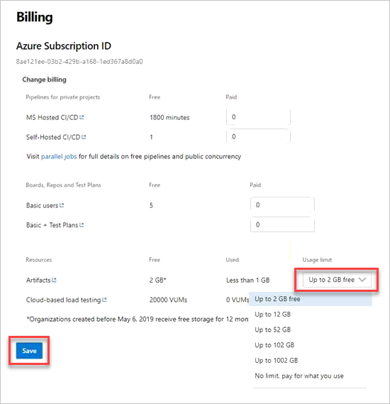

# Sign up for Azure Artifacts

**Azure DevOps** | **Azure DevOps Server 2019** | **TFS 2018** | **TFS 2017**

> [!NOTE]
> If you are using a version of TFS, you will need to license Azure Artifacts instead of signing up. 

::: moniker range="azure-devops"

[!INCLUDE [version-vsts-only](../_shared/version-vsts-only.md)]

This article guides you through the sign-up process for Azure Artifacts. Azure Artifacts is a service where you can create package feeds to publish and consume Maven, npm, NuGet, Python, and universal packages. Azure Artifacts is billed on a consumption basis, and is free up until 2 GB of storage. In the case that your organization needs more storage, you need to set up billing.

## Prerequisites

Ensure that the following statements are true:

- [Billing is set up for your organization](../organizations/billing/set-up-billing-for-your-organization-vs.md)
- You have [Project Collection Administrator or organization Owner permissions](../organizations/accounts/faq-add-delete-users.md#find-owner)

::: moniker-end

::: moniker range="= azure-devops-2019"

Users with a Basic license can use Azure Artifacts on-premises without needing to purchase an Azure Artifacts extension. This means with Azure DevOps Server 2019, users with a Basic license can create and consume Azure Artifacts on-premises if they have a Basic license assigned.

::: moniker-end

::: moniker range=">= tfs-2017 <= tfs-2018"

Azure Artifacts is an *extension* to TFS. The Azure Artifacts extension comes pre-installed in TFS 2017 and 2018.

Azure Artifacts is required for each user that consumes packages from (e.g., nuget restore or npm install) or produces packages to (e.g., nuget push or npm publish) Azure Artifacts feeds. Azure Artifacts is also required for each user that consumes or publishes symbols.

## Install Azure Artifacts in TFS

Azure Artifacts is installed by default for TFS 2017 customers.  You must upgrade to TFS 2017 in order to use Azure Artifacts.

> If the Azure Artifacts extension has been removed, you can install it from the [Marketplace page for Azure Artifacts](https://marketplace.visualstudio.com/items?itemName=ms.feed).

## Assign licenses in TFS

1. From any collection in TFS, hover over the settings menu and select the **Users** page. Then, select **Azure Artifacts**.

   

2. Select **Assign**, enter the user to whom you want to assign licenses, and then select **Ok.**

   * Users with Visual Studio Enterprise subscriptions get Azure Artifacts automatically.  
   * [Ensure that your Visual Studio Enterprise subscribers are assigned VSE access level](../organizations/security/change-access-levels.md).

::: moniker-end

::: moniker range="azure-devops"

## Billing and free monthly usage

Azure Artifacts includes a free usage tier of 2 GB. Any usage below this level isn’t billed to your subscription. Above this limit, we charge you for your actual usage. The usage limit allows you to control the maximum volume of storage that you're billed for. Once the maximum usage limit is reached, you can no longer upload artifacts. For more information on usage tiers, see the [Azure Artifacts pricing page](https://azure.microsoft.com/pricing/details/devops/azure-devops-services/).

## View storage used

See and manage what your overall storage use is for Azure Artifacts.
 
1. Sign in to your organization (```https://dev.azure.com/{yourorganization}```). 
 
2. Select  **Organization settings**. 
 
    
 
3. Select **Billing**. 
 
   
 
4. Find Artifacts and review your current usage.

   

## Pay for Artifacts

Each organization gets Azure Artifacts for free, up until they hit 2 GB of storage. If you need more than 2 GB, complete the following steps to set up billing.

1. Sign in to your organization (```https://dev.azure.com/{yourorganization}```). 
 
2. Repeat steps #2 and #3 from [View storage used](#view-storage-used).
 
3. Find Artifacts, under Resources, and increase the usage limit above the free tier, by selecting from the dropdown menu. Then, select **Save**. You're only charged for the storage you use, up to the limit. 

   

> [!NOTE]
> If you have reached your storage limit and are blocked from making additional uploads, it can take up to 1 hour after increasing your limit for uploads to be re-enabled. 

## FAQs

### Q: Which artifacts count toward my storage total?

A: Currently, the following get counted toward your storage total:
* All npm, NuGet, Python, Maven, and universal packages (including those packages stored from upstream sources)
* All symbols

You get Pipeline Artifacts, Build Artifacts, and Pipeline Caching with Azure Pipelines, and currently they don't count toward your storage total. 

### Q: Why do I see 0 GB of storage, even though I'm storing artifacts?

A: Currently, the billing page only shows integers of storage (0 GB, 1 GB, 2 GB, and so on). Even though you have stored artifacts, you most likely haven't reached 1 GB. 1 GB is currently our lowest granularity.

### Q: How can I control how long artifacts are stored?

A: Azure Artifacts retention is controlled by feed retention policy settings. Symbols also contribute to Azure Artifacts storage usage. Symbols retention is controlled by build retention policy.

For more information on how to set the feed retention policy, see how to [automatically delete old package versions with retention policies](how-to/delete-and-recover-packages.md#automatically-delete-old-package-versions-with-retention-policies).

### Q: How long does it take for deleted artifacts to affect the amount of used storage?

A: Deletion of artifacts doesn't register immediately. It can take up to 24 hours for the usage level to be updated. If you're blocked from uploading artifacts, you can temporarily increase your usage level to continue publishing artifacts. Then, reduce the level once the storage metrics are updated.

Usage is updated once per day, so when you delete Artifacts, it may not reflect immediately.
For more information, see [Delete and recover packages in Azure Artifacts](how-to/delete-and-recover-packages.md).

### Q: What happens if I remove my Azure Subscription from my Azure DevOps organization?

A: If you remove your Azure Subscription from your Azure DevOps organization, you'll only have access to the free tier of storage (< 2GB). If you have above 2 GB of used storage, you can read packages, but you can't push until you either get your usage below 2 GB, or reconnect an Azure subscription to your organization and increase your storage tier appropriately.

### Q: What about customers who were using Artifacts before May 6, 2019 under the previous per user model?

A: Customers from before May 6, 2019 aren't charged for Artifacts storage until May 6, 2020. You can opt in to the new storage model by setting a paid limit above the amount of storage you're currently using. Then, starting on May 6, 2020, you’re charged under the new storage model.

::: moniker-end
