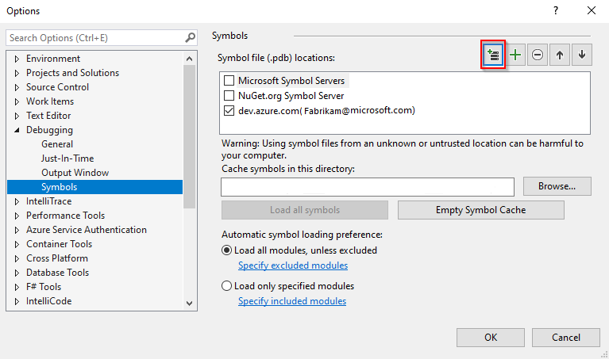
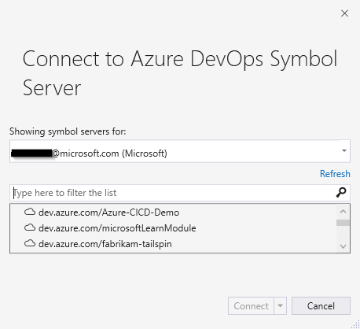
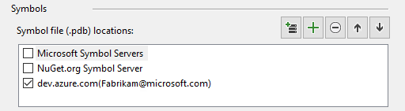

# Debug with symbols in Visual Studio

[!INCLUDE ]

Symbol servers enable debuggers to automatically retrieve the correct symbol files without knowing product names, build numbers or package names. These files contain useful information for the debugger and generally have the `PDB` extension.

## Add the symbol server to Visual Studio

To debug with symbols, select and add the Azure DevOps Services symbol server to your Visual Studio environment.

1. Select **Tools**, then **Options**, then **Debugging**.

1. Select **Symbols** and select the `+` sign to add a new Azure DevOps symbol server location.

    > [!div class="mx-imgBorder"]
    > 

1. In the **Connect to Azure DevOps Symbol Server** dialog, select your account from the dropdown menu, then select the organization that you wish to connect to. Select **Connect** to connect to the symbol server.

    > [!div class="mx-imgBorder"]
    > 

1. Your symbol server is added to the list of symbol file locations.

    > [!div class="mx-imgBorder"]
    > 

## Debugging optimized modules

If you're debugging an optimized module (e.g. something that was built with the `Release` configuration) and you haven't modified the default `Enable Just My Code` setting, Visual Studio will not automatically fetch symbols for the optimized module.

To debug the module, you can either:
- Open the Modules window, right-click and select **Load Symbols** (recommended).
- Select **Tools** then **Options**. Select **Debugging** in the right panel then chose **General**. uncheck **Enable Just My Code**. 

## Source Link support

We recommend enabling source link support to step into source code. To do so, check **Enable Source Link support** under Options > Debugging > General. By default Source Link support is enabled in Visual Studio.

If you choose to enable source server support, please consider the [security implications](/visualstudio/debugger/source-server-security-alert) before doing so.

### Portable PDBs and Source Link

If you're using [Portable PDBs](https://github.com/dotnet/core/blob/master/Documentation/diagnostics/portable_pdb.md), Source Link does not support authenticating to private source repositories like Azure DevOps Services. See [Source Link diagnostics](https://github.com/dotnet/designs/blob/main/accepted/2020/diagnostics/source-link.md) for more details.

## What's next?

* [Symbol files](../concepts/symbols.md).
* [Publish symbols for debugging](../../pipelines/artifacts/symbols.md?toc=%252fazure%252fdevops%252fartifacts%252ftoc.json). 
* [Debug with symbols in WinDbg](debug-with-symbols-windbg.md).