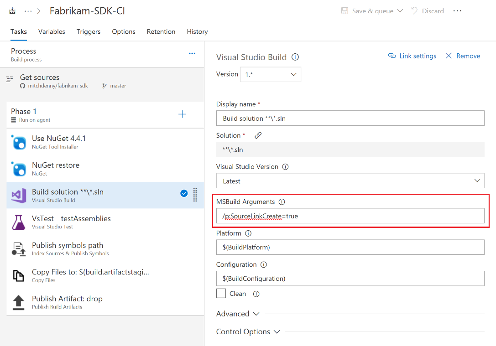
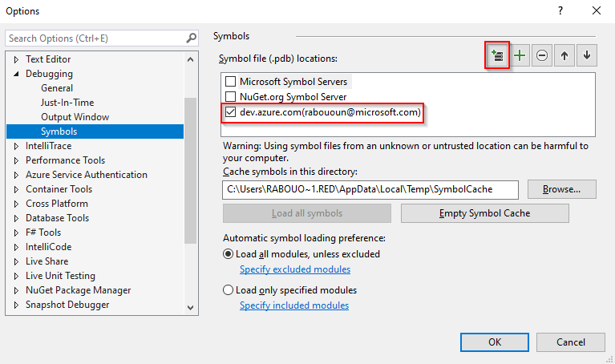
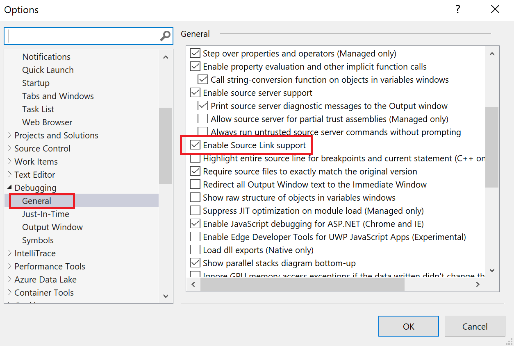
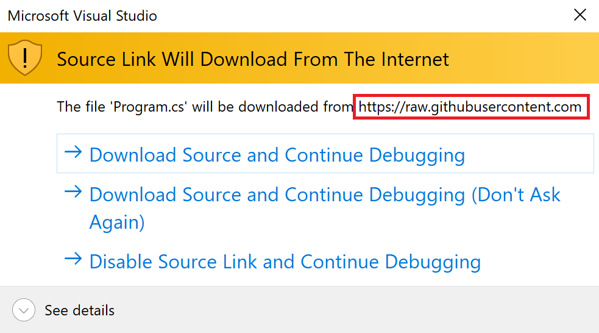
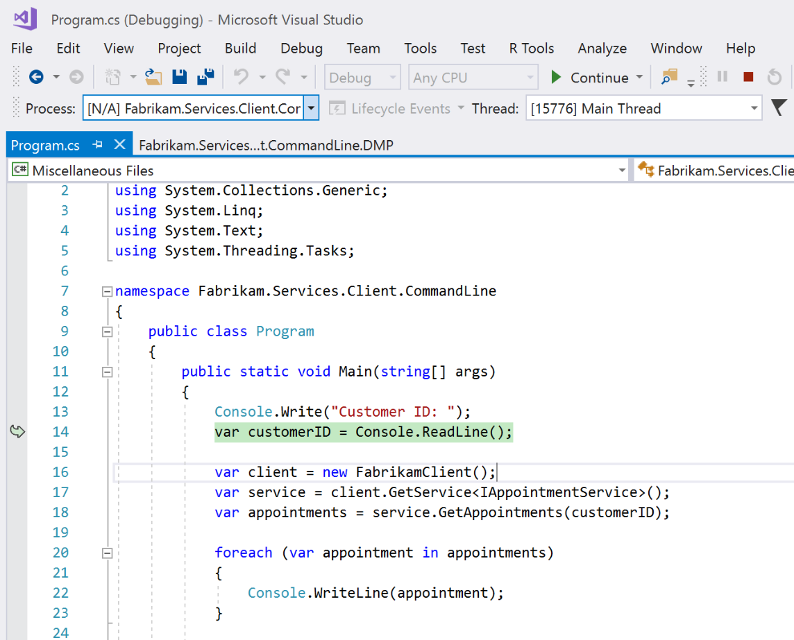

---
title: Publish and consume symbols with Azure Artifacts
description: Publish and consume symbols using Index Sources & Publish Symbols task and Visual Studio
ms.technology: devops-artifacts
ms.assetid: 3cb56371-3ef2-4bd9-871b-ec6cfa93bedf
ms.date: 03/18/2021
ms.topic: conceptual
monikerRange: '>= tfs-2017'
---

# Publish and consume symbols

Symbols are PDB files that are created from source files during compilation. PDB files (Program database) contain mapping information to the source code and are used to debug application. Azure Artifacts offers a dedicated symbols server to publish your symbols. 

## Use Index Sources & Publish Symbols task

The Index Sources & Publish Symbols task is used to index your source code and publish your symbols to Azure Artifacts symbols server. To do so, add the **Index Sources & Publish Symbols** task to your build process, check the **Publish symbols** checkbox, and select the **Symbol Server in this account/collection** option from the dropdown.

:::image type="content" source="media/publish-symbols-task-classic.png" alt-text="Publish symbols path task":::

## Use Source Link in .NET projects

Source link is a set of tools that allow developers to debug their source code by mapping from the .NET assemblies back to the source code.

- For projects hosted on GitHub, add the `Microsoft.SourceLink.GitHub` package reference to your project file.

  ```xml
  <ItemGroup>
    <PackageReference Include="Microsoft.SourceLink.GitHub" Version="1.0.0" PrivateAssets="All"/>
  </ItemGroup>
  ```

- For projects hosted on Azure Repos, add the `Microsoft.SourceLink.AzureRepos.Git` package reference to your project file.

  ```xml
  <ItemGroup>
    <PackageReference Include="Microsoft.SourceLink.AzureRepos.Git" Version="1.0.0" PrivateAssets="All"/>
  </ItemGroup>
  ```

- For projects hosted on Azure DevOps Server, add the `Microsoft.SourceLink.AzureDevOpsServer.Git` package reference to your project file.

  ```xml
  <ItemGroup>
    <PackageReference Include="Microsoft.SourceLink.AzureDevOpsServer.Git" Version="1.0.0" PrivateAssets="All"/>
  </ItemGroup>
  ```


## Modifying the Build Pipeline

The next step is to modify the build pipeline to invoke Source Link during the build process. To do so, add `/p:SourceLinkCreate=true` to the **MSBuild arguments** field within the **Visual Studio Build** task.

> [!div class="mx-imgBorder"] 
> 

Select **Save & queue** to save and run your build pipeline when an agent is available.

## Set up Visual Studio

Once the build has been completed and the symbols published, it is time to make sure that everything is working properly. But first, we must ensure that Visual Studio is set up properly.

1. Select **Tools** then **Options**.

1. Under **Debugging**, select **Symbols**.

1. Select the `+` sign to add a new symbol file location then type your URL.

    > [!div class="mx-imgBorder"]
    > 

1. Select **General** under the same section. Scroll down and check **Enable Source Link support**.

    > [!div class="mx-imgBorder"]
    > 

## Verifying the Setup

Now that Visual Studio is configured, it is time to attach the debugger to the process you want to debug. Once the debugger is attached Visual Studio will establish connection to the symbols server and attempt to locate the symbols.

The first time Visual Studio attempts to download the source code it will prompt the user for input.

> [!div class="mx-imgBorder"]
> 

Visual Studio will then download the file(s) needed and launch the code editor at a break point.

> [!div class="mx-imgBorder"]
> 

> [!TIP]
> When attaching to a process, you may need to uncheck the **Enable Just My Code** option. See [Enable or disable Just My Code](/visualstudio/debugger/just-my-code) for details.

## Related articles

- [Publish Symbols for Debugging](/azure/devops/pipelines/symbols/)
- [Build: Index & Publish Symbols](../../pipelines/tasks/build/index-sources-publish-symbols.md)